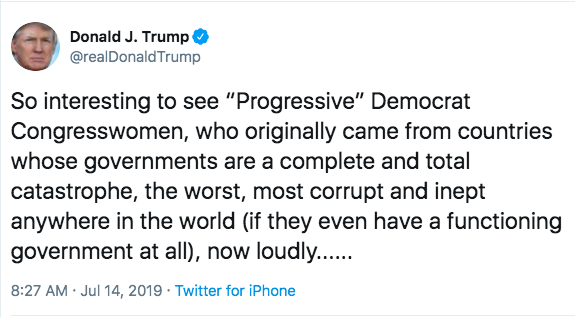

Remember how this all started. Alexandria Ocasio-Cortez made a Twitter video in which she said the "United States is running concentration camps on our southern border." The media backlash was harsh and swift. The Democratic leadership distanced themselves from her. The right wing faux-outrage machine kicked into overdrive. AOC stood by her words.

Then, Nancy Pelosi rallied House Democrats behind a border funding bill which AOC and her three freshman "squad" members, Ayanna Pressley, Rashida Tlaib, and Ilhan Omar, thought provided insufficient protections to the migrants being detained in these camps, which started to look more and more like the "concentration camps" Ocasio-Cortez first described. Pelosi, in her exclusive interview with Maureen Dowd, fired back at them, "All these people have their public whatever and their Twitter world...But they didn't have any following. They're four people and that's how many votes they got."

Again, the Squad stayed strong. AOC responded by accusing Pelosi of disrespecting them, and took offense at what she perceived as Pelosi's "explicit singling out of newly elected women of color." This comment then brought on even more media criticism. Maureen Dowd felt it necessary to follow up her initial Pelosi puff piece with yet [another Pelosi puff piece](https://www.nytimes.com/2019/07/13/opinion/sunday/scaling-wokeback-mountain.html), titled "Scaling Wokeback Mountain," in which she called AOC's comment "outrageous" and proclaimed she had "slimed the Speaker." Dowd also took issue with AOC's assertion that Pelosi's comments emboldened the reactionary right, whose consistent racially charged attacks on them have sometimes taken the form of explicit death threats.

Then, this happened:

Once again, the Squad stayed strong. They called a joint press conference, where they proved themselves unafraid and undeterred by the barrage of attacks they had recently been under from all corners of the political and media landscape. Rashida Tlaib condemned the president's tweets as "disgusting and bigoted" while renewing her call for impeachment. Ilhan Omar called out Trump's obvious hypocrisy when it comes to criticizing the country, and correctly assessed his divisive rhetoric as a method of undermining cross-racial working class solidarity. AOC assured the children of the country that "no matter what the president says, this country belongs to you."

While all three of those statements were honest and courageous, none rings more true than Ayana Pressley's comment that "We are more than four people. We ran on a mandate to advocate for those ignored, left out, and left behind. Our squad is big. Our squad includes any person committed to building a more equitable and just world." This was obviously a retort to Pelosi having dismissed the Squad as a small, irrelevant group with no real following or influence. And it is clearly spot-on.

Not only did House Democrats unanimously vote to condemn Trump's racist tweets against the Squad, but the media, who just one week ago was piling on them for daring to disrespect Nancy Pelosi and question establishment orthodoxy, has now expressed nearly universal admiration for their courage and conviction throughout this period. Moderate, centrist Democrats, like those who support Kamala Harris, who [took Pelosi's side](https://www.essence.com/news/kamala-harris-defends-pelosi-the-squad/) in her squabble with AOC, are sharing memes of the four congresswomen's photos captioned "I'm With Them." Ilhan Omar's comments at the press conference have been shared far and wide throughout the internet, often by the very people who joined the media and the Democratic establishment in [condemning her](https://www.politico.com/story/2019/02/11/house-democrats-ilhan-omar-antisemitism-1163728) for what they falsely categorized as anti-semitic statements about Israel's influence on global politics. [Nationwide vigils](https://www.ncronline.org/news/justice/across-us-lights-liberty-shine-solidarity-immigrants) are being held to protest the hideous conditions at the camps that AOC first took criticism for calling concentration camps. The House is set to vote on an impeachment resolution this week, after Tlaib re-applied some pressure in her remarks.

What these four women did over the course of the past couple of weeks is something we haven't seen from Democrats in ages. They made bold statements, refused to apologize for them, withstood smears and criticisms from every angle, didn't backtrack one bit, didn't capitulate, and didn't express one morsel of regret. And in the end, *they won.*And they won for two main reasons. The first is that they're right on the substance of the issue at hand, which is the despicable treatment of migrants at the border and the Democrats' inability to effectively respond. The second is that they know they're right, and they knew that if they stuck together and stayed on message, they'd be proven right in due time. And that is precisely what happened.

So the message for the rest of the Democrats is clear: join the squad. Reinforce what has already been proven to party leadership, which is that these are not simply four people with four votes and a "public whatever" and a "Twitter world." They've got mass appeal. They're on the right side of history. They're the future. And they know it. The question now is whether or not the Democratic Party, at all levels, from the leadership down to the voters, can demonstrate a mere fraction of their fortitude by unequivocally rallying behind them, and other Democrats like them, should any emerge during the 2020 campaign. Their courage is what's needed to counter right wing bigotry, their conviction is the antidote to media spin, and their strength is the path to victory.
