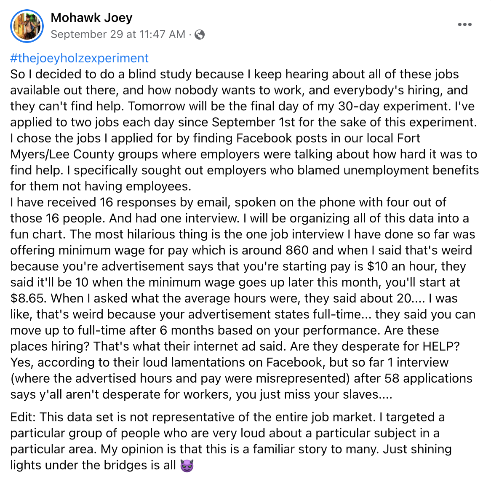

Joey Holz went viral shortly after posting the following to his Facebook page on September 29:

At this writing, the post has been shared 18,000 times, and has gotten the attention of multiple media outlets, including, most famously, *Business Insider,* who wrote a [full article on his experiment](https://www.businessinsider.com/worker-applied-to-60-jobs-got-one-interview-labor-shortage-2021-10) entitled "A worker in Florida applied to 60 entry-level jobs in September and got one interview."

Joey's findings fly in the face of the growingly popular "no one wants to work anymore" narrative being propagated by frustrated business owners looking to staff up after a year and a half of coronavirus lockdowns and limitations on their operations.

According to basic laws of economics, as demand for labor increases, so should its price. And while [wages have been on the rise overall](https://www.theguardian.com/business/2021/oct/10/us-small-businesses-wages-gene-marks), there are a significant number of business owners holding out, expecting and insisting that workers return to the job for the same paltry pre-pandemic pay rates. This explains why despite the abundance of "Now Hiring" signs appearing on storefronts throughout the country, many are still having a difficult time finding work. As 'Fight for \$15' posted on Twitter, a more honest rendering of these "no one wants to work" signs might look more like this:



We reached out to Joey immediately after discovering his story, and he was kind enough to give us his first long-form interview for our podcast. In it, we discuss his life experience leading up to his now-famous "labor shortage" experiment, as well as his views on politics, labor, and the people-centered economy we should strive to create.

Listen to our full conversation by clicking the player below, or watch the interview on YouTube by [clicking here](https://www.youtube.com/watch?v=-KqCt2J9trU&t). Subscribe to our podcast and listen on [Apple,](https://podcasts.apple.com/us/podcast/due-dissidence/id1457244081)[Stitcher](https://www.stitcher.com/podcast/due-dissidence)[,](https://podcasts.apple.com/us/podcast/due-dissidence/id1457244081)[Spotify](https://open.spotify.com/show/3jDky0r8Cg0vlYuORwWhaE)[,](https://podcasts.apple.com/us/podcast/due-dissidence/id1457244081)[Castbox](https://castbox.fm/channel/Due-Dissidence%7D-id2086184?country=us)[,](https://podcasts.apple.com/us/podcast/due-dissidence/id1457244081) [Google Podcasts](https://podcasts.google.com/feed/aHR0cHM6Ly9mZWVkcy5zb3VuZGNsb3VkLmNvbS91c2Vycy9zb3VuZGNsb3VkOnVzZXJzOjYwNjI5Njg0NC9zb3VuZHMucnNz), or any major podcast player.

**Photos: Due Dissidence, [Fight for $15 Twitter](https://twitter.com/fightfor15/status/1391836846267592706)**
