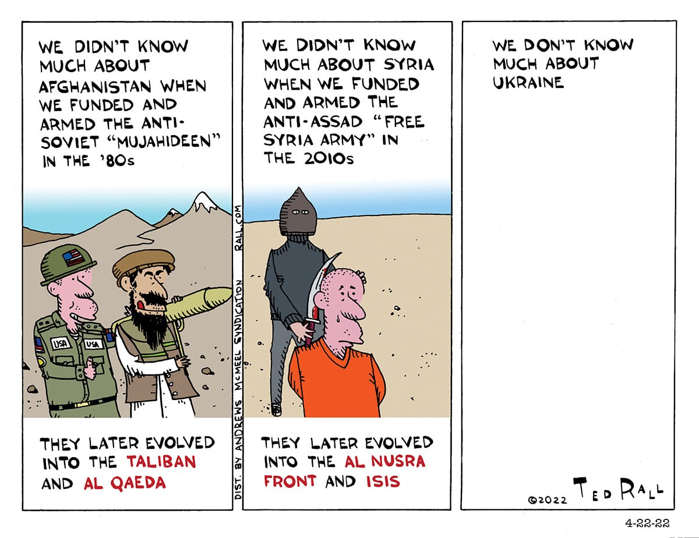

Biden's ungodly [proxy war](https://medium.com/@adventuresinthefreeworld/lets-tell-the-truth-about-the-war-in-ukraine-d150fec3ee7f) with Russia, this time using [Ukraine](https://medium.com/@adventuresinthefreeworld/lets-tell-the-truth-about-the-war-in-ukraine-d150fec3ee7f) as a pawn to force regime change against Putin (it was Syria the first time), seems like a moment to remind people of one key point: When the government tells you something or some nation is a "threat"- a "national security threat" or threat to "U.S. interests"- just remember that it has absolutely nothing to do with *you*. State power brainwashes us from birth to death into falsely identifying ourselves with its agenda and believing that the State represents what is best for the people.

*It does not.*

In recent events, the brainwashing results in citizens declaring blue and yellow as their new favorite colors and pearl-clutching over tales of Putin trying to restore the Russian empire; demonstrating an astonishing lack of awareness about their own country. But then, as they love to say, it's never bad when we're the ones doing it- thus demonstrating the *second* most notable characteristic of the voting majority: the use of moral relativism as justification for everything.

Most of the time, the State's agenda is directly opposite what is best for the people, and its interest is in protecting the rich along with its power and control over the proletariat. This is largely done by convincing people to imagine their interests align with the government's.

Nowhere is this more currently apparent than in Biden's ridiculous rhetoric about the skyrocketing cost of living, claiming that "WE" all have to sacrifice for "justice" (contain your laughter, this is serious) in Ukraine. I'm not even going to waste time debunking that obvious lie. Our history books glorify how "WE" came together during "war time" -which is really the kind of time that governments decide to send poor people to get killed so that oligarchs can profit- while selling the masses some version of the "might makes right" fairy tale to get everyone feeling invested in the cause.

The media spins its usual stories to push peoples' emotional buttons. Under Bush the First, it was ‘babies being torn from incubators.' Bush the Second's spectacular "WMDs in Iraq" started a multi-continental war we still haven't ended. We've had ‘chemical attacks against their own people,' ‘attack on an American embassy,' ‘Russian bounties on U.S. soldiers in Afghanistan," and every other variation on the usual Tonkin Gulf theme… which could actually be called the Lusitania theme, but no one knows history anymore so that will just confuse people.

Sometimes, the U.S. even uses terrorists (and terrorism- but it's not called that [when *we* do it](https://www.mintpressnews.com/cia-guantanamo-bay-torture-programs-mkultra-roots/280275/)) to "fight terrorism," predictably creating whole organizations of *new* terrorists. Wheee!

Not a single nation that the U.S. government deemed "a threat" in the past 50 years has posed any actual threat to U.S. citizens. This includes the countries falsely accused of being responsible for 9/11. Meanwhile, said government has continued its 1971 weapons-for-oil petrodollar scam with the one country *actually* responsible for 9/11. We even helped them commit mass murder in Yemen, Jordan, and [Syria](https://www.mintpressnews.com/julian-assange-us-israel-planned-to-overthrow-assad-in-2006/209493/). Every POTUS pays the requisite yearly visit to the Holy Kingdom of Human Rights Violations (why yes, I *do* mean Saudi Arabia), accompanied by billions of dollars in arms sales and roundly covered by the mass media as "diplomacy." People are always shocked that we keep selling them weapons, which is unsurprising considering a total of 10 Americans are aware of how the petrodollar economy works or the fact that perpetual weapons sales are part of the deal.

Thus, U.S. wars are not *your* wars. Threats to the U.S. economic agenda of singular world domination is not *your* agenda. Imperialism is not protecting your "freedom" from a world of jealous freedom-hating aggressors. What benefits the U.S. empire does not, in any way, benefit *you*. In other words, you‘re not obligated to ‘sacrifice' a damn thing for them. You don't owe it to anyone to wave the flag or say ‘support our troops' or listen to the endless parade of former generals and CIA hacks selling wars on the news or join the hype. Cheering for mass murder of humans and animals and widespread environmental destruction does not make you a "good citizen-" as if being one had any sort of benefit to you anyhow.

If Americans withdrew all support, voting and otherwise, for imperialism and imperialist politicians, the narrative would collapse in a week.

Palestinian rapper [Lowkey](https://www.mintpressnews.com/MyMPN/after-being-targeted-by-the-uk-govt-british-rapper-lowkey-returns/), often [targeted](https://www.mintpressnews.com/MyMPN/after-being-targeted-by-the-uk-govt-british-rapper-lowkey-returns/) for cancelation by government censors and currently under aggressive assault [by the Israel lobby](https://www.mintpressnews.com/israel-lobby-attempt-cancel-rapper-lowkey-antisemitism/280193/) for his activism against their policy of genocide, sums up the empire acutely in songs like Obama Nation (below), [Terrorist](https://www.youtube.com/watch?v=kmBnvajSfWU)? and interviews like [this one](https://youtu.be/5MJcIIqWknA?t=334) and [this one.](https://www.mintpressnews.com/ben-norton-us-backed-coup-pakistan-new-world-order/280216/)

And here's a step-by-step of exactly how U.S. imperialism works:

1. Oligarchs have oligarchic designs on some hapless part of the world, usually in the global south, requiring enforcement by the Pentagon and its bottomless resources (which come at the expense of American citizens.)
2. They place their order for a shiny new military campaign with the politicians they buy; sometimes directly, and sometimes through their related lobbyists. The Capitol public relations machine unironically crafts a narrative about some evil dictator that exploits his own people *(no!)*, or committing [human rights violations](https://www.mintpressnews.com/cia-guantanamo-bay-torture-programs-mkultra-roots/280275/) *(whaaat?!)*, or- *GASP!*- doing imperialism.
3. The U.S. government starts a war with no opposition from anyone in Congress, from either political party. They pass a bill appropriating billions of tax dollars to fund the new war instead of thing s like a functioning healthcare system or education or climate action.
4. When a tiny handful of Americans point out these atrocities are also precisely what their own government does, the PR machine spins it with some version of "bUt wE'Re dOiNg tHe ‘gOoD' kInD oF tHaT tHiNg," laden with tales of American heroes restoring justice to the global order. Hollywood puts out a summer blockbuster with the current theme.
5. Washington's State "security" apparatus and its various alphabet agencies place their order with the Silicon Valley tech goons to silence dissenting opinion and cancel anti-war voices from the internet. They unironically order various Op-Eds and thinkpieces from the neoliberal intelligentsia about the dangers of free speech and need for more [censorship](https://www.mintpressnews.com/chris-hedges-social-media-censorship-ukraine-russia/280248/) to save democracy from fascism. Moral panic over the heresy of disagreeing with the Imperial Narrative ensues. In the years since his administration ended *(but not his hold over the Democrat party machine)*, with annual regularity, the establishment [trots out Obama](https://www.youtube.com/watch?v=9w6cXkO6ZIc) to give speeches on the importance of shutting up speech.
6. Nations are decimated, often reduced to failed states as in the case of Libya, and refugees of those nations show up at U.S. borders asking for asylum.
7. This sparks the Great Immigration Debate. Of the Republicans, Democrats say *"Embrace all immigrants, you hateful, inhumane, uneducated racist bigots!"* Of the Democrats, Republicans say *"Build a wall! Tell the beggars to go home and work for a living!"* They run campaigns on immigration policy and voters support them based on "Let ‘em in!" or "Let 'em die!" as preference dictates.
8. Not one politician says *"We created this shit, now it's at our door, we owe these people and also if we stopped doing imperialism our immigration problem would suddenly disappear."* Which, obviously, is the truth. Not one ever runs campaigns on ending imperialism.
9. The costs of war are passed on to the American citizen by way of tax and price hikes along with cuts to the already-meager spending for the kinds of social programs that paying taxes is supposed to pay *for.* New austerity measures ensue, and millions of citizens continue to eke out a subsistence living (or often, they don't) under our failing neoliberal system.
10. Defense contractors make billions, the stock market skyrockets, Wall St. manufactures a few more billionaires. All of the above dumps money into buying more politicians. Lather, rinse, repeat.
11. Not *one* American worker or child ever benefits from whatever millions of brown people died *(represented by* [*Ahmed*](https://www.youtube.com/watch?v=FNqum-_5RhY)*, in* [*this*](https://www.youtube.com/watch?v=FNqum-_5RhY) *collective obituary)* or whose homelands were destroyed for the war that whatever POTUS of the moment proclaimed is flying the flag of humanity and justice over the world and thereby worth our noble "sacrifices."

Conveniently, since the collective memory is outdone by that of a goldfish, the buildup of manufacturing consent (Russiagate, anyone?) for the [war in Ukraine](https://medium.com/@adventuresinthefreeworld/lets-tell-the-truth-about-the-war-in-ukraine-d150fec3ee7f) is a perfect reference example of the all of the above… as is the practically unreported [U.S.-backed coup d'etat of Palestinian prime minister](https://www.mintpressnews.com/ben-norton-us-backed-coup-pakistan-new-world-order/280216/) Imran Khan, going on at the same time.

Thus, the necessity of class solidarity cannot be overstated. The worldwide working class *(SPOILER: if you support your cost of living by a job you are working class)* has one set of interests, and the State power apparatus in the U.S. and western imperial nations has an entirely different set of interests. Neither political party provides an electoral solution to the problems of working people, and no candidate or election within the current system will change that. As long as world domination at all costs is the primary agenda of the U.S. government, your material needs will never be a priority. It is only when the proletariat unites and starts demanding what is good for US that we create societies governed by systems that SERVE the people instead of exploiting them.

In these halcyon days before either nuclear or climate apocalypse, whichever arrives first, it would be useful to bear in mind that capitalist imperialism is the direct cause of both. Don't be conned into taking ownership of apocalypse.

**Photo: Oleksandr Ratushniak (CC 4.0)**
