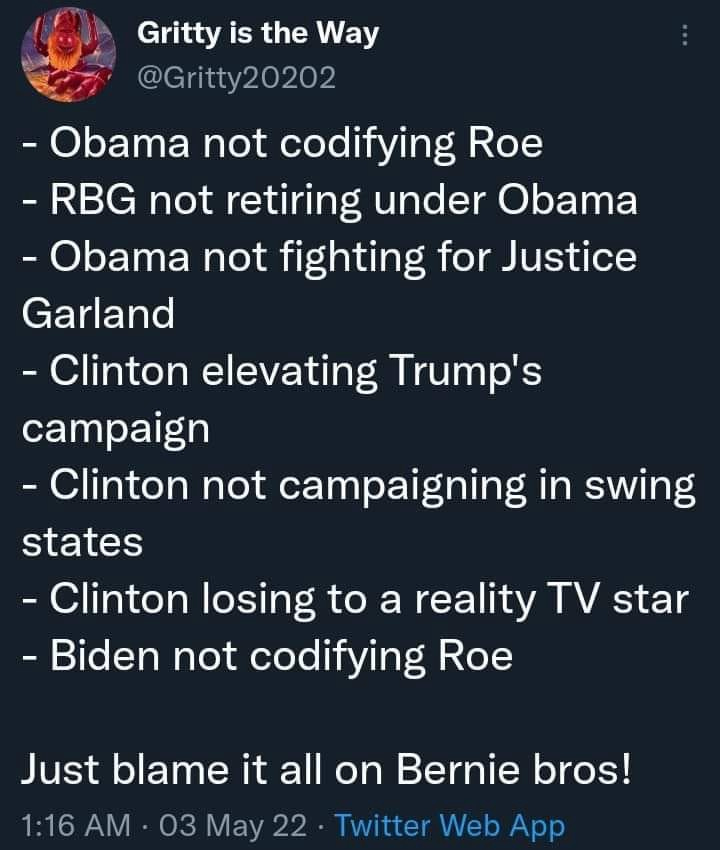
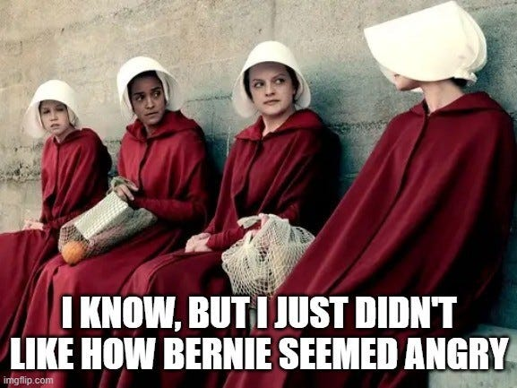
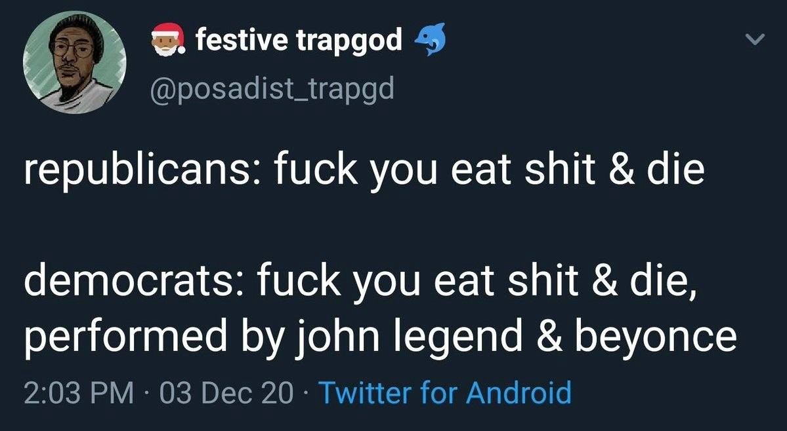

It's well and good to cite the statistics and reasons *(which should not actually have to be explained, but Gabrielle Blair puts it so well [here](https://humanparts.medium.com/men-cause-100-of-unwanted-pregnancies-eb0e8288a7e5))* on [why women need to control their own bodies](https://humanparts.medium.com/men-cause-100-of-unwanted-pregnancies-eb0e8288a7e5), but it doesn't do much when we have a population that can't even correctly identify the cause of why we're still fighting for this. Only then can anyone clearly see what we need to do if we want this to change. Thus, rather than stating all the obvious things, I'm going to talk about what *should* be obvious, but apparently isn't. Let me connect the dots for everyone that wants to blame the Republicans for Roe v. Wade.

I'll start with this: Democrats have had 50 years to codify Roe into law, and in 50 years they haven't done it. Since 2000, they have held the majority in both houses 3 times- twice with a Democrat president at the helm. If you haven't already arrived at the obvious conclusion, here it is: They'd have little else to run on in close elections if it weren't for abortion. But before the *"But Trump's SCOTUS"* objections start up, examine the facts there too:

Biden was in charge of the appointment of Clarence Thomas, in case you forgot he's been around for 40 years, [steamrolling Anita Hill](https://www.youtube.com/watch?v=8dHrbEeQBjk)- a black woman victim of sexual assault- in the process. In 1982, Biden voted for a constitutional amendment giving states the right to overturn Roe. And at the beginning of the primary as with many times before, he said- verbatim- that women controlling their own bodies was 'going too far.'

The Democrats, having rehabilitated Bush II as "a good guy" in the last election, prefer we all forget that Alito was *his* SCOTUS appointment. But he's a friend now, *(look! he hangs out with Ellen DeGenres and stuff!)* so just nevermind that little detail.

Bernie Sanders ran in 2016. Kavanaugh and Coney-Barrett were appointed by Trump. Trump **would not have been president in the first place** if Democrats hadn't screwed the pooch the first time Bernie ran. Had they not screwed the pooch the second time, Bernie would likely have helped to codify Roe into federal law during his first 100 days in office, in fact he ran on that promise. For whatever his detractors say about him, everyone knows Sanders keeps his promises.

The same, that they would have taken care of this issue already, could actually be said for [every single progressive challenger that has run in the Democrat presidential primary since the JFK administration.](https://medium.com/@adventuresinthefreeworld/a-brief-history-lesson-timeline-of-democrats-running-centrist-presidential-candidates-and-a09c31692d26) There has been one every time. I'm going to repeat that: *Every presidential primary since 1963 has had a progressive challenger.* [Here's a timeline, for those with doubts.](https://medium.com/@adventuresinthefreeworld/a-brief-history-lesson-timeline-of-democrats-running-centrist-presidential-candidates-and-a09c31692d26) And every time, the party sabotages them. This is the same at the state and local level.

Progressives though, haven't exactly been showing up for folks of *any* color lately, have they? The House Progressive Caucus sandbagged [Nina Turner](https://www.youtube.com/watch?v=KzpSdtEXhU8)- an amazing, strong black woman full of heart and committed *(mostly)* to progressive policy- [in favor of endorsing another corporate bootlicker, Shontel Brown](https://www.youtube.com/watch?v=y5hkl_kZ65E), who will do nothing for anyone's equality or rights ever, as she was chosen to enable the status quo. *"[With these hands](https://www.youtube.com/watch?v=hlYo-qybP_o),"* Nina says in her [iconic speeches](https://www.youtube.com/watch?v=hlYo-qybP_o), *"we will transform this country."*

I guess people didn't want that. Predictably, [Nina lost in Ohio again last night.](https://www.youtube.com/watch?v=1aNhOFLQ49Y&t=5598s) Also predictably, the party progressives are punching left as usual at everyone that's done enabling the Blue Team and its corrupt machinations for not voting blue, while the Blue Team is [punching left at progressives](https://medium.com/@adventuresinthefreeworld/debunking-the-democrats-favorite-scam-b38d709a63bf) for being "too far left."



I'm not done talking about Bernie though, now that one of the many hundreds of opportunity costs of not having a Sanders presidency is suddenly coming to the attention of the liberal class. (You'd think not having a healthcare system during a global pandemic would be the thing that got everybody going, except liberals don't notice anything they don't think [personally affects](https://medium.com/@adventuresinthefreeworld/no-karen-you-dont-get-to-tell-me-how-to-vote-126da4f689d8) *[them](https://medium.com/@adventuresinthefreeworld/no-karen-you-dont-get-to-tell-me-how-to-vote-126da4f689d8)-* by which I mean the class that can afford to treat politics like a personality contest.)

[White feminists](https://medium.com/@adventuresinthefreeworld/no-karen-you-dont-get-to-tell-me-how-to-vote-126da4f689d8) on the Elizabeth Warren train were too busy bitching that Bernie was "a sexist" (an allegation that was debunked as quickly was it came out) to acknowledge that *his* Medicare for All bill- (*actual bill*, unlike Warren's "plan") introduced in 1999 and sitting in congress ever since- specifies ALL women's care as healthcare. Black women, white women, trans women. Just... women. Clearly though, Bernie's non-existent sexism was a dealbreaker in their voting choices.

### We all have our priorities, I guess.

At its core, abortion rights is a class issue- and liberals and their Democratic party represent the Professional Managerial Class- in other words, the petite bourgeoisie. Abortion rights is also a labor issue, which is the take we all forgot but has been so clearly elucidated [here](https://inthesetimes.com/article/abortion-rights-union-labor-roe-wade-supreme-court). As Kim Kelly [says](https://inthesetimes.com/article/abortion-rights-union-labor-roe-wade-supreme-court),

> *"There is no time to mince words: Abortion rights are a labor issue, and this is a moment in which the labor movement needs to make clear that bodily autonomy and reproductive freedom are core issues that unions will fight tooth and nail to preserve. The right to control our bodies is part and parcel of our centuries-old battle to control our labor, and they cannot be separated from one another. **It matters that so many workers are not only at risk of unwanted pregnancy themselves, but are also expected to engage in reproductive labor — the so-called "women's work" that is so often undervalued and underpaid (or wholly unpaid).** It matters that pregnant workers face discrimination as well as physical and medical hazards on the job, and that far too many don't have access to quality healthcare or paid parental leave. It matters that workers who do not want to have a baby or cannot do so safely are about to have that choice stolen from them, and that forced birth is the only option on offer from the most powerful court in the land (as illegitimate as it is and always has been).*"

A couple of interesting facts:

The highest rate of abortions in the USA happens among educated white women.

Most of them already have children and a) can't afford more or b) are older and at high risk for complications either to themselves or the fetus.

To put it more on the nose about class and race: Rich white women have never had a problem getting abortions. Not when they were illegal, not when they were legal but expensive unless you went to Planned Parenthood, and not after they're made illegal again due to the Democrat Captains of Failures' cascading miscalculations. Affluent women, while they may work, are not constrained by cost limitations when they need to travel to another state or even another country to terminate a pregnancy. They're less likely to be exposed to "physical or medical hazards on the job." Their resources are greater to hire daycare, nannies, and other things to make motherhood- including working motherhood- easier for themselves. They are also most likely to be either married or receiving alimony.

Banning abortion is a strategy to maintain an underclass of impoverished women, trapped in a predatory economic system that produces easily exploit-able workers for the service sector and desperate soldiers for the Pentagon's endless regime-change wars.

It's not just white feminists that ignored this, however. Despite the medical establishment's racial injustices and the unaffordable cost of healthcare for most of the black population, old black folks- the Clyburn folks- ignored it too, in favor of voting for the Dixiecrat that wrote the 1994 crime bill. In favor of the guy that still called a member of the Congressional Black Caucus "boy" during a meeting prior to the general election. In favor of the guy whose entire campaign trail was littered with racist gaffes and stories about Corn Pop. In favor of the guy that has been sending poor black children to fight in endless regime-change wars and enthusiastically bombing black and brown people all over the global south for 3 generations.

Somehow, ["bErNiE iSn'T fOr uS"](https://medium.com/@adventuresinthefreeworld/reality-check-for-the-over-50-set-about-election-2020-3f636ac8280f) was just a more compelling argument at the time. Apparently. Or it was the fact that the Monday night coup before Super Tuesday 2020 came at the powerful directive of Obama himself. Either way, [it has cost us all.](https://medium.com/@adventuresinthefreeworld/dear-bernie-sanders-on-the-day-you-quit-the-revolution-b6ea6d977993)

So the guy that explicitly said when asked that he would veto Medicare for All if it ever came across his desk, and said women were going too far to demand reproductive choice, became the POTUS and nobody thought this was going to be a problem when the now-majority conservative Supreme Court finally decided to weigh in.

We can't put it *all* on Biden, however. The Democrats could have codified Roe any time they've held a majority since 1973 and simply chosen not to. As House Rep. Pramila Jayapal correctly said yesterday, the Senate can bypass the filibuster to do this right now. I guarantee you they won't. As stated before, what *would* they run their campaigns on these days if they did?

Hillary Clinton chose Tim Kaine, a [vocally anti-abortion Democrat](https://slate.com/human-interest/2016/07/hillary-clinton-picks-anti-abortion-tim-kaine-for-vice-president.html), as her running mate in 2016. Obama [promised to work for the codification of Roe v. Wade](https://www.nytimes.com/2009/05/15/us/politics/15abortion.html) into law in 2008, then, consistent with his praxis, didn't. House Speaker Nancy Pelosi [removed abortion access from the Affordable Care Act](https://www.npr.org/2010/03/22/125028935/pelosis-triumph-its-personal-for-women). Just this week, Pelosi and other party power-brokers are in Texas, fundraising and campaigning for the virulently anti-abortion Henry Cuellar for the second time against the progressive Jessica Cisneros. Yet whenever Democrat politicians behave badly, their loyal voters are happy to look the other way.

The party's favorite- and strategically necessary- rotating villians grift comes in handy at times like these; this time around, Joe Manchin and Kirsten Sinema. Manchin was challenged by Paula Jean Swearengin twice. Swearengin had overwhelming bipartisan support in West Virginia. She was sabotaged both times by the DNC and Democrat party leadership. The party needed him to be their bad guy so they can blame their deliberate ineptitude on a couple of "yucky corporate Dems" and lead their voters away from the truth that **the problem is the entire party.** Manchin's complicity in standing against abortion rights is a price the Dems were entirely willing to pay to maintain their charade.

The same way, Mitch McConnell would no longer be a problem if the Democrats hadn't screwed Charles Booker, who also had overwhelming bipartisan support in Kentucky, in favor of the candidate nobody wanted and nobody thought could win: Amy McGrath. The point here is that where Democrats have always been unreliable about protecting anyone's rights except for the occasional performance (ripping up Trump's speech, kneeling in Kente cloth at the Capitol), progressives have been more strident about it. The internecine war between the party's two factions proves that equality for anyone isn't on the agenda anywhere but campaign speeches and outraged tweets.

### Really, this all comes down to basic pattern recognition.

Of course, it helps to also learn about peoples' political records before voting instead of just listening to campaign promises. And, you know, understand how the party you're aligning yourself with functions and what it truly represents. But I digress.

I'll tell you another thing, the entire *"Our body, our choice"* argument espoused by the Democrats and the liberal class as a whole for decades rings mighty hollow after their epic, paranoid pivot on this position the second a Big Scary Pandemic came along. Obviously, the pandemic *was* serious and scary. But the inflated sense of self-importance that the liberal class brought to it -*the* *very same class that wholesale rejected universal healthcare, including in the primary election that was in full swing as the pandemic began raging* - characterizes the hypocrisy of categorically dismissing the well-being of others until one feels personally threatened. Then the finger-pointing and demands began. "Do this for the good of everybody" REALLY means "do this because I'm scared I'll catch it at the grocery store," but that would (gasp!) sound self-centered. Don't think the 47% of voters who are actually independent, as in not aligned with the two-party grift, didn't note this glaring consistency. They did. Think that will undermine the credibility of liberals arguing for bodily sovereignty in the future?

### Yes. I think it will.

The push for mandates of the experimental mRNA drug treatment is a clear legal, scientific, and ethical violation- while also severely undermining the ability to use choice as a moral argument. **Bodily sovereignty is sacrosanct, full stop.** Be it medically-assisted suicide, reproductive control, or choosing which medical interventions and treatments to accept or decline, this is a non-negotiable line item in any society which wishes to call itself free.

To say that using religion or moral "right to life" claims to bolster the abortion debate is transparently false is stating the obvious. But that doesn't mean the people stating this have a leg to stand on, because even [when they're correct](https://humanparts.medium.com/men-cause-100-of-unwanted-pregnancies-eb0e8288a7e5), after eight years of culture war hysteria and Russiagating, *no one's listening to them anymore.* To the outside observer, it all looks like pearl-clutching, moral-panicking hypocrisy. …Right, I'll just be blunt: A meme. It all looks like a meme.

This is the predictable damage caused by both tribal factions in this country politicizing the pandemic to advance their respective partisan cultural-social agendas. Now, if you point out the hypocrisy of the thoroughly unscientific and basically made-up pandemic response with regards to this issue, cheered - in fact, *demanded* - by the same people that five minutes earlier were supposed to be for bodily choice, you're a crazyantiscienceMAGAracisttransphobicantivaxxer out to Covid-murder your fellow Americans and deserve to die screaming.

It serves to mention, however, that the highest percentage of "anti-vax" sentiment (a blatant propaganda slur if I've ever heard one) in the U.S. was among black folks, but you'd never know it from the corporate media. Gee, I wonder why, after things like the Tuskegee Experiment and other racist abuses of power levied at black people under the guise of medical advancement made them little more than guinea pigs for nearly a century.

So it's not like bodily sovereignty among black folks has ever been policy in this country- but it sure as hell doesn't help the cause when the party that is supposed to be advocating for it suddenly abandons this position as soon as something pierces the safe little bubble in which affluent white liberals working their six-figure jobs from home and ordering Whole Foods delivery live, and makes them feel personally threatened.

Lastly, if you hadn't noticed, the Blue Team is in for the shellacking of the century in the upcoming midterms. Their favorite scapegoat, Donald Trump, just came out and voiced the *sane* position on Russia-Ukraine while their Democrat president, Democrat House/Senate majority, and various State media apparatus are busy [fomenting a proxy war](https://medium.com/@adventuresinthefreeworld/lets-tell-the-truth-about-the-war-in-ukraine-d150fec3ee7f) with the world's #2 nuclear power. Meanwhile, Republicans are suddenly the party [pushing for anti-trust laws](https://www.youtube.com/watch?v=4IUBEVilAx4), opposing censorship, and breaking up monopolies. In other words, what *used* to be the Democrats' brand.

I'm sure this little SCOTUS leak on the most inflammatory culture issue in the country is probably just a coincidence though. I mean… *they would never...* would they?

Facts to the contrary could not be more in abundance, but when those elections roll around, the usual faction of tribalistic liberals will be screaming at everyone to *"vote blue no matter who,"* making the usual nonsensical arguments about this how this is going to save women's rights and everyone that doesn't is a racistsexistNazibrownshirtBerniebro. The canyon between liberals *(Democrats)*, progressives *(still Democrats but like to think they're not as Democrat-ey)*, and leftists *(former Democrats, progressives & anti-capitalist independents- all DemExit)* will grow to the size of the continent. The 2024 election will surely see the Party of the People get clobbered as well.

Right now, as predictable as the sun coming up in the morning, the Democrats have dramatically announced an urgent [show vote](https://www.youtube.com/watch?v=yKaxoP6u9r8&list=PLR1VVi2S5xz8slbWisynDT5b_y6IfxozH&index=2) to do the thing they should have done since the original Roe v. Wade decision three generations ago. Just this morning I received a series of desperate text messages from "Joe Biden" and "Kamala Harris" via ActBlue, asking me for $15 to save women in America. You'll understand why I told them to use the hundreds of millions they made insider-trading during the pandemic and fund this little *deus ex machina* themselves.

Meanwhile, Status Quo Joe Biden is busy filming live informercials for javelin missiles, extolling the virtues of the military-industrial complex and [doing imperialism](https://medium.com/@adventuresinthefreeworld/lets-all-remember-what-this-nation-stands-for-e000434e23e6) as his entire constituency wonders whether we're sleepwalking straight into The Handmaid's Tale. Which, as Caitlin Johnstone [points out](https://caitlinjohnstone.com/2022/05/04/the-most-joe-biden-thing-ever-notes-from-the-edge-of-the-narrative-matrix/), is *"the most Joe Biden thing ever."*



> *"It's a good thing Trump lost because otherwise Roe v Wade would be on the chopping block and immigrants would still be getting mistreated and the Iran deal would still be dead and the military budget would keep inflating. That bastard would probably have us on the brink of World War 3 by now."*

What's the point of this screed, you say? Isn't it detracting from the issue? No.

**No, it *is* the issue.**

The moral of the story is that THERE IS NO OPPOSITION PARTY IN THE UNITED STATES GOVERNMENT, and *without an opposition party, what the f\*\*k else did you think was going to happen???* As long as people keep deluding themselves that there's an electoral solution for abortion or any of the other problems in this country- that we're going to magically vote our way out by picking either half of the corrupt neoliberal government to save us- you can bet your life on the fact it will never change.

Make no mistake, the [United States is an empire in collapse](https://medium.com/@adventuresinthefreeworld/the-u-s-governments-wars-are-not-our-wars-4c11bf326321). Reproductive rights and women's equality have remained an electoral cudgel, rather than being resolved, for a reason- and it's *not* due to any absence whatsoever of decades of legislative opportunity, political capital and public demand.

So ask yourself: **What have we been getting wrong about this?**

**Photo: Instagram: p\_ssyhat project**
