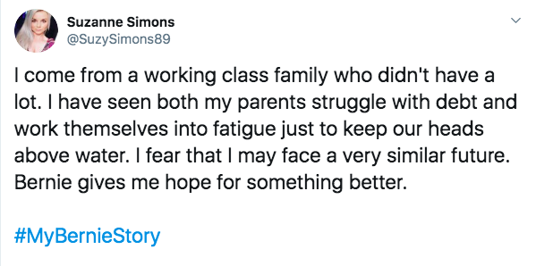
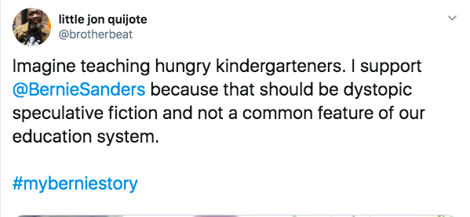
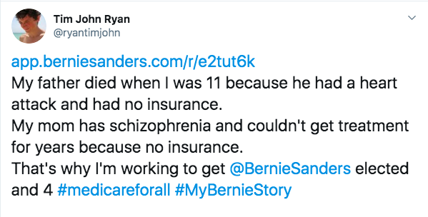
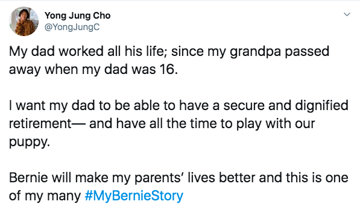
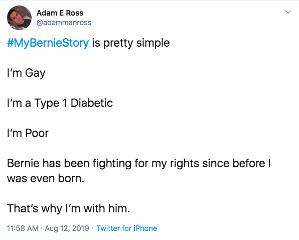
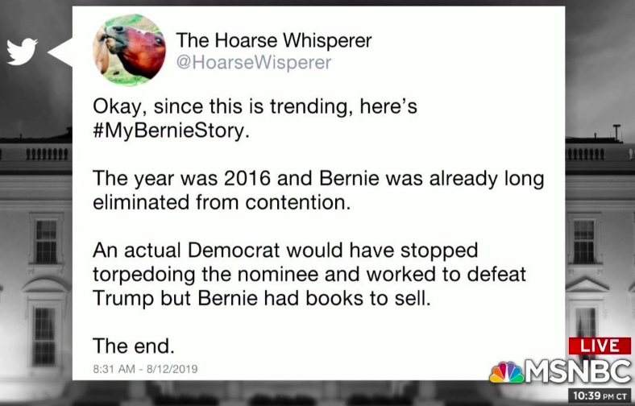
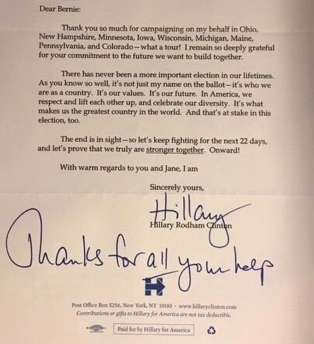

I know, I know, I know. If you're a pussy-hat wearing, Chardonnay-and-Xanax mixing, blue-no-matter-who preaching, "resistance" liberal, your hair is probably on fire right now because I sound "JUST LIKE TRUMP!" Well, call Trump a broken clock. In fact, call him a doubly-broken clock, because he's only right *once* a day. Better yet, call him a *quadruply* broken clock, because he's only right once a day *and* for the wrong reasons. But he does happen to be right about one thing: corporate media is the enemy of the people.

Examples abound, which is why this piece has been percolating in me for quite some time. The 2016 election was a wake-up call for progressives such as myself as to just how biased the mainstream media is in favor of the interests that fund them. It should have been obvious long before that, but the Obama presidency proved a very effective smokescreen for them. It was a perfect storm of obscurantism: a popular, charismatic president pushing their neoliberal agenda while posing as a progressive whose "real" agenda was being thwarted by a reactionary, racist Republican Party. Under those circumstances, the job of perpetuating the neoliberal status quo was quite easy, and easier yet was their ability to hide their biases. After all, *most*of that above description of the Obama years is true. Obama *was*a popular president with outstanding political skills, and much of the Republican opposition to him *was*in fact paranoid and irrational at best, bigoted and hateful at worst. Sandwiched in between, however, is the all too important and easily overlooked lie that Barack Obama's *"*real agenda" had been hamstrung, as if he were really trying to push through a populist progressive program. It became quite apparent by the end of his second term that he wasn't. In no way was that more obvious than his unrelenting push for the Trans-Pacific Partnership right through the 2016 general election. By then, thanks in large part to the Bernie Sanders campaign and the media's blatant contempt for him and his movement, progressives had been awakened to the fact that the mainstream corporate media is in fact pushing an agenda of neoliberal corporate globalism. It then became much easier to make sense of what had transpired over the previous eight years.

You know how when you're dreaming, you just kind of take for granted that everything you're experiencing is real, even if it doesn't quite make sense, and only after you wake up do you look back and realize all of the signs you missed along the way? It was like that.

So that's when it clicked for me that the media was in the tank for the interests of the entities that either own them outright, whether it's Jeff Bezos (*Washington Post*) or Comcast (MSNBC), or who advertise on their platforms (Humira, Otezla, etc). And, again, the list of examples is endless. I wrote an [entire piece](https://duedissidence.com/2019/06/27/msnbc-is-controlled-opposition/) on MSNBC which I'll refer you to for a more thorough history of systemic anti-progressive bias at their network, but for now let's just look at the past eight weeks. First, MSNBC's coverage of the Democratic debates was littered with anti-Medicare for All propaganda, with Chris Matthews going as far as to suggest it would be "unconstitutional." Then, the media chastised Alexandria Ocasio-Cortez for invoking "concentration camps" when referring to the situation at the border (how do you feel about that now, [Chuck Todd](https://www.youtube.com/watch?v=vY8CBY5ISok)?). Then, they nearly unanimously took [Nancy Pelosi's side](https://www.nytimes.com/2019/07/13/opinion/sunday/scaling-wokeback-mountain.html) in the intra-party feud that resulted from AOC's "Squad" voting against the Democrats' border funding bill. Then, CNN's coverage of the second round of Democratic debates consisted of repeating the Orwellian talking points that Medicare for All would actually mean taking *away*people's healthcare, and the corporate media narrative in the days following the debate was that Democrats had [faltered by too harshly attacking the Obama legacy](https://www.politico.com/magazine/story/2019/08/08/emanuel-obama-2020-democrats-227511) in favor of a more progressive agenda. Just recently, in their coverage of the Iowa State Fair, the *New York Times*published that Bernie Sanders ["spoke to almost no one,"](https://www.nytimes.com/2019/08/12/us/politics/bernie-sanders-iowa.html) despite that he had, in fact, spoken to overflow crowds of supporters.

So why wait until now to write this piece? Well, the thesis that these media organizations are not simply biased entities with interests of their own that they try and hide from the public, but are actually, in essence, the enemy of the people, was laid shamelessly to bare by Brian Williams on MSNBC this week.

A hashtag #MyBernieStory started trending this week, as the Bernie Sanders campaign encouraged their supporters to share on social media personal stories of how and why they came to support Sanders' presidential bid. Being that Bernie Sanders has centered both his 2016 and 2020 campaigns on the material needs of ordinary Americans, this seemed like a great idea. And not long after the prompt was put out there, thousands of these stories flooded the twittersphere. A few examples are listed below:

That's just a sampling of responses from real people, of all different races, genders, and sexual orientations, with real, urgent, material needs that are not being met under the current status quo. They are supporting the Bernie Sanders campaign because he is the candidate who not only articulates the severity of their situations in a way that no other candidate does, but has a forty year track record of fighting on their behalf.

Perhaps that would make for an interesting segment on Brian Williams' show. Instead, he chose to feature this, calling it "The tweet from last night that caught my attention:"

The dishonesty of this tweet is obvious to anyone who closely follows politics. First, there were twice as many Clinton-to-McCain voters in 2008 as Sanders-to-Trump voters in 2016. Second, Clinton herself was criticized heavily in 2008 for staying in the race until June, despite having no viable path to nomination after Super Tuesday. Third, as for the idea that Bernie didn't sufficiently campaign for Clinton, I'll refer you to the below photograph:

Aside from the dishonest nature of the tweet itself, it's important to note that it came from an anonymous account. Who is this "Hoarse Whisperer" anyway? Could the Hoarse Whisperer be a Republican operative seeking to foment discord amongst Democrats? Could the Hoarse Whisperer be a troll who just likes to stir the pot to raise his/her profile? Or, could the Hoarse Whisperer be, wait for it...get your Xanax ready... *Russian?!?!*Think about it. Putin rides a horse, does he not? Whose horse is it in the profile pic??? Of course, these questions are completely nonsensical in this case, being that the account in question is attacking Bernie Sanders. Were the Hoarse Whisperer attacking a centrist on a progressive's behalf, Rachel Maddow would devote 20 minutes to how the grass in the background of the profile pic looks eerily like the hills in which Putin has been photographed shirtless on horseback.

But both the lie of the tweet itself and the dubious nature of the twitter account from which it came are both secondary concerns here. What's most important, and most damning, is that of all the #MyBernieStory tweets they could have highlighted which amplify the urgent concerns of ordinary Americans, MSNBC chose to showcase this one.

There were literally tens of thousands of tweets to choose from in which ordinary people either write, or in some cases, record themselves on video, to express how the problems in their lives which have been exacerbated over the years could be ameliorated by the Bernie Sanders agenda. Single mothers raising children on minimum wage jobs, HIV patients struggling to afford their medications, students drowning in debt, veterans with inadequate health benefits. The list goes on, and on, and on.

The choice on Brian Williams' part to forego amplifying those voices, and instead lend his megaphone to an anonymous, lying troll who's goal is to drown out those same voices, means one thing. It means that whether you're a poor, gay, type 1 diabetic, or a senior citizen facing a bleak retirement, or a fatherless child whose dad died because he had a heart attack and was uninsured, or a kindergarten teacher whose students are starving in your classroom, or a young woman entering the workforce in fear of what's to come, Brian Williams **is your enemy.** MSNBC **is your enemy**. The corporate media, as an institution, **is your enemy**.

Plain and simple.

And if you think that's too harsh, or too divisive, or too "Trumpian," then I'd like to know what you'd call them. What would you call a multi-millionaire news anchor who cherry picks one dishonest, irrelevant tweet from an unverified account, which, in all seriousness, would get the full Russiagate treatment if not for its pro-establishment bent, out of a sea of stories from real people with real problems who are desperate for real solutions? You might be confused as to what to call him, or shy about what to call him. I am not. I call him my enemy, because he is. And he's yours too. And he's not alone.

The Sanders campaign is finally hip to this dynamic, and I am encouraged to see them tackling this problem head on. For obvious reasons, they can't be as blunt as to use the language that I have, but I can. And *we* can. And we *must.*

Joe Biden, from his awful debate performances to his constant gaffes, has proven an extraordinarily weak candidate. At this point, his candidacy is being held together by the corporate media narrative that the progressive agenda will not sell in middle America, and that Democrats must settle, as they always have of late, for modest incrementalism. This means that at this moment, the biggest enemy of progress, the biggest obstacle in the #MyBernieStory contributors' paths to solace, relief, and peace, is no one candidate, no one party, and no one president. Their number one enemy at this point is the corporate media, which is working, around the clock, *against their interests.*They are working tirelessly against the interests, to put it simply, *of the people*, and are, therefore, *their enemy*.

So what can be done about this? Well, in a Democratic primary, unfortunately, outlets like MSNBC, CNN, *The New York Times,*and the *Washington Post* have quite a bit of power. If you agree with this article, whether you'd go as far as to use my wording or not, the most important thing you can do, at the risk of sounding hucksterish as I myself have carved out a small niche in this arena, is to promote independent media, *especially*to your well-meaning liberal friends and family members being led astray by these networks and publications. We *must*overcome their insidious attacks if we are to usher in the kind of reforms that we know are so urgently needed, and we can only do that by outnumbering them in terms of viewers, readers, and listeners.

Let's get to work.
