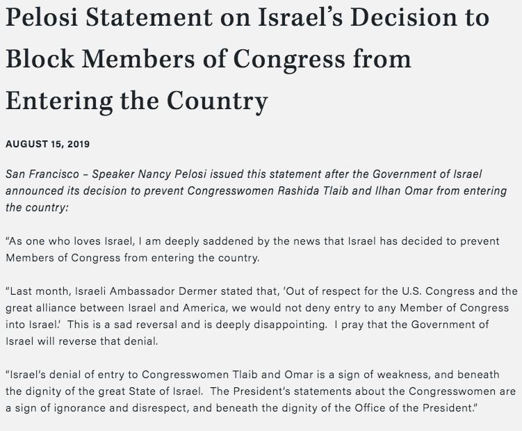
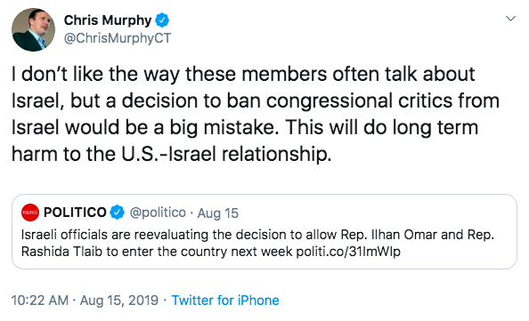

Congresswomen Rashida Tlaib and Ilhan Omar recently held a press conference after being banned from entering Israel and the West Bank. In her opening statement, Omar stated that their intended trip had been planned in order to "highlight the human cost of the occupation" by speaking not just with Palestinians, but also "to meet directly with members of the Knesset and Israeli security along with Palestinian civil society groups."She went on to note that" all the activities on my trip had been done by members of Congress in the past, including a nearly identical trip a few years ago led by the very same Palestinian organization leading this trip."

Tlaib then stepped up to the mic. She spoke emotionally about her experience traveling from the United States as a young woman to the occupied territories to visit her grandparents and family members. She recalled, holding back tears, watching her mother "go through dehumanizing checkpoints, even though she was a United States citizen and proud American." After reciting several other personal stories of how she and her family had been affected by the Israeli occupation, she iterated, once again, that the purpose of their trip was one of "exposing the truth the only way I know how...by humanizing the pain of oppression." She continued:

> "Our delegation trip included meetings with Israeli veterans who were forced to participate in military occupation. They also desperately want peace and self-determination for their Palestinian neighbors. They could have shed light into injustices of raids, shootings, demolitions, and child detention. The delegation would have seen first hand why walls are destructive, not productive."

Each of the Congresswomen's opening statements make abundantly clear why President Trump suggested that they be barred from entering Israel, as well as why Prime Minister Netanyahu acted upon his recommendation. The combination of their identity as Muslim women, their fame and notoriety as members of the high profile "Squad," and their mission as peacemakers and soothsayers committed to human dignity and international human rights, combine to pose a serious political threat to the nationalist, xenophobic agendas of both the Trump and Netanyahu governments.

What's less clear is why the Democratic Party has been so sheepish in its defense of its two freshmen members. While congressional leaders Nancy Pelosi and Chuck Schumer have both expressed their disappointment with this travel ban, they've both done so using the mildest, most conciliatory language possible, and neither of them have affirmed or validated the humanitarian mission of the trip in question. Their responses were as follows:

Worse yet was Senator Chris Murphy, who serves on the Foreign Relations Committee:

"I don't like the way these members often talk about Israel." Is that right? Well I'd be curious to get a response from Chris Murphy to the aforementioned press conference held a few days after he published this tweet. What does Chris Murphy make of Tlaib's personal testimony to the plight of her Palestinian family members? And what role does he feel Israel should play in mitigating the suffering that continues to this day as a result of their occupation and apartheid-like treatment of Palestinians in the occupied territories? We haven't gotten clarity on these matters from any Democratic leaders.

In fact, just yesterday, Jerry Nadler took to Twitter to once again browbeat Omar and Tlaib for sharing a supposedly anti-Semitic cartoon in which the two Congresswomen are shown being silenced by Trump and Netanyahu. The cartoon in question is listed below, followed by Nadler's response.

"Vile underlying message?" Why? Because it contains the Star of David? If it hadn't contained that imagery, could it have been said to have an "underlying message" of anti-Semitism? After all, Ilhan Omar and Rashida Tlaib *were*silenced by Donald Trump and Benjamin Netanyahu. That much is indisputable. So if the invocation of Jewish symbolism is the problem here, perhaps I, a Jewish man, should remind Jerry Nadler that Israel is a self-proclaimed Jewish state, and *insists*on being recognized as such. In Netanyahu's [own words](https://www.npr.org/2019/03/11/702264118/netanyahu-says-israel-is-nation-state-of-the-jewish-people-and-them-alone), Israel is "the national state, not of all its citizens, but only of the Jewish people."

And if that's their attitude, then it ought not come as a shock that Jewish imagery is invoked when critiquing their postures and policies. Furthermore, the sharing and forwarding of these images and messages by these two Muslim Congresswomen ought not invoke the wrath of the leadership of their own party, which, at every opportunity, flaunts its openness to diversity and multiculturalism. Rather, a party truly committed to these ideals should be fully and unequivocally supporting Rashida Tlaib and Ilhan Omar. Because the reality is that they *were*silenced, and they were silenced *by the self-proclaimed Jewish state.*Such an observation is not a statement of anti-Semitism, but simply a statement of fact. And if Israel and their allies are uncomfortable being spoken about in that way, then it is completely within Israel's ability to say that they are not an exclusively Jewish state, but rather a truly *democratic*one, and to treat all of their citizens in a way that reflects such a commitment to democratic ideals. Until then, they can spare us their indignation, and so can their staunchest allies in the Democratic Party.

This dilemma that Zionist Democrats find themselves in, stuck between Trump, Netanyahu, and the Squad, is just reward for their weakness and short-sightedness. You could argue that Bill Clinton is largely to blame for this trend, as he campaigned against George H.W. Bush from the *right*on the Israel-Palestine issue. Bush threatened to [withhold $10 billion](https://www.huffpost.com/entry/george-h-w-bush-last-president-to-get-tough-with-israel_n_5c06ac48e4b07aec5753418a) in loans from Israel if they didn't curb their settlement expansions. Clinton argued that Israel ought not be subject to such pressures, and it seems the Democratic Party has mostly adopted that attitude ever since.

Fast forward a bit to AIPAC's 2018 conference, where Chuck Schumer made headlines with this shockingly bigoted statement:

> "Of course, we say it's our land, the Torah says it, but they (Palestinians & Arabs) don't believe in the Torah. So that's the reason there is not peace."

You could easily dupe unsuspecting people into believing that those are the words of Netanyahu himself, not the Democratic Senate Minority Leader from New York. *In 2018.*

Setting aside how the party of "diversity" could elevate such cretins to its leadership positions in the first place, it's worth asking how a party so proud of its tolerance, inclusiveness, and worldliness could be caught so flat-footed in this current moment. Surely, Democrats understood the inevitability of people like Omar, a Somali refugee, and Tlaib, of Palestinian heritage, running for office, and winning, as Democrats. Surely they could have anticipated the ascent within their party of people with a different experience of Israeli policy. Perhaps they took for granted that when such people got elected, they'd have compromised themselves and their principles the way their Democratic predecessors have. I mean, historically, it's been a pretty safe assumption that Democrats would sell out in that way, so it's understandable that party leadership would expect such subservience from their incoming freshman class.

Unfortunately for them, Rashida Tlaib and Ilhan Omar have made it clear that's not how they roll. They have demonstrated a courage, a conviction, and a commitment to human rights that not only deserves, but commands, our complete and unwavering support. And we must demonstrate to their Democratic colleagues that we expect that same support from them. The party bosses' conundrum at this moment is the product of having taken an anti-democratic, anti-humanitarian position decades ago, and having grown all too comfortable with it. We should be grateful to Ilhan Omar and Rashida Tlaib for guiding them out of their comfort zones and onto the right side of history.
