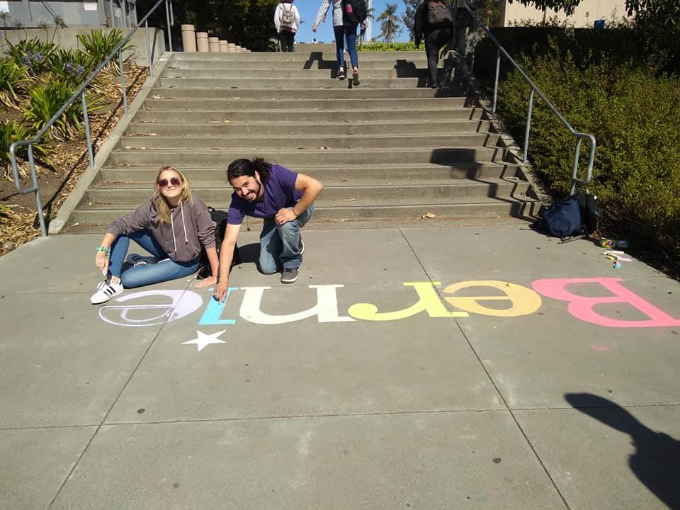
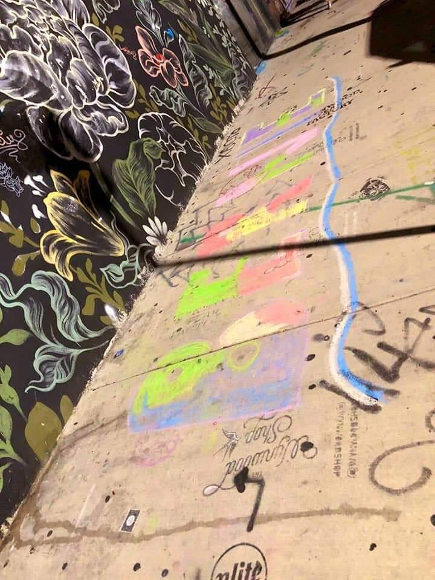
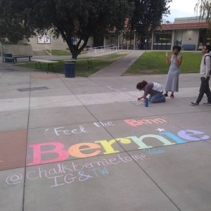
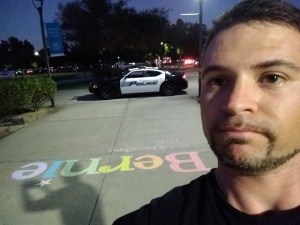
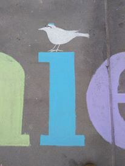
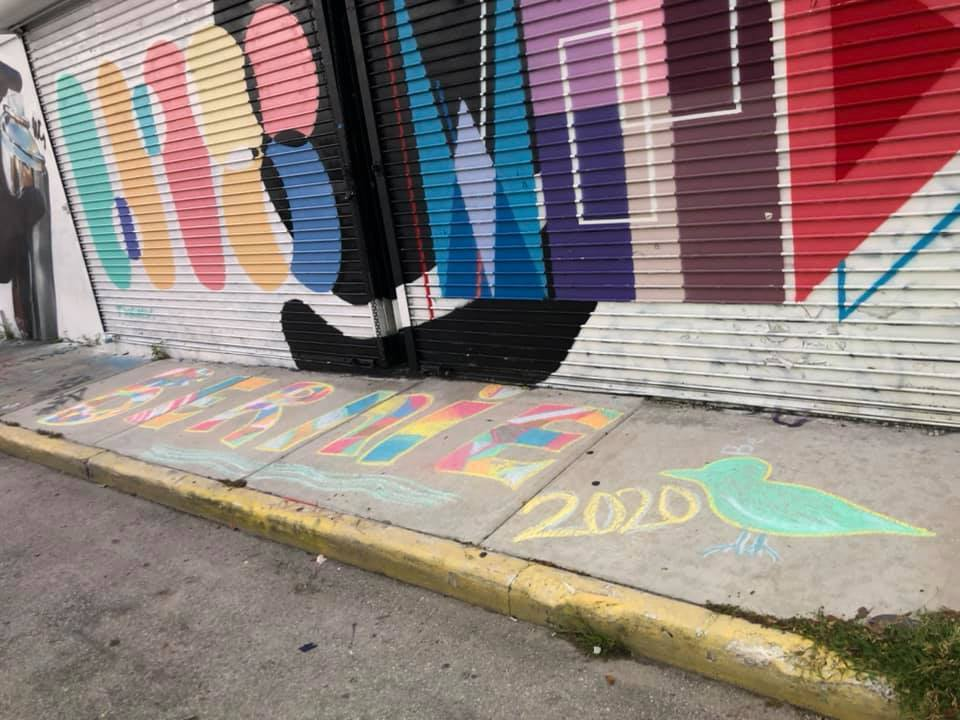

Yesterday I returned home after two weeks on the road, clocking in 2,300 miles. My trip had one purpose: to chalk Bernie's name at as many colleges as possible across California. I managed to make 45 Bernie chalks, which, on top of the 24 chalks I did prior to my trip, comes to a total of 69. At first my goal was 50, but now I'm well on my way to 100. Next week I will set out again. I don't plan to stop chalking until I'm physically unable to.

What sparked this ambitious project? Since March I've spent about 500 hours tabling for Bernie in Santa Cruz, California. When people see me tabling, they don't usually stop, but I get them thinking about Bernie. I start conversations. I inspire people with my self-sacrifice of sitting out on the street for hours on end. After all, the power is in the streets. It's an act of great humility, putting oneself completely at the mercy of the public, sitting in full confidence that Bernie is on the side of the people.

I've come to appreciate the importance of getting Bernie's name out in public, which is why I've pushed a visibility-centered grassroots strategy from the beginning. In the struggle to displace the hegemony of neoliberal ideology and bring about a new age of progressive hegemony, there are three main arenas of struggle: the mass media, social media, and physical space. The commanding heights of the mass media is thoroughly on the side of establishment interests, as Noam Chomsky proved in *Manufacturing Consent*. Social media, meanwhile, has been largely won by progressivism, despite all the establishment attempts to reel in its revolutionary potential through algorithms and outright censorship. The third arena is physical space, and this is the crucial battlefield where Bernie's revolutionary movement will win or lose.

The question is, how to win physical space for Bernie. The problem with tabling is that one cannot table continuously. Placing Bernie banners in prominent spots is effective, but it can be difficult getting the permission of property owners. What if I could have a continuous presence on the street? And not just be present in one place, but fifty places, or more, all at once? I found out, there's a way. Through the power of chalk.

")

My first chalks were in downtown Santa Cruz. They were well received, but were washed off within a day. Next, I decided to try the local community college, Cabrillo College. It was my best chalk yet and, much to my amazement, it lasted a week, then two weeks, then a month. The chalk was located in such a prominent place that it had surely been seen by a majority of the students. Just to think of all the conversations it had started, and to think how easy it would be to destroy my chalk with water, yet people had respected my artwork. They respected Bernie. It was surprising, but also made sense for an institution as working class as a community college. It seemed like a much more efficient form of activism than talking to people at my table. Such a humble medium as chalk, mere dust, seemed to be a material of revolutionary potential.

 

Seeing the revolutionary potential of chalk requires reassessing a lot of the mythology that drives grassroots activism. There is a tendency among activists to believe that one-on-one voter contact is supreme and there is no such thing as mass activism. There is a tendency to rely solely on forms of voter outreach that can be recorded and quantified. But this form of activism has an elitist aspect to it. It's based on the assumption that all voter contact should be mediated through a designated "activist" or "volunteer." And those who are volunteers have a tendency to be people who are retired or well-to-do, which excludes working class people who have no time for activism, yet are the people with the most intimate knowledge of our broken system. Chalking represents a philosophy of organizing that cuts out the middleman and places confidence directly in the working class. The idea is that the working class can figure out what its own interests are. We merely have to stimulate conversation among the people, and that can only result in raising working class consciousness. Chalking is the perfect catalyst for stimulating conversation among the people.

I wasn't sure that my chalk at the community college was making a difference until my friend, Alekz Londos, who had helped me fill it in, overheard a group of students walking by downtown discussing my chalk work. Of all the conversations he could have overheard, it seemed like confirmation from the universe that I was doing something important. It's then that I realized I needed to expand. Silicon Valley was closest, but why stop there? I started dreaming of a statewide chalking tour. My hope was that others would imitate me and I would spark a nationwide chalking movement, but I didn't see it happening. People were intimidated by my work and didn't feel they could replicate it. I felt a lot like Bernie, who really didn't want to run for president, but because no one else with progressive bona fides was stepping up to the plate, felt he had to.

I started looking for hosts and once I had a host lined up in Bakersfield and San Diego, I decided to set out. I figured that once I started my journey and promoted my project on social media, the movement would help me along the way, and that's exactly what happened. In two weeks, I did not spend one night in a hotel. I stayed with Bernie supporters. People who supported my project threw me gas money and I raised over $700, almost exactly enough to break even. This would only happen with a candidate with a grassroots movement behind them, and Bernie Sanders is clearly that candidate. Along the way I had three encounters with police who came close to citing me for vandalism. Yet if what I'm doing is criminal, the movement that has supported me and been fully complicit in my project must be criminal too. And then who are the laws for? Not the people.

Chalking is an essential part of the progressive movement because it shows that this is much more than an economic revolution against the billionaire class. It is, in fact, a cultural revolution, a rejection of the neoliberal culture that atomizes us, pits us against each other, and makes us believe that success must come at the expense of others. Chalk inspires people because of the great care that goes into it and because the result is vibrant and stunning. It demonstrates that Bernie is the only candidate who inspires artwork, and that has to count for something. The beauty is not only inspiring, but serves a practical protective purpose as well. I've witnessed a stumbling homeless man walk around my chalkwork, in addition to a group of twenty students, a breathtaking act of respect.

During my chalking journey, Rivan Canderin from the Arts and Culture team of the Bernie Sanders campaign reached out to me acknowledging my good work, and I prepared the following statement, which I think summarizes my project:

*"Chalking for Bernie is much more than a form of art. It is an expression of an outlook on life that aligns fully with everything Bernie's campaign represents. It's an understanding that true power is in the streets. It's a willingness to be completely down to earth. It's the courageousness to put oneself at the mercy of the public, to be completely vulnerable. It's the humility to get one's hands dirty. It's an act of placing trust in the people and honoring our right to determine our own destiny. Each chalk is a meditation on the self-sacrifice that Bernie makes every day to serve a higher self, the 'Not Me, Us."*
*Every Bernie chalk is a small revolution. It is a protest against the media's unfair coverage of a good man. To counteract the media's false narratives, we must make our support publicly visible. If the media gave Bernie fair coverage, it would not be necessary to chalk. But if the media gave Bernie fair coverage, this would not be a revolution. Every Bernie chalk shows the public that Bernie is the only candidate who inspires art, and the candidate that inspires art is the candidate that deserves to win. A revolution will only succeed if it's led from the heart.*
*Just as the power is in the streets, the chalk is in the streets. Hence, the power is in the chalk. Bernie does not complete the revolution. He only provides us the outlines. The people have to fill out the revolution. The only question is: will the people pick up the chalk?*
*The revolution will not be televised. It will be written in chalk. The chalk dust of the revolution will wash away, but the lines will be etched in the history of the people's liberation.*
*Pick up the chalk."*

If you support my project, the best thing you can do is imitate me. I don't want fame, I want to start a chalking revolution. I use Crayola sidewalk chalk from Staples. It's not as hard as it looks. I just make outlines of the letters and fill them in. The second best thing you can do is toss me some gas/chalk money at [paypal.me/chalkbernietome](https://www.paypal.me/chalkbernietome). It will help me chalk every corner of Northern California and the Central Valley. I'm only getting started.
