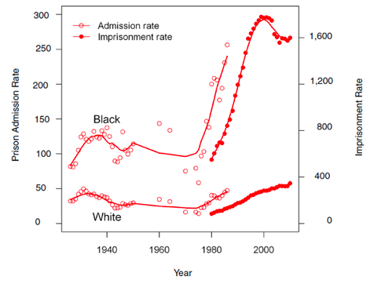

> "You are kept apart that you may be separately fleeced of your earnings. You are made to hate each other because upon that hatred is rested the keystone of the arch of financial despotism which enslaves you both."
> 
> -Tom Watson, Georgia Congressman, 1892

It's a strange time to be a white guy from the American underclass. In a moment when the cultural conversation is being defined by educated elites as one about the inordinate privilege of white people generally, and white men specifically, it puts poor white people in the very odd position of getting "called out" by folks who usually come from far more exalted backgrounds than themselves. It's kind of like if the villain from Karate Kid grew up to be a social justice warrior and started telling Ralph Macchio to check his privilege. What are you supposed to do with that? These richies have always been around, and they've always found reasons to look down on the working class, but in the past they at least had the decency to stay in their lane; if you weren't part of their world of sports cars as graduation presents and hefty donations securing their slots at Ivy League schools, you didn't hear from them much. You drank beer on the corner, while they drank cocktails in Daddy's den, and rarely did the twain meet. Sure, a few daughters of the suburbs, usually the ones with particularly aloof fathers, would make their way to your part of town looking for someone to play Patrick Swayze to their Jennifer Gray, but they never stuck around long. For this new generation of rich white kids though, economic privilege just wasn't enough. Now they want to virtue signal too.

The thing is, a poor white person and a poor person of color have a lot more in common in the kinds of experiences they're likely to have, and the kinds of attitudes and values they're going to cultivate as a result, than either one of them do with someone in the upper 20% of income distribution. Understanding society as a thing that's been designed to keep you and yours down, seeing the police as enforcers of an unfair system, and the cultivation of a reputation for generosity and reliability among your own, (cuz when you can't buy your way out of trouble, you never know when you're going to need help from your network), are attitudes that all poor communities hold in common. I've always related to the people I've met in jail a lot better than I ever have to the people I've met in college. Because of systemic racism, I've usually been the lone white dude in the cell on those occasions, and I am not in any way suggesting that POC don't face a huge, glaring, extra obstacle that poor whites don't. But I am suggesting that class has more to do with your way of seeing the world than race does, making any discussion of "white privilege" that treats white people as a monolith absurd in its contradictions. By way of example: a friend told me that white people don't have to code-switch. But if you get me drunk or angry, I sound like I just walked off the set of the Sopranos. That's my most natural way of speaking. Try getting taken seriously in a university setting speaking that way. When I went away to college, I had to suppress it. I've been code-switching since the day I left home. I still slip once in a while, dropping "Lookit ‘dis fuckin' guy ovah heyah," and such, in mixed company. I bet Michael Herriott, whose [great piece](https://www.theroot.com/pete-buttigieg-is-a-lying-mf-1840038708) on Pete Buttgieg went viral recently, could relate to that. I definitely related to his story of growing up the book smart kid from a poor neighborhood, who got to go to college. Yet, Herriott describes himself as an expert in "whypipology," as if those kinds of experiences are exclusive to POC. I don't know what to do with that either. When everyone wants to deny the reality of your experience, because it doesn't fit neatly into their preferred narratives about race and class, it can feel like your entire identity is being erased in service to a narrative.

But all 'whypipology' aside, I've never actually had a working-class POC accuse me of white privilege, probably because people from the lower-classes have a certain way of handling themselves that's easy to spot if you know the vocabulary. I've only ever heard that from other white people, all of whom had it a lot better than I did growing up. That's because being naïve is a privilege. So's being an asshole. Poor people can't afford either, so they usually size up who they're dealing with based on their actions and aren't all that quick to jump to conclusions. When you don't have money, relationships are your most valuable resource. There's no reason to write off a potential ally in a world that's stacked against you, until you get a sense of who they are and what they're made of. When poor people say "ally" they don't mean a straight person who marches in the gay pride parade to show their solidarity. They mean someone you can call at 3AM from central booking to be there in the morning with your bail. ‘Cause when you're poor, those things happen. And when they do, you'd better hope someone out there owes you a favor.

Aside from the deflection from their own class privilege that drives wealthy virtue-signaling white people, the phenomena is actually just a new twist on something that's as old as the country; the cultivation of resentment and mistrust between poor whites and poor blacks, in order to keep them from uniting. In the past this was always done from the white side, meaning it was the poor white people who were flattered and exalted by society's elites, by way of keeping them from making common cause with poor blacks, and indeed that tactic is alive and well on the political right. But that's not a tenable approach on the so-called "left," so instead, elites are exalting POC and denigrating poor whites, which, in the end, has the same effect of keeping them from getting together and fighting against their eternal common enemy: the rich.

There have been both white and black leaders who have attempted to challenge this divide and conquer strategy, from John Brown, to [Fred Hampton](https://truthout.org/articles/the-assassination-of-fred-hampton-47-years-later/), to [MLK.](https://www.theatlantic.com/politics/archive/2018/04/mlk-last-march/555953/) They all got whacked. Huey Newton, Kwame Torre, Louis Farrakhan; they all made it to a ripe old age, in spite of their fiery and often violent anti-white rhetoric. And Malcolm didn't get taken out until he re-evaluated his views on black separatism. Stoking racial resentment doesn't threaten to overturn the apple cart. It actually helps to maintain the status quo. But when you start trying to bridge racial divides by focusing on class solidarity, now that shit is dangerous. That's one of the reasons Bernie Sanders is so terrifying to the establishment. Old and white though he might be, his views on race and class are dangerously Marxist, and were he to become president, he's going to be talking a lot less about micro-aggressions, than he will be the macro-aggression to all non-wealthy people that is the capitalist system. They'd much rather have you talking about glass ceilings that people who start life in the basement are never going to encounter, and who is and isn't allowed to wear a kimono, than to develop a real class consciousness that brings the entire American underclass together under one banner.

So, does this mean we should ignore the reality of "white privilege?" No, of course it doesn't. I lived in Harlem throughout most of the Bloomberg administration, and I never got stopped-and-frisked once. That honor was reserved for black men on my block, who I would often see getting a pat down on the corner for no good reason at all. To live in a black neighborhood is to see up close and personal that the nightmare police state that only exists for white people in dystopian sci-fi films is the actual lived reality for much of the black population. When white people fret that Trump will bring fascism to America, what they really mean is that they're afraid Trump will bring fascism to them. Fascism is already here for POC, and always has been.

But woke virtue signaling isn't going to solve these problems. If it could, they'd have already been largely solved, or at least ameliorated, by now. Since the 50's, we've gone from 'negro', to 'black', to 'African-American', and back to 'black', and through it all, the actual [economic conditions](https://www.epi.org/publication/50-years-after-the-kerner-commission/) of blacks in America have barely budged, and actually worsened in some areas, over the past 50 years. Given that the [incarceration rate](https://www.nap.edu/read/18613/chapter/4#57) in the black community has increased 16x in that same period, largely as a result of the racially motivated ["war on drugs,"](https://www.businessinsider.com/nixon-adviser-ehrlichman-anti-left-anti-black-war-on-drugs-2019-7) you could make the case that things are worse today in some respects than they were 50 years ago.

If language policing and feel-good symbolism had any meaningful real-world impact, why would that be the case? And if rich white people really cared about the underlying causes of poverty, wouldn't they be spending more time freaking out about the fact that we've [re-created slavery](https://www.huffpost.com/entry/prison-strike-modern-day-slavery_n_5b857777e4b0511db3d21da8) by a different name through the carceral state, and less time trying to cancel people on Twitter? The truth is, they really don't give a fuck about POC, and they never have. They only care about preserving their privileges and feeling good about themselves while they do it. POC are used simply as props, in order to deflect attention away from any examination of an economic system that favors those who already have over those who have never had and, in all likelihood, never will have.

So, by all means, let's keep talking about "white privilege." It's real, and it's important. But lets not weaponize it, and most of all, let's not allow the concept to divide working people by race the way they always have been in America, going [all the way back](https://www.pbs.org/wgbh/aia/part1/1narr3.html) to indentured white servants and the black slaves they worked alongside from the earliest days of the colonies. Let's always consider the realities of class and how much impact it has on outcomes and opportunities for people of all backgrounds. And lets not forget that policies aimed at helping working people, like Medicare-for-All, a living wage, and free college, are going to benefit all of us. The struggle for those things must not be derailed as it has been so many times in the past, by internecine fighting over race. When that happens, the only people who benefit are the same wealthy elites that have been keeping us at each other's throats for the past 400 hundred years. It doesn't really make a difference if they're doing that by convincing white people that blacks are inferior, or if they're doing it by portraying all poor whites as ignorant racists; the end result is always the same. We waste our energies attacking each other, while nothing really changes. If we want to do something truly new in all of American history, we should try not to fall for it this time.
