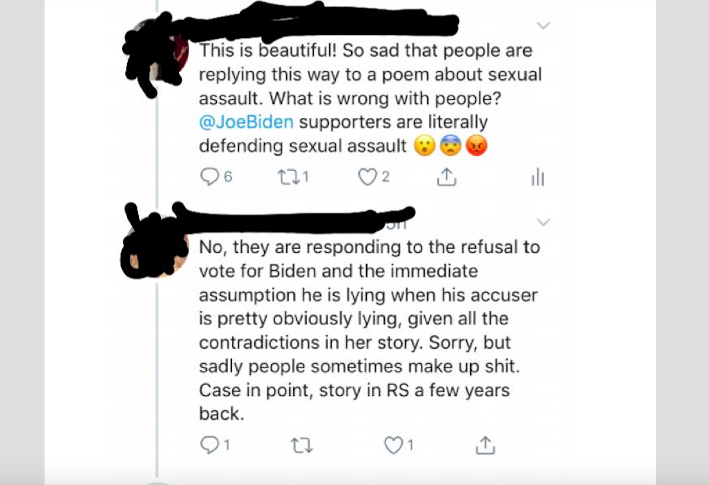
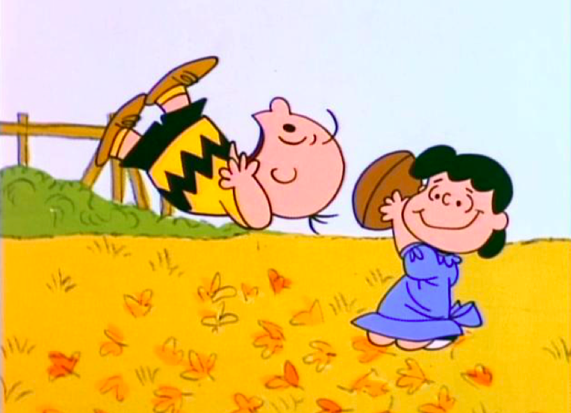

I've been a registered Democrat for my entire adult life, like my parents before me, and their parents before them (although my grandfather was of the "Nixon is just the one who got caught," school of thought on Watergate. In his defense, it was a pretty common take back then). But in this election cycle, I've reached a breaking point with the party and there's just no turning back. To riff on Groucho Marx's famous formulation, "I wouldn't belong to any club that would have someone like me as a member," I personally can't belong to any club that would have someone like Neera Tanden as a member. Are the Republicans worse? I guess it kind of depends on what your definition of 'worse' is.

I've always had a hard time with hypocrisy and elitism. And if those are the kinds of things that really put a bug up your ass, being a Democrat is going to feel kind of like taking a bath in ground glass. Its just a constant series of small cuts and big wounds that ultimately add up to unending psychic torment. What follows are a few specific examples of the kinds of things that have made me decide to join the plurality of voters who identify themselves as Independents.

### 1. What Do You Mean We're Responsible for Mass Incarceration? We Have Black Friends.

There was a time when Democrats were true allies to communities of color. That was a long time ago. Like, LBJ kinda long time ago. From the day that Bill Clinton chose to announce his candidacy at the Stone Mountain Correctional Facility, the actual birthplace of the KKK, with a group of [black prisoners posed behind him](https://jacobinmag.com/2016/09/stone-mountain-kkk-white-supremacy-simmons), lest anyone miss the message, the Democrats have been even more destructive to POC than the Republicans, in deed if not in rhetoric. This isn't because the GOP is more well-disposed to those communities; its because when the GOP proposes draconian anti-crime measures, the left organizes against them. But when those same policies originate with Democrats...crickets. It wasn't the Republicans who wrote a crime bill that incarcerated a generation of black men; it was soon to be nominee [Joe Biden](https://www.vox.com/policy-and-politics/2019/6/20/18677998/joe-biden-1994-crime-bill-law-mass-incarceration). And it wasn't a Republican President who signed it. It was Bill Clinton. Nor was it the Democrats who spearheaded the first [major piece of legislation](https://www.nytimes.com/2018/11/12/us/politics/prison-sentencing-criminal-justice-reform.html?rref=collection%2Fbyline%2Fnicholas-fandos&action=click&contentCollection=undefined&region=stream&module=stream_unit&version=latest&contentPlacement=1&pgtype=collection) aimed at undoing its insane sentencing guidelines. Jared Kushner did that. And the President who signed it? One Donald J. Trump. On race, the Democrats are kind of like the secretly gay preacher who runs a conversion therapy center. All that rainbow rhetoric is the perfect cover for a party that never hesitates to throw black and brown people under the bus, any time they think it can win them a few more white votes in the suburbs.

### 2. We Hate You and Everyone You've Ever Cared About. Now Vote Blue!

From Hillary's "deplorables" comments, to Taylor Swift's portrayal of rural voters as half-human, toothless mutants in [this video](https://www.youtube.com/watch?v=Dkk9gvTmCXY) (set in some kind of non-binary trailer park no less), to [this disgusting monologue](https://www.youtube.com/watch?time_continue=3&v=s0oeeXjyHiw&feature=emb_logo) from Bill Maher about how what red staters really want deep down is to be just like their more refined, coastal countrymen, the way Democrats think about pretty much everyone who isn't a white collar professional, is just gross. The genesis of this contempt is a battle that most modern Democrats don't even know occurred. Beginning in the 70's, the New Left, comprised mostly of college educated ex-hippies who couldn't find a factory floor if you dropped it in the middle of Woodstock, fought the traditional union base of the party for control, and ultimately triumphed with the election of Bill Clinton. The death blow was soon delivered by Clinton himself in the form of NAFTA, which broke the power of unions in America down to the present day, but its [real strategic purpose](https://www.theatlantic.com/politics/archive/2016/10/how-democrats-killed-their-populist-soul/504710/) was to break the power of unions within the party. An unintended consequence was that most of those union voters, who were the party's bread and butter, either fled to the Republicans, or stopped voting. That history, combined with the obvious contempt that Democrats have for most of their fellow citizens, are the real reason why they can't win an election for dog catcher in most places. And the condescending, smug, elitist cultural style that's accompanied that shift, is a huge part of the reason why a scion of the working class like myself, would rather put a spike through his forehead than spend another minute in a political party with these people.

### 3. Believe Women. When It's Convenient.

The supposedly pro-woman party covered for [accused rapist](https://www.buzzfeednews.com/article/katiejmbaker/juanita-broaddrick-wants-to-be-believed) Bill Clinton for twenty-five years, with [one feminist writer](https://www.newsbusters.org/blogs/nb/scott-whitlock/2018/07/21/week-media-bias-history-give-clinton-oral-sex-for-abortion-legal) even offering to break out the Presidential kneepads in appreciation for his service to the movement. This is just one example of how up is down, black is white, and outrage is always highly selective in the topsy-turvy world of Democrats and their virtue signaling. But never has that been more apparent than in the combination of shameless hypocrisy and ugly creativity that they're bringing to the task of dismissing Tara Reade's claims against Joe Biden. Scrolling through the Twitter threads of those who, a few short months ago, were demanding the head of Brett Kavanaugh on less evidence, is like reading the ecclesiastical treatise of a Medieval monk, dedicated to the question of whether or not an all-powerful God can make a stone that He himself cannot lift. The parsing, the equivocating, and most of all, the complete lack of self-awareness, are stunning to behold. Here's just one thread that pretty much catches the drift of it:

That these same people have spent years rightly convincing society that attacking women when they come forward with these stories is the absolute wrong thing to do, seems not to trouble them in the slightest as they blithely accuse Reade of being a liar, a flake, and (of course) an [agent of Moscow](https://medium.com/@eddiekrassenstein/evidence-casts-doubt-on-tara-reades-sexual-assault-allegations-of-joe-biden-e4cb3ee38460). Which brings us to...

### 4. So How Long Have You Been Working With Putin?

One of the most bizarre spectacles of the past several years, and there's some stiff competition for that title, has been the complete embrace by the so-called left of a neo-McCarthyism every bit as all-encompassing as anything you might have experienced at the height of the cold war. The real irony here is the fact that the figure of the Russophobic right-wing fanatic has been an object of both satire and fear for the left since the 50's. You would think if any people would understand the dangers of labelling everyone with whom they disagree as agents of Moscow, it would be the people who crowded into theaters to take in *Good Night and Good Luck* during the Bush years. But that hasn't prevented them from going full-on *Doctor Strangelove*, stopping just short of ranting about fluoride in the water. To add to the general strangeness of the thing, the intelligence agencies that have been long regarded with a deep and wholly justified suspicion on the left, have now been embraced as protectors and defenders of the nation's freedom. Criminal miscreants like John Brennan, best known for [lying](https://theintercept.com/2014/07/31/lying) to Congress about the NSA's bulk data collection program, and for also having overseen the CIA's hacking into Senate computers in order to cover up their torture programs, are being held up as heroic patriots. By the left! I mean, you just can't make this shit up.

 
### 5. I Heard It On the TV, So It Must Be True.

There's one institution in society that ranks even lower in public opinion polls than Congress, and only one: the media. It didn't used to be that way. In 1976, 72% of people expressed trust in the media. By 2019 that number had [fallen to 41%](https://news.gallup.com/poll/267047/americans-trust-mass-media-edges-down.aspx). For Republicans it's 15%. For Independents it's 36%. But there's one group that's been completely unmoved by the shift in the corporate media's business model over the past several decades from the neutral reporting of facts, to the providing of partisan fan service for their particular demographic niche. That group would be the Democrats, who continue to give the media a 69% approval rating. It doesn't seem to matter how many times the perfect storm of elite reporters practicing access journalism, corporate owners deeply invested in the status quo, and the overriding concern with ad revenue, leads to news coverage that ends up being disastrously wrong (WMD's, Trump's electability, the Mueller report); Democrats remain the most blindly loyal of corporate news consumers. And this is really the lynchpin of everything else we're discussing here-none of the other demonstrably false beliefs that Democrats hold near and dear to their hearts would survive one day of honest reporting. But that reporting never comes, and so they go on, year after year, adopting whatever opinions are presented to them as the "right" ones to have. As we saw in these primaries, this reality makes it quite impossible to develop any kind of meaningful left agenda within the party. No matter what you try to build with the Democrats, the media will always have a veto.

### 6. It's Not Personal. It's Strictly Business.

Wow. Just wow. What did we just witness? I mean, we always knew the party leadership cared more about beating Bernie Sanders than they ever cared about defeating Donald Trump, but at least Debbie Wasserman Schmuck had the courtesy to feign neutrality. But faced with the real prospect of a Sanders nomination, [Barack Obama](https://www.nbcnews.com/politics/2020-election/looking-obama-s-hidden-hand-candidate-coalescing-around-biden-n1147471) and the rest of the party hacks decided that the time for playing coy had passed. This wasn't just a threat to the nation a la Donald Trump, this was something far, far worse: a threat to their sinecures. That simply could not stand, even if their *Godfather* baptism scene approach to the problem was bound to so utterly alienate the 70% of voters under 45 who had supported Sanders in the primaries, that it would virtually guarantee Trump's reelection. Fuck it. Gotta keep those checks rolling in, and the people who write them don't dig universal health care.

### 7. It's Not Dementia, It's Just A Stutter With Racist Leanings.

And this is where all these other threads come together in one big, Orwellian mindfuck. It's one thing for party elites to throw all pretense to the wind and straight out order their voters to line up behind someone who's about two years away from an all applesauce diet. It's quite another for those voters to acquiesce. And it's another still for those same voters to find their way clear to doing so, by internalizing whatever narratives the party offers them, however absurd, that will allow them to reconcile their support for Joe Biden with the reality of Joe Biden. That dementia that [everyone](https://theintercept.com/2020/03/09/it-was-democrats-and-their-media-allies-who-impugned-bidens-cognitive-fitness-yet-now-feign-outrage/?comments=1) from Corey Booker to Andrea Mitchell was discussing openly as of five minutes ago? It's just a stutter, and anyone who tells you otherwise is an ableist monster. Campaign trail chestnuts like, "Poor kids are just as smart as white kids," and suggesting that black parents want help, but simply, "don't know what to do?" [All gaffes](https://www.rollingstone.com/politics/political-commentary/drop-out-joe-biden-democratic-primary-884047/). Kind of lovable, really, ol' Joe, and his offhandedly racist verbal diarrhea. His record? "Donald Trump." Lying constantly about that record? "Donald Trump." Sexual assault? "Lies. And also, Donald Trump." I ask you, has there ever been a more mindless group of voters in the history of this, or any other Republic, going all the way back to ancient Greece? I know, I know, the FOX folks. But you know what? Those people nominated Donald Trump against all council from their media figures and the leadership of their party. Is that because the GOP base had more points of agreement with Donald Trump than Democrats did with Bernie Sanders? Not at all; on [every major issue](https://www.newsweek.com/2020-democratic-primary-bernie-sanders-polls-policies-democratic-socialism-1469949), from climate, to health care, to the economy, Sanders was the most trusted candidate in the field. And yet when the same people who told them that Hillary had a lock on the presidency, signaled that the best way to win in 2020 would be to walk into a voting booth and nominate a sundowning old warmonger with whom they didn't particularly agree on any subject, that's exactly what they did. The Democrats have thus managed to outshine the right wing in their unequalled capacity to swallow bullshit, if not in their ability to win elections.

And finally...

### 8. Whoopi Goldberg

I just can't even... It's one thing for someone who's never seen the inside of a housing project to grow up to be this much of an asshole, but seriously, WTF, Whoopi? I can't even watch TNG anymore because of you. But it's not the ravings of one *now that I got this money, I'm gonna pretend I don't know what's up*, actress that matters. It's the fact that for the most part, Democrats find those ravings sensible.

Needless to say, eight is an arbitrary number, picked more for brevity than lack of material. I could write a book about the Lucy and the Football experience that trying to reform the Democratic Party from within has turned out to be for so many.

I've deliberately chosen not to argue one way or the other on the question of how to vote in November. My only suggestion would be that if you don't live in a swing state, there's absolutely no reason to endorse this farce with your vote. If you do live in one, that's a tough moral conundrum, and as a New Yorker, I don't envy you the choice you're going to have to make. Take some comfort in the fact that the air is crackling right now with more energy for a Third Party than there's been since the Gilded Age, so with any luck this will be the last election in which, to borrow a phrase from Krystal Ball, "shoot me/stab me," are your only choices.
