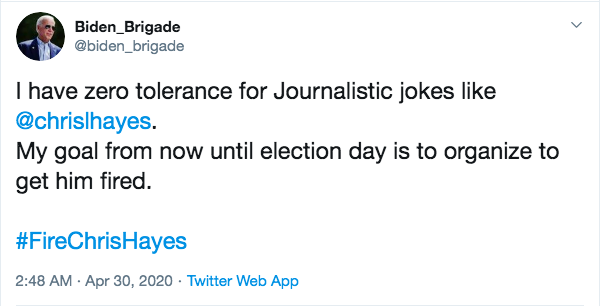
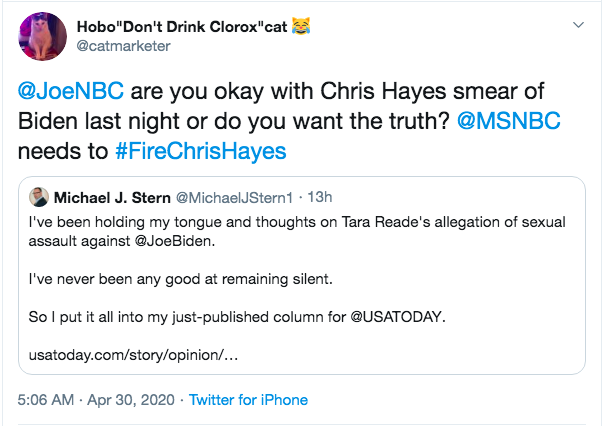
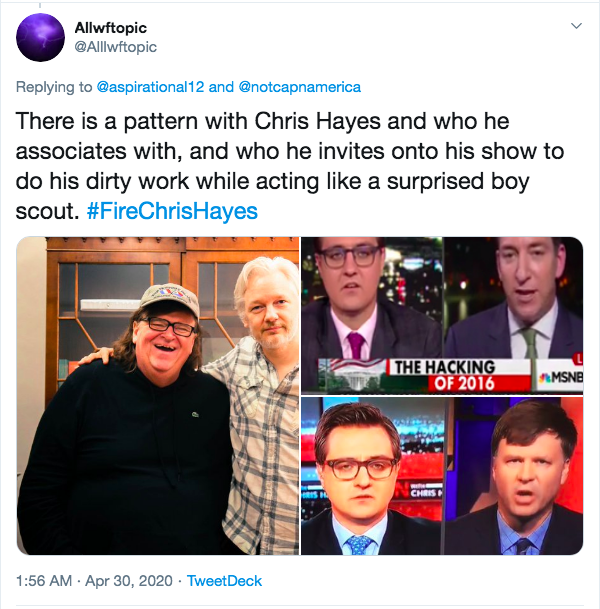
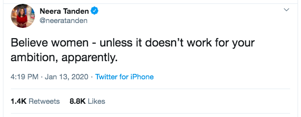

Chris Hayes is one of the more honest and insightful MSNBC commentators, which is akin to saying Bobby Baccalieri is one of the kinder, gentler members of the Sopranos crew. Bobby 'Bacala,' as he was called, had never personally whacked anyone until well into the show's final season (and even when he was called upon to do so by an increasingly sociopathic Tony, he was hesitant to go through with it), but he was nonetheless a willing profiteer in a criminal enterprise. Hayes, in holding down a primetime slot for a 'round the clock propaganda network like MSNBC, is no more innocent than Bobby (proportionally speaking, of course). He could get a real job and make an honest living at an outlet like *The Nation*, where he once wrote, but he knows TV is far more profitable, and conveniently, Comcast's blood money gets transmitted via direct deposit; no briefcases or duffle bags necessary.

Last night, however, Hayes did a little freelancing. He opened up his own shop, and went against the family. He *dared* to honestly cover the sexual assault allegations of Tara Reade against presumptive Democratic nominee Joe Biden. He said the following:

> "There have been moments...when we have heard accusations against someone that we find ourselves desperately wanting not to believe. Whether that is because we have some personal admiration for the individual or their work, or political admiration, someone on our quote-unquote side. Part of the difficult lesson of the #MeToo era is not that every accusation is true, and everything should be believed on its face, but that you do have to fight yourself when you feel that impulse. You have to do that in order to take seriously what is being alleged, what the evidence is, and to evaluate it. And that is the case with the accusation by a woman named Tara Reade against Joe Biden."

He continued by narrating a timeline of events and accounts that those of us not brainwashed enough to be watching his show in the first place are already familiar with, because they've been covered extensively at this point throughout not just independent media, but in outlets like *[The New York Times](https://www.huffpost.com/entry/new-york-times-joe-biden-tara-reade_n_5ea98a86c5b6fb98a2b6081e)* and *[The Washington Post](https://www.washingtonpost.com/opinions/the-new-tara-reade-revelations-make-it-imperative-that-biden-address-the-allegations-directly/2020/04/29/1d2f8e74-8a58-11ea-8ac1-bfb250876b7a_story.html)* as well. He recounted Reade's original claims of harassment, followed by the alleged assault, as well as the Biden camp's vehement denials of said accusations. He then mentioned the the ["new development in the story,"](https://www.businessinsider.com/former-neighbor-corroborates-joe-bidens-accuser-2020-4) an on-the-record statement by Tara's former neighbor recounting that Tara had in fact told her of the assault back in 1995 or 1996, shortly after it allegedly happened. He then went on to confirm that his own network had done their due diligence by confirming this for themselves. He said:

> "NBC News reached out to Reade's neighbor, who later confirmed, by text message, the story. This on-the-record reporting from a neighbor, [a] roughly contemporaneous relaying of the story, has rightly occasioned a new round of coverage and scrutiny."

Within minutes, #FireChrisHayes was trending on Twitter. Here's just a tiny sample of the discourse:

Pretty ridiculous, yes, but at least he hasn't been Russified yet - oh, wait:

One user thought to checkmate Chris Hayes by pointing out that from time to time he has interacted with the likes of Michael Moore, Julian Assange, Glenn Greenwald, and Ryan Grim; you know, *journalists.*

All this, not for saying Joe Biden is guilty, or should withdraw his candidacy, or anything of the sort. Hayes' great crime was the mere *mentioning* of Tara Reade's name without either dismissing her story or smearing her character. His point about #MeToo being a wake-up call for all of us to have the courage to hold even our friends and allies accountable for their actions is about as simple and obvious as could be, yet it apparently eludes his audience of sophisticated, woke, cosmopolitan, card carrying members of the liberal intelligentsia.

I use the word "apparently" very specifically in this case, because it's impossible to know for sure the percentage of Hayes' audience whose outrage over his reporting is sincere versus those who know better and whose Twitter tantrums are expressions of their own guilty conscience. I suppose the latter is the more contemptible group, but really, they're both more or less the same. Because on a whole, their rage at Chris Hayes for doing the bare minimum that a primetime political news anchor with any credibility would do in this case, reveals their clique to be the fraud it's always been.

The entire #resistance phenomenon was phony from day one. In fact, it was phony from *before*day one, if you consider "day one" to be November 9, 2016. The #resistance was really just the post-election incarnation of the Hillary Clinton campaign. [Neera Tanden and the Center for American Progress](https://www.politico.com/story/2016/12/center-american-progress-tanden-trump-232667) would be its thought leaders. It would emphasize [pragmatism and a restoration of normalcy](https://www.theglobeandmail.com/opinion/article-the-resistance-to-donald-trump-is-not-what-you-think/) over a more ambitious progressive agenda. It would tout its support from the same [Never Trump neocon Republicans](https://theoutline.com/post/5973/meet-the-resistance-grifters?zd=1&zi=cxi2y7kj) like David Frum, Nicole Wallace, Bill Kristol, and others.

Most importantly, though, the #resistance is a continuation of the 2016 Clinton campaign's ["Pied Piper"](https://www.politico.com/magazine/story/2016/11/hillary-clinton-2016-donald-trump-214428) strategy, which sought to elevate Donald Trump in the Republican primaries. The easiest and most common explanation for this tactic is that Team HRC thought Trump would be the easiest opponent to beat in the general election, and therefore hoped he'd win the nomination so they'd get to run against a weak opponent. That obviously backfired, but that was only one element of the pied piper strategy. The other benefit of running against Trump, both then *and*now, is that Trump allows them to play fast and loose with their own moral convictions, because they trust that no matter their shortcomings in that department, they will always have the ability to invoke the name of Donald Trump, and thus appear righteous and virtuous by comparison. By elevating someone so overtly grotesque and appalling, and constantly decrying his numerous offenses, they're giving themselves license to be immoral, so long as they can still claim to be less so than the man himself.

Trump is a human Get Out of Jail Free card they've printed for themselves, which they feel relieves them of their obligation to pass a robust progressive policy agenda. Because Trump wants to repeal the ACA and essentially abolish the EPA, and they oppose such draconian actions, they have no moral imperative to pass Medicare for All or a Green New Deal. Because Trump appointed the odious Betsy Devos as Secretary of Education, the simple act of replacing her is an adequate stand-in for actual education policy like tuition free college and student debt forgiveness. The wine-track professional-managerial class voters who largely make up the #resistance are complicit in this cowardice, as they themselves take comfort in the idea that letting the peasants keep their Bronze Plan is as far as they need to go when it comes to expanding access to healthcare. Their taxes weren't oppressively high when the United States was part of the Paris Climate Agreement, so, whatever the hell that is, if we just re-enter it, they'll be satisfied that they're good enough stewards of the environment, and their lifestyles won't be much, if at all, affected. And they worked their way through college (when it was much cheaper) and paid off their debt (when wages went a lot further and cost of living was a lot lower), so giving everyone free tuition seems unnecessary, or even a little "extreme." They're willing to, as [Elizabeth Warren suggested](https://www.washingtontimes.com/news/2020/jan/30/elizabeth-warren-vows-transgender-child-must-appro/), let a transgender teenager vet Devos' replacement, and that's good enough for them.

The same moral flexibility they've given themselves in the policy realm can also be applied, perhaps even more so, to the personal behavior of those entrusted to protect and prop up the centrist, austerity-lite agenda they've embraced. When it comes to the allegations against Joe Biden, the problem it creates for the #resistance isn't simply that Biden is a Democrat, but that he's their kind of Democrat. If such allegations had been leveled against Bernie Sanders while he was still in the race, there's no doubt whatsoever they'd have been touting their support for his accuser and demanding he end his campaign. If you want evidence for this, I refer you to [mid-January](https://www.cnn.com/2020/01/13/politics/bernie-sanders-elizabeth-warren-meeting/index.html), when CNN broke the story, in big, bold type on its home page, that Bernie Sanders allegedly told Elizabeth Warren that he didn't think a woman could win the presidency. Not only was the corporate media quick to run with this narrative, but Neera Tanden herself tweeted the following in response to those who questioned Warren's claims:

So their first priority, obviously, is to defeat progressives, because even setting aside that our agenda is a threat to their material wealth, our very presence in the political arena punctures the moral cover they've created for themselves by spinning a version of reality in which Donald Trump is the source of all evil, and simple opposition to him is all that's required for salvation. After all, retweeting Alyssa Milano is a lot easier than a camel passing through the eye of a needle.

Once we lefties are out of the way, their work is essentially done, because they're now competing for the moral high ground against someone they know can never take it from them, and therefore, they're free to conduct themselves with impunity, both personally and politically. Because Trump is evil, and they're the only ones (the #resistance), along with their chosen candidate (Joe Biden), standing between us and another four years of a Trump presidency, they make the case that any and all opposition to them is actually in service of a greater evil, because by tearing them down, we're elevating Trump. What they don't tell you, of course, is that they're the ones who elevated Trump in the first place, and that they've repeatedly and ruthlessly undermined any robust political movement that could actually prosecute a moral case against him with any credibility.

Chris Hayes is more or less in on this scam, which is why they feel so betrayed that he's defied them, even as meagerly as he has. By reminding them of the supposed "lessons of the #MeToo era," he's committed the grave offense of holding the #resistance to a moral standard higher than the one they've set for themselves: Donald Trump. There's not as much room to maneuver in that space, and so it's understandable that they would lash out like the cornered animals they are by calling for him to be fired, which is quite ironic behavior for a group of people who freaked out over Trump's [revocation of Jim Acosta's press pass.](https://www.google.com/search?sxsrf=ALeKk029bVwHyQ1aPEwZcgjmcXKljuNY0Q%3A1588276758456&source=hp&ei=Fi6rXpaqGei2ggeo76mQDQ&q=jim+acosta+press+credentials&oq=jim+acosta+press+credentials&gs_lcp=CgZwc3ktYWIQAzICCAA6BAgjECc6BQgAEJECOgUIABCDAToKCAAQkQIQRhD5AToECAAQQzoECAAQCjoHCAAQFBCHAjoGCAAQFhAeUNkCWMCXOWDOmDloAXAAeACAAagBiAGCHJIBBTIzLjEzmAEAoAEBqgEHZ3dzLXdpeg&sclient=psy-ab&ved=0ahUKEwiWjfb_95DpAhVom-AKHah3CtIQ4dUDCAk&uact=5)

So you see, this is all of apiece. The #resistance is one big fraud from top to bottom. From the network executives at MSNBC all the way down to the viewers; from the Center of American Progress brain trust to the last person on their email list; from Joe Biden himself to the rank and file blue no matter who voters. This of course isn't to say that every person involved is of ill will; many of them aren't. But the entity itself, on a whole, is one big fake. The #FireChrisHayes campaign proves so beyond any doubt.

**Photo: All-In With Chris Hayes**
