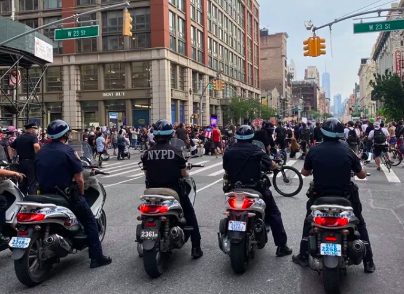
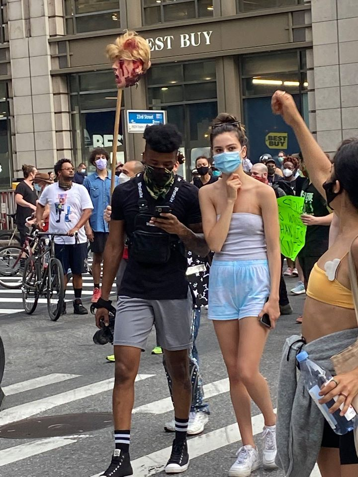
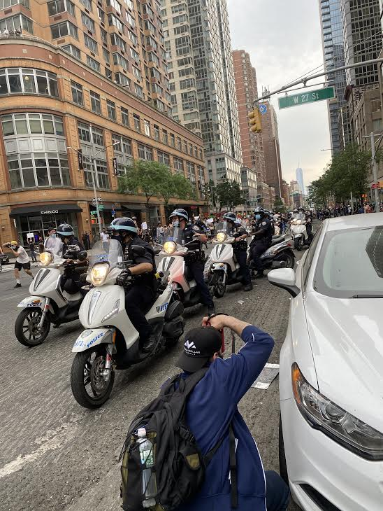
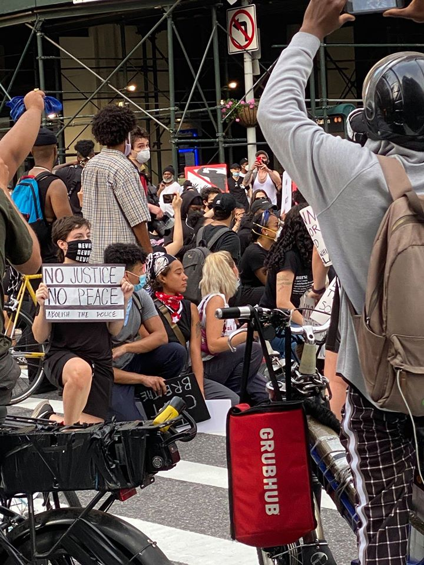
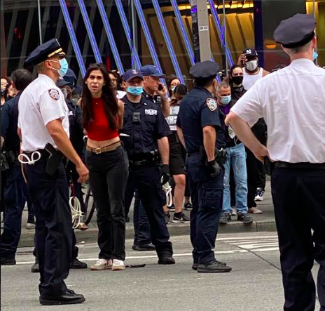
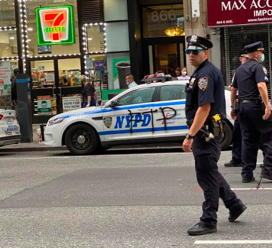
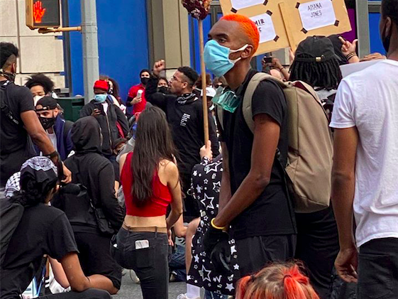

> "Which side are you on boys?
> Which side are you on?
> Which side are you on boys?
> Which side are you on?"
> -Pete Seeger
> "The Hamptons are not a defensible position. The Hamptons are on a low-lying beach. Eventually the people will come for you." 
> 
> -Mark Blyth

I had a bike accident right at the beginning of the pandemic. Between the destruction of my bike and physical injuries that were probably worthy of a trip to the hospital, under circumstances where one could go to the hospital without risking the plague, I haven't been off my block in almost three months. More or less fully recovered now (there are still things moving around near my shoulder blade that aren't supposed to move, but I'm not going to quit being a prime example of why men die younger at this late date, so fuck it), I finally got my bike fixed, headed downtown, and tried to do what I used to do before it all went to hell. I blasted the kind of dumb joy classic pop on my iPhone that I favor for workouts. I got an ice cream cone just because for the first time since March, I could.

It wasn't normal - the boarded up storefronts, the empty streets, the almost-non-existent- for-Manhattan traffic - but it was the most fun I'd had in awhile. Then reality came along and screwed it all up, as it will.

Coming up 6th Avenue, I saw a crowd at 23rd Street. *What the fuck is this,* I thought. *This is New York. We aren't the anti-lockdown protest types.* But it wasn't that kind of protest. Coming closer I saw the signs. *Can You Hear Us. Stop Police Violence. Fuck the Police*. One listed the names of the dead. Donald Trump's head sat on a spike above the crowd.

The NYPD were lined up on scooters, maintaining a little distance, clearly under orders not to make things worse. There wasn't a pussy hat or a hashtag resistance symbol in sight. It wasn't that kind of party. This was the kind of party where the protestors walk up to the police and try to talk them out of their duties on the grounds that they're propping up a failed, racist system. It was a common tactic in the 60's, but we haven't seen people confront authority this way outside the obligatory boomer nostalgia doc in two generations. At least not these people. They were neither the kind of hardcore lefties who would pay their own way to [Standing Rock to get doused by water cannons](https://www.theguardian.com/us-news/2016/nov/29/standing-rock-protest-north-dakota-shutdown-evacuation) in sub-zero temperatures while the nation goes about its indifferent consumerist business, nor were they looking for the easy virtue-signaling win. This was a new silent majority at the end of its rope and ready to break shit. It was the majority of younger Americans who have been screaming at the top of their lungs for most of their lives about racism, about climate change, about student loans, and about inequality, coming to the realization that elections aren't going to solve any of it. They don't watch MSNBC, and they know Joe Biden is only the lesser of two racists. The kind with black friends. And they have fucking had it.

"I can't wait until you pigs get what's coming to you. This is just day one motherfuckers," from a clean-cut white guy. "The police are here. White people in front," screamed a black man in a knit cap. "NYPD suck my dick," the crowd chanted in unison. All this as the mostly white cops repeatedly attempted to stop them from going any further up 6th Ave by lining up their scooters in the road. And each time the protestors walked right through them and around them. Retreating, they would make another attempt on the next block. And every time they were met by curses, chants, and a palpable desire for physical confrontation. But they followed their orders, not doing anything that would make headlines, until the crowd finally dispersed on its own around Macy's.

Like the man said, this was only day one. Over the weekend, New York followed the lead of other cities nationwide, with protestors breaking out windows, looting stores, and lighting cop cars on fire. Banks and high-end retailers were a [favorite target for vandalism](https://www.cnbc.com/2020/05/31/photos-new-york-city-the-morning-after-it-erupted-in-protests.html). Orders or no orders, [the police responded](https://www.nbcnewyork.com/news/local/nyc-protests-continue-saturday-following-night-of-arrests-violent-clashes-with-police/2439492/) by trying to run people over in Brooklyn and issuing hundreds of arrests. The relationship between New York mayors and the NYPD has always resembled the one Roman Emperors had with their legions. Knowing that their power is tenuous and dependent on the good will of the troops, they run for office as reformers, and end up as staunch defenders of the department's privileges. Hence [Mayor DeBlasio's quick defense of crowd control by SUV](https://www.nbcnews.com/news/us-news/new-york-mayor-bill-de-blasio-defends-police-after-video-n1220246).

A lot of people have seen this coming for a long time, and not just on the left. We've had at least [one billionaire warning his fellow 1 percenters](https://www.politico.com/magazine/story/2014/06/the-pitchforks-are-coming-for-us-plutocrats-108014) of the impending pitchfork mobs for years now. And the Scottish-American political scientist, [Mark Blyth](https://www.youtube.com/watch?v=nwK0jeJ8wxg&feature=emb_logo), has wryly advised that the "Hamptons is not a defensible position," without being taken very seriously by those who continue to vacation there without any apparent fear that hordes of the economically dispossessed might just descend on them one of these idyllic summers. But you know nerves are getting frayed when *The New York Times* starts running [articles that don't entirely miss the point](https://www.nytimes.com/2020/05/29/opinion/george-floyd-protests-minneapolis.html?fbclid=IwAR3u4s6Ydgt20Arglvt8tlG41ENoyM4yHhWVB5xJ0X_Xbk-jLKfyaevC68s), and CNN looking for a hot take, bypasses the usual cadre of Congressional Black Caucus members, in favor of [Cornel West](https://www.realclearpolitics.com/video/2020/05/29/cornel_west_america_is_a_failed_social_experiment_neoliberal_wing_of_democratic_party_must_be_fought.html?fbclid=IwAR1rIx0eLArTQRuuQ3_tjPK1gsmY6RVJHo2We7vHY8-aZ8luIo5mJvSTehc), who predictably took the opportunity to call out neoliberal Democrats from within their own stronghold. It's no accident that [CNN headquarters was targeted](https://www.thedailybeast.com/furious-demonstrators-swarm-cnn-center-in-atlanta-during-protest-of-george-floyds-death) by protestors in Atlanta. If Jeff Bezos has any sense, he's on the phone with Blackrock right now, hiring as many mercenaries to stand around the perimeter of WaPo's offices as he can get his filthy hands on.

The police execution of George Floyd was the spark, but the kindling has been gathering for 400 years. If you're white, its only been 40, but you've also been conditioned by your previous experience of America to expect better than what you've been getting of late. By comparison to the black experience, what whites have been getting is still pretty good. But when good starts to mean the bare minimum of being able to leave your house without getting choked to death by the police, and even that starts to look dicey, some measure of disillusionment is to be expected. As usual, it will be the black community who will lead the way forward, just as the civil rights activism of the 50's and 60's served as the model for all the anti-Viet Nam, feminist, and gay rights protests that followed. And make no mistake, these protests are only the beginning. Pretty soon 30 million people are going to get kicked off unemployment in a country without jobs. The results are going make the [closing scenes of Joker](https://www.youtube.com/watch?v=NHi_8FGMObQ) look like Gandhi marching to the salt mines.

There's a lot of predictable hand-wringing right now about looting, vandalism and attacks on the police, as if those things are independent of the protests themselves, and exclusively the acts of "outside agitators." But even if, strictly speaking, there are people running off with flat screen TV's who don't have George Floyd at the forefront of their minds, what kind of society produces so many people who want to risk getting murdered by a notoriously trigger-happy national law enforcement regime, just to hang a 60" on their walls? Doesn't the fact that so many have responded to these protests as an opportunity to grab something while they can, say something about how many don't have anything at all? Would you leave your home in a riot for a TV? I wouldn't. But then, I already have one.

In the late 60's and early 70's they had a name for all this. They called it Tuesday. Or sometimes Wednesday. Occasionally Thursday. [That history](https://time.com/4501670/bombings-of-america-burrough/) has been largely suppressed, but in 1971 alone there were over 2,000 domestic bombings, on top of constant protests, riots, and college campus shut-downs. That's why you can't just buy dynamite anymore in a country where owning an AK-47 is seen as an inalienable right. Until the mid-70's, you could get it at any hardware store. And that's also why local police departments have been beefed up with tanks and all sorts of other military grade equipment over the past couple of decades. The state has seen this coming for awhile too.

Always working the comedy angle, Joe Biden has released a statement calling for an end to the looting and violence, without ever acknowledging the historical role he played in creating the carceral state that in part has inspired it. He also failed to mention all the pepper spraying, tear gassing, and random beatings that have been inflicted on even [peaceful protestors](https://www.vox.com/2020/5/31/21275994/police-violence-peaceful-protesters-images?fbclid=IwAR04KUBUyB-lEjRYdveKnXbdaoF_bEJE4cqe-aKgDo3Z96OzcOLUPkWWd2Y). Nor did he bring up the somewhat ironic [arrest of a CNN journalist](https://www.cnn.com/2020/05/29/us/minneapolis-cnn-crew-arrested/index.html) along with his crew. It's unlikely that he ever will. On the corporate looting of the nation that has taken place over the past several decades, on a far wider and more devastating scale than a few improvised raids on chain outlets could ever hope to match, most recently in the package of tax cuts and bail outs contained in the two pandemic relief bills, he has nothing to say. And the possibility that the way the Democratic Party propped him up to stop a more progressive candidate from securing the nomination may have played some role in turning the young towards extra-political means of redress, is not entertained in his philosophy.

Joe Biden didn't consider any of this because he is far too much a product of the forces that have brought us to this moment, for him to even begin to understand its nuances. He's still defending the crime bill he co-authored with segregationists. He's still reassuring his wealthy donors that nothing will fundamentally change for them under his administration, even as that decision increasingly slips out of the hands of the Washington establishment that he represents. Biden is as qualified to meet this moment as Donald Trump is to form a truth and reconciliation committee. His candidacy is a farce that might be funny if the stakes weren't quite so high.

And what does it say about a Democratic Party that styles itself the champion of the downtrodden that so many of its leading candidates in this cycle have such highly problematic histories in office that it's complicating Biden's search for a VP? Buttigieg, Harris, and Klobuchar have all repeatedly stomped on black citizens in order to appease the racial anxieties of their white constituents. It's no accident that Amy Cooper was a Buttigieg fan. The corporate media has covered for these "lock ‘em up" Democrats time and again, but too many people are seeing them clearly now for that to work anymore on any but their most out of touch consumers.

These are the desperate tactics of a dying aristocracy finally being confronted with the rage of their subjects. Eventually, when all other methods fail, as they seem bound to do, the gloves will come off along with the mask and the true violence of the state will be revealed for all to see. At which point people will be forced to choose a side.

Choose well.
