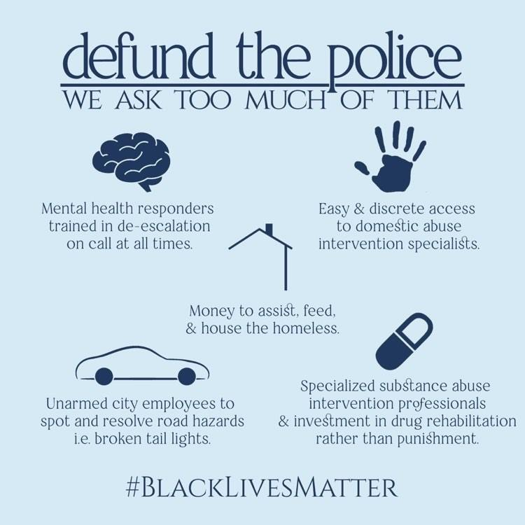
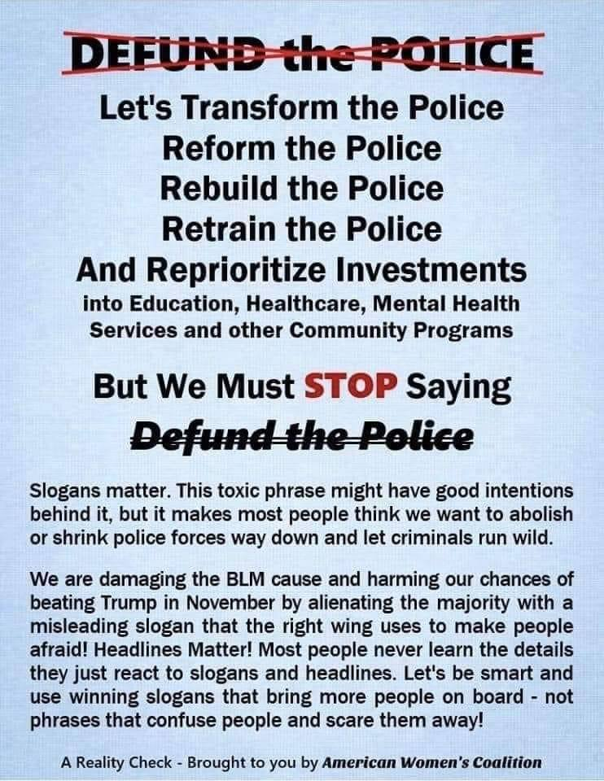

Polling indicates that [74% of Americans](https://abcnews.go.com/Politics/74-americans-view-george-floyds-death-underlying-racial/story?id=71074422) believe that George Floyd's death is a symptom of a broader, systemic racial injustice. In a separate poll, that same percentage [support the massive protest movement](https://www.forbes.com/sites/lisettevoytko/2020/06/09/74-of-americans-support-george-floyd-protests-majority-disapprove-of-trumps-handling/) that arose in the aftermath of his horrific murder. [By a 2-1 margin](https://www.wsj.com/articles/americans-are-more-troubled-by-police-actions-in-killing-of-george-floyd-than-by-violence-at-protests-poll-finds-11591534801), Americans are more upset by the police's actions in the Floyd case than they are by the violent incidents that have occurred at some of the protests. [A recent Yahoo News/YouGov poll](https://news.yahoo.com/new-yahoo-news-you-gov-poll-support-for-black-lives-matter-doubles-as-most-americans-reject-trumps-protest-response-144241692.html) shows that Black Lives Matter now has the support of 57% of the public, including 55% of independents, and even 27% of Republicans.

Simply put, an overwhelming majority of Americans now acknowledge the reality of institutionalized racism, and support the mass movement to overthrow it. Out of this sweeping and spontaneous uprising, a political demand has emerged: "defund the police." The thinking behind this is fairly simple. Police budgets should be substantially reduced, and the savings should be re-allocated in ways that help people with problems that, too often, we rely upon police to manage. These could include on-call mental health specialists, drug abuse intervention professionals, unarmed city employees to issue citations for minor traffic-related violations, and, of course, increased funding for other social programs, housing, infrastructure, etc. Nothing too complicated. In fact, all of that fits beautifully into this nifty little infographic:

So in just the past two weeks, we saw a horrific police murder inspire a mass movement of engaged citizens who took to the streets, and out of that movement, a solution has been proposed. In the beginning, calls to defund police departments were met surprisingly warmly. Mainstream publications like *[The Atlantic,](https://www.theatlantic.com/ideas/archive/2020/06/defund-police/612682/)* *[The Washington Post](https://www.washingtonpost.com/opinions/defund-the-police-is-a-call-to-imagine-a-safer-america-we-should-answer-it/2020/06/09/e3ccff78-a9d2-11ea-9063-e69bd6520940_story.html),*and *[The New York Times](https://www.nytimes.com/2020/06/09/podcasts/the-daily/defunding-the-police-black-lives-matter-protests.html)* all published stories and podcasts sympathetic to the idea.

But then, of course, as often happens, the Right voiced their opposition, and the liberals got scared and backed down. Liberals and Democrats are now concerned that calls to defund the police will hand a political victory to the conservatives and perhaps provide a boost to Donald Trump, whose [re-election prospects have been dwindling](https://www.realclearpolitics.com/elections/betting_odds/2020_president/), largely because of his overtly fascistic response to these very protests. They worry that "defund the police" is either too vague, too radical, or both.

[Scores of articles](https://www.google.com/search?sxsrf=ALeKk02JmJUrtfbXPr3dBAXlylr__6GWig%3A1592067483698&ei=mwXlXpOPKoySwbkP9pKs6AI&q=what+does+defund+the+police+mean&oq=what+does+defund+the+police+mean&gs_lcp=CgZwc3ktYWIQAzIFCAAQgwEyBQgAEMQCMgUIABDEAjIFCAAQgwEyAggAOgQIIxAnOggIABCRAhCLAzoLCAAQsQMQkQIQiwM6BwgAEEMQiwM6CAgAELEDEIsDOgUIABCRAjoFCAAQiwM6BwgAEIMBEEM6CAgAEIMBEIsDOgcIABAUEIcCOgoIABAUEIcCEIsDOgoIABCDARAUEIcCOgoIABCDARAKEIsDOgcIABADEIsDOgQIABAKUMhdWOJ2YMF4aABwAHgAgAFiiAG2EZIBAjMymAEAoAEBqgEHZ3dzLXdpergBAg&sclient=psy-ab&ved=0ahUKEwjTyMvGof_pAhUMSTABHXYJCy0Q4dUDCAw&uact=5) have appeared in recent days that attempt to "explain" what defunding the police would actually mean (none are any better than that infographic above). *The Atlantic*'s new piece on this matter is titled ["Unbundle the Police"](https://www.theatlantic.com/ideas/archive/2020/06/unbundle-police/612913/), and *The Washington Post*published an op-ed on June 11 called ["Don't Defund the Police. Reimagine the Police."](https://www.washingtonpost.com/local/dont-defund-the-police-reimagine-the-police/2020/06/11/9d827cd0-abe6-11ea-94d2-d7bc43b26bf9_story.html) The American Women's Coalition came up with a meme of their own, which has been making the rounds in nervous white liberals' social media circles:

So on the topic of "vagueness," let's stop and ask ourselves which of these messages is actually the *least* vague: *u**nbundle* the police, *reimagine* the police, *transform* the police, or *defund* the police? The answer is obvious. And at the risk of further confusing the liberal handwringers, the reason "defund" is the clearest of those messages is *precisely because*it's the most "radical." It's unafraid, uncorrupted, and undiluted. It's not pretending to be anything other than what it is, which makes it by far the easiest message to understand. Sure, it requires *some* explaining, but so does every political idea. And so the claim that defunding the police is somehow more difficult to wrap one's head around than any of these other proposals just doesn't pass muster.

Now that we've got that cleared up, let's deal with the liberals' *actual* concern: they're afraid that the Republicans will use this phrase against them. As the above meme from the American Women's Coalition states, they fear that 'defund the police' is a "toxic phrase," and that by using it, we're "harming our chances of beating Trump." Shying away from a fight is nothing new for liberals and Democrats. But what makes this instance particularly offensive is that this isn't their fight to shy away from.

This revitalized Black Lives Matter movement, which has accomplished so much in just a matter of days, owes nothing - *nothing whatsoever* - to the Democratic Party or the Joe Biden presidential campaign. The truth is, if Democrats' electoral prospects were worth worrying about, the issues being raised by these protestors would have been resolved decades ago, seeing as bloated police budgets, abuse of police power, gutted social safety nets, and grotesque income inequality, are all too common in [city after city](https://www.usnews.com/news/cities/articles/2020-06-11/how-much-the-10-largest-us-cities-spend-on-police) with Democrat mayors, Democrat DA's, and Democrat city councils. If anything, this uprising is a response to the failure of the liberal establishment to address the needs of their most loyal and reliable voter base. Atop the Democratic ticket this fall will be the [co-author of the infamous 1994 crime bill](https://www.vox.com/policy-and-politics/2019/6/20/18677998/joe-biden-1994-crime-bill-law-mass-incarceration) who has already come out as being [staunchly opposed](https://www.forbes.com/sites/tommybeer/2020/06/10/joe-biden-declares-definitively-i-do-not-support-defunding-police/) to the movement's loudest rallying cry. At this writing, it seems likely that his running mate will be the former Attorney General of California, who [prosecuted the parents](https://www.huffpost.com/entry/kamala-harris-truancy-arrests-2020-progressive-prosecutor_n_5c995789e4b0f7bfa1b57d2e) of truant children [(and later laughed about it in public)](https://www.theguardian.com/commentisfree/2019/jan/31/kamala-harris-laughed-jailing-parents-truancy), but not the white-collar criminal who currently serves as [U.S. Treasury Secretary](https://populardemocracy.org/news-and-publications/kamala-harris-fails-explain-why-she-didn-t-prosecute-steven-mnuchin-s-bank).

This movement is looking to upend the very status quo that's been perpetuated throughout the years by an impotent and feckless Democratic Party, and so they ought not even *consider* tweaking their language, diluting their message, or modifying their goals in order to accommodate the Biden campaign or any other Democratic electoral effort. To suggest that they should is to project an arrogance about where this movement's loyalties ought to lie. It's also woefully misguided in its assessment not only of how today's politics works (ie, the cat's already out of the bag, and Republicans are going to attack on this issue anyway, regardless of whether Democrats denounce it or not), but, more existentially, what politics *is*.

To the liberal class, politics is a battle of wits that takes place on the pages of the country's newspapers, in the studios of cable TV networks, on the scroll of The Huffington Post and/or The Drudge Report, and then, finally, on Election Day, at the ballot box. If this is your view of what politics is and ought to be, then it makes sense that you'd find it prudent to revise whatever slogans and messages arise from an authentic groundswell of grassroots energy into something more refined, more polished, and more palatable to the broader electorate.

This protest movement's view of politics is obviously quite different. They see politics as a battle of strengths that happens mostly in the streets, where direct action is applied to exert maximum pressure on the society and the state in order to push through the urgent reforms that they feel are long past due. And the thing about mass movements like the ones we're seeing now is that they have no editorial boards, no consultants, and no senior advisors. There is no marketing department staffed with experts who pore over data about what exactly the right slogan ought to be. Rather, a slogan, a message, an ethos, will naturally come together as the movement evolves and expands, which is precisely what's happened here. Therefore, "defund the police" *should* be the message because it already *is* the message. It's the message that arose authentically from a mass mobilization of ordinary people. Is it "perfect?" No. But it's the *most perfect* distillation of its spirit that the movement could produce, as evidenced by the fact that it *is*what the movement produced organically and spontaneously.

And remember, this movement, in just two weeks, has already been far more effective in moving the needle on public opinion than these liberal pearl-clutchers have been in the past forty years. Black Lives Matter's approval numbers have [doubled since 2016](https://news.yahoo.com/new-yahoo-news-you-gov-poll-support-for-black-lives-matter-doubles-as-most-americans-reject-trumps-protest-response-144241692.html). New polling shows that [76% of Americans view racism as a "big problem,"](https://www.monmouth.edu/polling-institute/documents/monmouthpoll_us_060220.pdf/) including 71% of white people - up an astounding [26 points from only five years ago](https://www.nytimes.com/2020/06/05/us/politics/polling-george-floyd-protests-racism.html?login=email&auth=login-email). These shifts in attitudes have also made themselves felt throughout the culture. [*COPS* is canceled](https://www.washingtonpost.com/nation/2020/06/10/cops-tv-reality-cancel/). The confederate flag is [banned at NASCAR events](https://www.nascar.com/news-media/2020/06/10/nascar-statement-on-confederate-flag/). Even the [NFL has issued an apology](https://abcnews.go.com/US/nfl-apologizes-listening-players-racism-colin-kaepernick-remains/story?id=71122596) for "not listening" to peaceful protests.

[Polling does indicate](https://nymag.com/intelligencer/2020/06/defunding-police-the-only-cop-reform-americans-dont-like.html), to be fair, that "defunding the police" is not popular at the moment. It polls at a mere 27% approval to 57% disapproval. Not surprisingly, though, when the question is asked of whether or not people approve of "budgeting less money for [their] local police department and more for social services," 44% approve and only 41% disapprove. And that is what defunding the police actually means. Now of course, the liberal reads this and says *Aha! See?! When we "explain" it better and don't use such a "toxic phrase," the people agree with us! So let's just dump the phrase!*

But we should remind them that, as [Alexandria Ocasio-Cortez recently tweeted](https://www.facebook.com/duedissidence/photos/rpp.2381101365256347/3336614809704993/?type=3&theater), "not long ago, 'Black Lives Matter' was *also*a rallying cry for justice that politicians worried polled too poorly, was too 'divisive,' and required 'too much explanation.'"

As a matter of fact, [Black Lives Matter's approval rating](https://news.yahoo.com/new-yahoo-news-you-gov-poll-support-for-black-lives-matter-doubles-as-most-americans-reject-trumps-protest-response-144241692.html) four short years ago was 27%, the exact same as today's "defund the police" slogan. Today, as previously cited, their approval has doubled, not because they wavered and moderated, but because they held strong and let society catch up with them. And they should do the same now. And whatever short-term electoral risks they pose to the Democratic Party by doing so are not their fault, not their problem, and ought not be their concern. Democrats' constant calls for conciliation, compromise, and concession are what got us to the point where this uprising became so necessary in the first place. Their choice for the presidential nomination this time around is an affirmation of their continued commitment to abject failure. The courage to defy them is the courage it takes to win, and the protestors are proving that every day.

*Photo: John Lucia*
