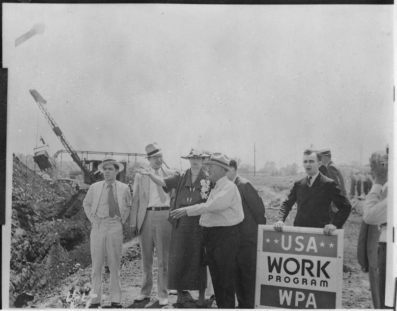

It has been several weeks since Valerie suffered a nightmare. After falling asleep, instead of suddenly finding herself at a grocery store checkout counter with no money, as happened so often in the past, or under arrest for crossing state lines to find shelter with her children, she has dreamt simply of flying, traveling, being alone in quiet fields, and reading.

Last month, Valerie caught up on her electric bill. She paid off some debt, tipped generously for grocery delivery and, for the first time in six years, deposited money into a savings account. In June, she gave her son "the best birthday of his life", sparing no expense for a dart board, an indoor mini-trampoline, a box of "kinetic sand", and Lego Minifigures for him and his brother.

At age 48 and recently divorced, Valerie, who wished to remain anonymous for this article, is raising her two sons alone on a declared income of \$19,270 per year in a small city in the Mid-Hudson Valley, one hour north of New York City. She is one of some 39 million people in the United States who lost their livelihoods to the Covid-19 pandemic this spring. She could afford her expenses and the gifts for her children because the federal government did something rare and wonderful: In response to mass unemployment caused by the pandemic, it gave those who lost their jobs an additional \$600 in weekly financial support to stay home and help them cover living expenses.

This week, however, the four-month period of Federal Pandemic Unemployment Compensation stipulated in the CARES Act (Coronavirus Aid, Relief and Economic Security) will expire and those payments will stop. Republican lawmakers have publicly considered reducing the benefits to [between $200 and $400 per week](https://www.washingtonpost.com/business/2020/07/14/unemployment-benefits-expiring-coronavirus/), and sending another round of $1,200 stimulus checks to taxpayers. But Senate Majority Leader Mitch McConnell has shown [no urgency](https://www.latimes.com/opinion/story/2020-07-23/mcconnell-600-unemployment-benefit-pandemic) for people like Valerie, who stand to lose [between 50 and 85 percent](https://www.politico.com/news/2020/07/14/coronavirus-jobless-benefit-lapse-361455) of their income.

"I have no idea what I'm going to do," she told me over the phone in mid-July. "I'm terrified to start cleaning AirBnBs again. I don't really have the energy and I'm nervous to be in spaces where people from New York City have been. I'm scared to bring the virus home to my children."

")

Valerie does not have to imagine what it is like to contract COVID-19. Though she was careful to keep her distance from people, to wash her hands and avoid touching her face, she says she caught the virus somehow in April. As she waited to recover, her boys, ages 11 and 12 took care of their mother and each other. Her generosity on her son's birthday was also a thank-you to both of them for stepping up when she could not maintain their home and her future was uncertain.

"My 12-year-old cooked and took care of the cleaning as best he could," she said. "He kept us afloat. Children shouldn't have to take on that kind of responsibility, but they did. They were terrified and they never let it show until after I was well."

Twelve years ago, Valerie quit her job in IBM's intellectual assets and property division to take care of her first child, who was born with autism and four genetic diseases, three of which are shared by his younger brother. The boys can have allergic reactions to perfume and their own sweat, she says. Valerie homeschools the boys and spends between five and six hours each day preparing food that will not hurt them. She regularly monitors them for reddened lips and other indications that a kind of "silent" anaphylaxis is underway in their bodies.

> The boys know that their circumstances are fragile. Since the pandemic began, they have had nightmares that they did not have before, including about the end of the world.

"They're the healthiest kids that doctors who treat these disorders have ever seen, so I'm doing something right," she beamed proudly. "I'm constantly looking out, but now I haven't worked a proper ‘job' since 2007, so I'm basically unemployable."

The boys know that their circumstances are fragile. Since the pandemic began, they have had nightmares that they did not have before, Valerie says, including about the end of the world.

"My big guy's not talking to me as much," Valerie said. "He says: ‘There are some things I need to keep just for me' and I completely agree with that. My little one has never been terribly articulate verbally, but he's more emotional and needy. He's requesting to spend a lot more time cuddling and reading, and pretending to fall a lot. It's just not like him to do that."

Valerie lives in one of many places in the United States where people have self-organized in beautiful mutual aid operations to help each other survive through the pandemic. She has called upon the group to get deliveries of prescription medications, medical supplies and health services, but before the pandemic, she rarely sought help from her neighbors.

"I don't bother people," she said. "I just figure that everyone is going through their own shitshow and I try to get through every day as best I can." When she really needs someone to talk to, she calls her father, an "incredibly bright, intuitive and insightful" retired blue-collar worker who lives in the Midwest and whom her boys adore. Custody rules prevent her from traveling the distance that would be required to live with him or her sister, hence her recurring nightmares about getting arrested for crossing state lines.

In the absence of a safe way to work and earn money, Valerie and her boys need the weekly \$600 federal payments or some large portion of them to be renewed in order to survive.

"I don't think there's a hope in hell of it happening," she said. "But I do think that they should extend it to at least the end of January 2021. I'm not up on all the proposals for what could happen. I skim the news very gently and from very specific sources. I think they should give everyone a universal income; \$40,000 is an insane cap that I saw being thrown around randomly, but in New York that's nothing. Especially for single family households. I would like to see our tax money going towards supporting people to be able to make choices about savings, and not having to panic with a calculator at the grocery store. Or to be able to treat their kids to something in these extraordinary times."

> "I have to think they're completely out of touch and not actual demons. Because it feels like they might be demons."
> 
> Valerie

"The kids should not be going back to school," she continued. "I can't even go to the Social Security Administration office and get the name on my Social Security card changed back to my maiden name. I thought, ‘I must be able to do this. The bars are open.' But I can't. They're not letting us have access to Social Security Administration employees for urgent business because they're protecting those employees. But they'll send children back to school like sacrificial lambs so the parent worker bees can work again and make the gazillionaires richer. It's appalling."

"I have to think that these politicians don't understand the implications of their actions because they're of such privilege at this point," she concluded. "They've been making over \$100,000 a year and getting kickbacks from everywhere, and they have great jobs lined up for after their time in Congress. I have to think they're completely out of touch and not actual demons. Because it feels like they might be demons."

In late March, shortly after the pandemic erupted in the United States, my friend Peter Frase [published an article](https://jacobinmag.com/2020/03/coronavirus-economy-public-health-exterminism) in Jacobin warning that the bipartisan ruling elite would sooner sacrifice the lives of working people than allow a government response to the pandemic to diminish their power to profit. Four months later, the Trump administration has not just failed to end the pandemic; rates of COVID-19 infection and deaths are spiking as states and businesses reopen and close again, and frightened, vulnerable people are being forced back to work.

In addition to helping people pay their bills and stay safe by staying home, the \$600 weekly Federal Pandemic Unemployment Compensation has been a lifeline for U.S. businesses too. Consumer spending — the cash we spend on food, energy, entertainment and tchotchkes, etc. — is a key driver of the nation's economy. For every three dollars consumers spent before the pandemic erupted, they spent just two dollars under lockdown. Corporations and businesses panicked and the government took action. It passed the CARES Act, which among other things simply put cash into the hands of tens of millions of jobless people. By late June, consumer spending returned to within a few points of pre-pandemic levels. (Predictably, poorer people — who must spend their money to stay alive — are spending closer to pre-pandemic levels than wealthier people.)

As a general stimulus then, the \$600 weekly pandemic unemployment payments were not just a lifeline to people in need. They kept businesses afloat as people spent their benefits into the economy.

With characteristic cruelty, Republicans tried to prevent these benefits from reaching unemployed people. As if the fabric of society were not coming apart, Republican Senator Lindsey Graham [complained](https://www.theguardian.com/world/2020/mar/25/senate-passes-coronavirus-stimulus-package) that modestly high unemployment payments would give people the freedom to refuse to report to life-threatening jobs in exchange for poor wages, and called for the payments to be reduced. Ignoring the fact that unemployment laws prevent people from collecting benefits if they turn down a job because of low pay, Graham [later rationalized](https://www.postandcourier.com/health/covid19/sen-lindsey-graham-says-unemployment-benefits-are-holding-charleston-economy-back/article_71c91fd8-a1c6-11ea-82a7-7fa51a1355bc.html): "If you pay someone \$23 an hour not to work, they're going to take you up on it... You shouldn't be paid more in unemployment than you do at work."

But Senator Bernie Sanders fought for the unemployed, using his bully pulpit to publicly shame Republicans like Graham and threatening to halt passage of the CARES Act. Business owners and capitalists can thank the socialist for their recovered revenue.

Instead of preserving this vital support, the Trump administration and the conservatives in Congress are ready to pull it out from underneath people and businesses that are barely standing. "The economy going back into recession is likely if we cold-turkey cut the extra unemployment insurance benefits," Moody's Analytics Chief Economist Mark Zandi [told](https://fortune.com/2020/06/30/going-back-into-recession-is-likely-if-extra-600-in-federal-unemployment-benefits-arent-extended/) Fortune in late June. Additionally, conservative politicians and pundits are whining over some kind of imagined unfairness because two-thirds of the 25 million people receiving the $600 weekly payments are getting more money than their employers paid them — 34 percent more, on median. ("Personal income rose [more than] 9 percent in April and May from a year earlier," [wrote](https://jacobinmag.com/2020/07/unemployment-benefits-coronavirus-covid-cares-act) the economics analyst Doug Henwood.)

These politicians are pissed that the unemployment program is actually helping people in need. And it's not just Republicans who are the problem. In Colorado, Democratic Governor Jared Polis [justified](https://twitter.com/alex_burness/status/1284204484218912769?s=21) his decision to allow landlords to evict jobless people during the pandemic by simply asserting that, "People should generally be back at work and earning money" — despite the fact that unemployment is rising in the state.

Conservatives are not just seeking to slash unemployment benefits. They are also working to shield employers from the threat of lawsuits filed by workers who get sick with Covid-19. Two Congressional Progressive Caucus staffers [warned that](https://slate.com/news-and-politics/2020/06/mcconnell-corporate-liability-covid.html) the new policy "would make it nearly impossible to sue corporations for Covid-19-related legal claims by workers [and] give employers a free pass to flout worker safety laws."

Being unemployed is not simply a vacation, free of onerous requirements, legal hazard and threats of punishment from the state. As the journalist David Sirota [wrote recently](https://www.theguardian.com/commentisfree/2020/jul/21/americans-coronavirus-pandemic-workers-safety), jobless "workers can be harshly sanctioned for trying to collect benefits if they dare turn down any job, no matter how poorly paid or dangerous." In many cases, "unemployment systems are now set up to deny benefits at every opportunity," [says](https://www.theguardian.com/commentisfree/2020/jul/21/americans-coronavirus-pandemic-workers-safety) Michele Evermore of the National Employment Law Institute — with the rate of erroneous benefit denials [nearly doubling](https://s27147.pcdn.co/wp-content/uploads/Data-Brief-State-Unemployment-Systems-Counter-Recession.pdf) over the past decade.

According to [Michigan Public Radio](https://www.michiganradio.org/post/attorneys-unemployment-fraud-cases-join-forces-call-state-review-ai-government), Michigan's automated computer system "falsely accused more than 40,000 people of fraudulently claiming unemployment benefits" between 2013 and 2015. After Republicans took control of the state in 2011, people accused of collecting benefits after refusing a job offer can be forced to repay four times the amount of money they received, plus 12 percent interest.

The chief scholarly justification for ending the payments comes from a trio of University of Chicago economists — academics who decided that the most important contribution they could make to the general welfare in this time of danger was to scrutinize the amount of money being used to help poor people. Claiming twice in their May paper that they "take no stand" on how much support the involuntarily jobless should receive, they nonetheless provided anti-worker politicians and pundits with academic cover to lecture the public as if the main problem with the government's pandemic-economic response is that poor people have a little money with which to make their lives tolerable.

By contrast, these servants of the rich are not motivated to quibble with the hundreds of billions of dollars that the CARES Act shoveled toward corporations, [millionaires and billionaires](https://www.propublica.org/article/the-cares-act-sent-you-a-1-200-check-but-gave-millionaires-and-billionaires-far-more); nor do they question the Federal Reserve's policy of providing ["](https://www.cnbc.com/2020/07/07/citi-raises-sp-500-forecast-citing-incessant-fed-support.html)[incessant" support](https://www.cnbc.com/2020/07/07/citi-raises-sp-500-forecast-citing-incessant-fed-support.html) to Wall Street but not working people and the institutions that benefit them.

To defend the $600 unemployment payments as both morally and economically necessary is not to suggest that the CARES Act is a sufficient solution to our economic problems. Nor, says Pavlina Tcherneva, Associate Professor of Economics at Bard College and a Research Scholar at the Levy Economics Institute and advisor to Bernie Sanders's 2016 presidential campaign, is the Democratic-led HEROES Act, which would extend the payments through January 2021 if Senate Republicans and the Trump administration would support it.

What is happening to Valerie and tens of millions of other people fired, laid off or losing benefits, healthcare or housing is not simply "natural" – it is the predictable and preventable consequence of established government policy. Alternatives are known, and working people, organizers, activists and voters must discover them and force them upon politicians and government if society and life are not to further deteriorate under pressure from the pandemic, a rigged economy and worsening, generalized fear.

Dr. Tcherneva studies the impact of unemployment on growth, income inequality and public health, and saving people from the hardship that awaits Valerie is the focus of her work. In [The Case for a Job Guarantee](http://pavlina-tcherneva.net/the-case-for-a-job-guarantee/), which she published this summer, Tcherneva explains how the federal government could provide a living-wage job to anyone who wants one.

What follows is an edited transcript of our conversation about what the pandemic unemployment payments meant for the economy and how the United States could enact a Job Guarantee.

---

##### How did these weekly unemployment benefits affect the economy? Was it the right action?

Everybody is focused on how the unemployment insurance program is providing greater income for a lot of people, and the debate is whether we should retain it or not. But the real problem is not unemployment insurance. The real problem is the low wages in our economy. The fundamental issue is jobs and how poorly paid they are.

Roughly half the workers in the United States earn less than \$15 an hour. That is a very, very low level of income generation. The floor is really rock bottom. Unemployment insurance is inadequate and the job losses already caused by the pandemic would cause additional layoffs and other ripple effects. I'm talking about bankruptcies, people not being able to pay their bills, storefronts shuttering, etc.

To stop these things from happening the government decided to use this one-time boost of \$600 weekly payments, and it was the right thing to do. It's a really good policy. In fact, it tipped the scales toward the least advantaged workers! That's a benefit, not a shortcoming. You have to appreciate that the market is already so skewed and that we already have such runaway inequality, so using the average worker's income to calculate how much we should give to each unemployed worker as a supplement was a tiny rebalancing. I don't want to oversell it. The federal unemployment insurance is really just a Band-Aid, a patch.

Okay. So now we have to decide what to do next. The major proposals are problematic.

First, Democrats want to renew the unemployment insurance boost. That's all well and good. But they don't really have anything else to offer. Remembering that the real issue is jobs and wages, let's think back to the Great Depression. FDR put a minimum wage in place and a few years later Truman doubled it. This is the sort of thing we have to think about doing now. If our federal minimum wage is \$7.25 per hour, we have to at least double it to \$15 per hour. But that's still not going to be enough. We'll still have mass unemployment. So we need a policy that creates jobs. Democrats should defend continued unemployment insurance, but they have to offer something else as well.

> "FDR put a minimum wage in place and a few years later Truman doubled it. This is the sort of thing we have to think about doing now."
> 
> Pavlina Tcherneva, Associate Professor of Economics at Bard College

Now, Republicans on the other hand insist that we have to remove the unemployment payments because they disincentivize people from working. This, of course, is a cruel way of dealing with mass unemployment. It says: "Let's just take away the little support that folks have so that they can go out and look for jobs that aren't there." It doesn't matter how many incentives they try to create or how much they attempt to flog people into submission: People won't find jobs that aren't there and the jobs that are there won't be well-paid.

##### That paper by the University of Chicago economists supports the cruel perspective you're describing.

Yes. They say the distribution of payments is problematic. They imply that the program is more unequal because lower-income folks are getting a little bit more money. But they don't recognize that income today is already extremely skewed to the top. You can't argue that the program unfairly distributes income without recognizing that the economy has been distributing income unfairly for a very long time.

I think it's disingenuous when economists pretend that they don't have a moral position. Several times in that paper the authors claim: "We take no stand on how one should weigh these pros and cons." Of course they take a stand! Their stand is the following: "These payments create moral hazard," which is economist-speak for "they would make people lazy, they would discourage them from working." This is a value judgment. Calling unemployment insurance a disincentive is a moral claim, not an economic claim. These people are fighting for their survival. If you suddenly get \$600 more every week and you're able to pay your mortgage and you're not defaulting on your credit card, that's an aid in your fight for survival. These are the kinds of blinders that I think really need to be exposed. Economists pretend to have a neutral way of talking about issues. But moral claims and assumptions underlie every one of our models, and we have to expose them.

##### Our culture and the corporate-soaked media don't encourage people to think about these things deeply, beyond appearances and the surface of their experiences.

Right. But you don't have to be an expert to understand this. A lot of folks are saying that unemployment insurance is bad because it gives people more money. This has become a conventional talking point. You can look at this on the surface and say, "Hey! Somebody is getting more money than they got before!" It feels unfair on its face, I guess. But if you drill deeper and ask why, well then you can see that an extra \$600 per week is not that much money. Just compare that to what rent costs each month in New York City. The \$300 average that people normally get from state unemployment programs is not replacement income. It's not nearly adequate. If the \$600 per week extra puts some people on top, then that really exposes how poorly some people are getting paid. Like I said before, less than half of American workers make roughly \$15 per hour. And a whole lot of them earn even less.

Even if you don't approach the issue of unemployment payments from the cruel perspective, even if you approach it from the desire to help people, we still have to drill deeper. At the individual level, there are real consequences to these programs. For employers, too. And we can't overlook them.

Click image to learn more.

For instance, I have a friend who manages a gym. He told me: "I have to reopen the business and need to figure out who to bring back from the furloughed workers. On the one hand, I don't want to bring some workers back who were paid so little because they'll lose the \$600 per week. But if I don't bring them back, then they'll become permanently laid off. I can't reopen my business with 100 percent staff capacity."

So, someone's going to get cut, and it's the low wage-folks. And they will become the long-term unemployed who have the *hardest* time getting jobs afterwards. There is a Catch-22 here: Low-income folks might not want to go back to work because right now they can have the \$600 extra. But if they want to go back to work, say at the end of this year—depending on when their benefits end—the economy won't bounce back to create enough jobs by then, and they will become the long-term unemployed and face higher barriers to re-enter the workforce.

We want to raise wages, but from the perspective of a business owner, they're operating on razor-thin margins. Many businesses simply can't afford to pay double wages or match the benefits of the person who doesn't want to come in. On the other hand, there are so many unemployed people that, if employers want to hire, there will be many more people desperate for those few jobs, and firms will not feel the pressure to offer better pay.

##### So, continuing the unemployment payments alone won't ultimately fix our economy. And neither will taking jobless people's benefits away to force some of them to take underpaid jobs while the others find no work. What should the country do instead?

What most people probably don't realize is that the government is essentially supporting the economy almost in its entirety. The CARES Act was $2.2 trillion. It was distributed very inequitably, but it was an enormous chunk: 10 percent of our economy. The private sector is on life support because the government is supporting it. The Federal Reserve is providing loans. Congress is appropriating more loans. And there's unemployment insurance. There's going to be spending on COVID and crisis control. But they're doing it in a way that props up a very unequal system, a system that is going to endure mass unemployment and mass devastation. When we shake off our phobia about spending, then we can start to ask better questions, starting with the question of what the government should spend its money on.

During the Great Depression, the U.S. rethought the foundations of the economy with the New Deal. We committed to stronger wages, stronger employment, better working conditions and stronger protections for workers. Today, the economy does not provide comparable economic security. We don't have universal healthcare amid a pandemic. In fact, millions of people who had health insurance lost it because it was tied to their jobs!

> "When we shake off our phobia about spending, then we can start to ask better questions, starting with the question of what the government should spend its money on.**"**
> 
> Dr. Tcherneva

So there is much to do. But we need to keep our eye on the ball — abundant and better-paid jobs. I would like to see the government create big and bold investment and employment programs to address all the neglect in our communities, including improving our infrastructure and greening the economy. To me, the Green New Deal is the clearest articulation of what the future society should look like. It rebalances how we produce things. It focuses on local sustainable practices. It has a social component, which means we're not going to just allow people to live in weatherized homes, we're actually going to ensure that every person has a home; it's not going to be a world of homelessness with some solar panels. The government will be spending enormous resources to deal with this crisis. We can choose to use those resources to pursue a green agenda that restructures both our economy and society and provides the employment security and jobs that we need right now.

##### When you envision that, what do you see?

So, I work [on the federal Job Guarantee](https://www.cbpp.org/research/full-employment/the-federal-job-guarantee-a-policy-to-achieve-permanent-full-employment). For me that is a critical piece of the employment safety net. If you're an unemployed person, you will go into a public employment office and get a public service job. We will help you find work in your community. The Job Guarantee is a critical safety net and a critical component of the Green New Deal, which ensures that if we pursue this new world, everybody will have a place in it. We won't leave behind people in mining communities and towns dependent on fossil fuel extraction. We'll clean up and rebuild our communities.

Contrary to what some politicians and private employers say, people want to work. But the private sector doesn't provide adequate jobs. So, the Job Guarantee steps in to fill the void.

Say you've been a stay-at-home parent for a long time now. Your kids are off to college and you want paid work. But where do you start? Your resume is blank. You could do some good community work locally through the Job Guarantee. In reality, people already organize themselves to work. In the mutual aid groups that have emerged in the pandemic, people are already doing work on the ground to address their community's needs. You can make that the engine of job creation for the Job Guarantee. And the nature of work — the forces that motivate it are fundamentally different from most of the jobs we have now. In the private sector, the profit motive ensures cost-cutting and leads to precarious pay and working conditions. With the Job Guarantee, the terms on which work is offered is for public purpose and the public good.

Now, let's step back. The Job Guarantee might sound daunting. The obstacles might seem insurmountable given today's politics. We are dealing so poorly with COVID, let alone other crises. But the thing is that nearly 100 years ago, in the midst of really desperate times during the Great Depression, we rethought the purpose of government in radical ways. This took leadership. I don't know if we're going to get it now or if we'll have to wait longer, but this is the kind of moment we're living through. It calls for the same kind of re-thinking and bold action.

I don't have a crystal ball to know what will happen, but I keep thinking of the years that led up to the New Deal. This kind of rethinking, activism and work on the ground was thriving for decades before FDR was elected president. From the early 1900s, even the late 1800s, this push for better working conditions was strong, it came from many corners of civil society and the work coalesced. Now, we have environmental problems and it's a crisis that will only get worse. I see people once again challenging conventional wisdom.

I thought 2008 might be the moment to transform government policy and remedy the inequities in our economy. But our failure to do that has brought us here, more unprepared to tackle this crisis and the hardships it will bring. Simultaneously, rightwing governments are seizing on the economic pain. We need democratic solutions and hopefully we won't miss this chance.

##### The idea of a Universal Basic Income (UBI) inspires many people. How does a Job Guarantee relate to that?

There are many different versions of the UBI, so we really need to be very careful of what we're talking about. I object to the UBI that just gives everybody \$30,000 or \$35,000 per year, rich or poor. Now, there are people who cannot work and should not work, and they need basic income. That's different from UBI. In the Green New Deal and the Job Guarantee, there is income support for those who should not be working. If you're a student, for example, tuition-free college is a type of basic income. If we have universal healthcare, that's a kind of basic income.

In my Job Guarantee proposal, I argue that it should be coupled with universal childcare and universal child allowance, along with basic income support for veterans or people with disabilities. The point is that the income is targeted to the specific dimension of insecurity that a person is experiencing.

Silicon Valley advocates of UBI, not to mention rightwing supporters, are pushing it as a replacement for the existing safety net. Andrew Yang explicitly funds his $1,000 per month "Freedom Dividend" by having recipients opt out of Social Security! This should worry people very, very much. To me, UBI is a Trojan Horse and a false promise. It says, "I'll just give you income. Go out and find affordable rent. Go find affordable childcare." People who have decent salaries today already can't find these things!

So UBI does not solve these other problems that we face. It always resonates more with upper middle class individuals. Working folks who are juggling two or three jobs want to work, and they want stable, good work. But the hate mail I get is usually from some college-educated person who tells me: "I would like to spend my life gardening. Why are you against universal basic income?" And I'm thinking, "Well, I don't want to lose our hard-fought-for social safety net, and I want an economy that provides jobs for those who want them."

> "To me, [Universal Basic Income] is a Trojan Horse and a false promise. It says, ‘I'll just give you income. Go out and find affordable rent. Go find affordable childcare.' People who have decent salaries today already can't find these things!"
> 
> Dr. Tcherneva

##### Alright, let me ask the question that people always ask: How can we afford a Job Guarantee and a Green New Deal?

I think we've been doing a pretty good job of debunking the myth that the government can't afford these programs. Remember, in response to COVID we passed an enormous budget overnight. We did the same thing during the 2008 financial crisis. In these moments of crisis, the government musters the public resources, the fiscal power, and they pass a budget. I think we should always reject the question of "But how we will pay for it?" It is quite clear that when a policy is a priority, there is no problem funding it.

So first we must recognize that the federal government is self-funding. It already has the financial resources. It pays for the Job Guarantee or the Green New Deal the way it pays for everything else: by appropriating budgets which the Treasury and the Federal Reserve coordinate to fund. Unlike state governments, the federal government does not depend on tax revenue to spend. It is the issuer of currency. It has a public monopoly, and if you have the monopoly on issuing dollars, how can you possibly run out of them? Most people just don't focus on this very basic fact of life. The government issues the dollar, and every expenditure it appropriates through Congress results in an injection of new dollars into the economy. Tax payments represent the retrieval of those dollars. Taxes are not a funding mechanism.

So think of it like this: Votes fund programs. As long as you can muster up the votes, then the sovereign monetary institutions of the government — the Treasury and the Federal Reserve — coordinate to make all payments. Again, the government will be paying for the crisis one way or another. The question is: Will it spend and use resources in *reaction* to mass immiseration and environmental destruction? Or will it spend them for prevention and the rebuilding of our economy?

##### This is a key correction that you and others in the Modern Monetary Theory school of economic thought have made to the conventional understanding of federal government spending. Ronald Reagan told Americans that the federal government *must* budget as a household does. In other words, the government can't afford to meet the public's needs and we can't have a wonderful society because the money isn't there. But as you said a moment ago, the federal government can't run out of money precisely because it *issues* money, whereas households and individuals do not. And it's not just conservatives who think and talk this way, enormous numbers of activists on the left do it as well.

Yes. Frankly, I find the positions of some people on the left baffling. Look, there are two things that conservatives have no problem doing. One, they never hesitate to use the power of the public purse to pursue their reactionary agenda. *Never*. And they have been extremely clear, from Reagan to Cheney to Trump: the deficit doesn't matter. We print our own money. But many on the left refuse to acknowledge this basic fact and hide behind a fake respectability. By clinging to sound finance they cripple their own policy agenda. So, what kind of fight are you fighting when you don't have all the tools in the arsenal?

The other issue is jobs. In desperate times, the right will have no trouble launching punitive workfare programs. For the unemployed, these programs will still be considered better than no jobs at all. What is the left's alternative? In my view, it is the Job Guarantee. That is the alternative to workfare: a voluntary, decent public option for jobs.

But many on the Left cling to universal basic income and some are clearly opposed to the Job Guarantee. They might as well raise the white flag. One cannot strengthen the position of labor by providing income alone when the threat of unemployment is perennial. In fact, in a market economy, income assistance is a wage subsidy for the employer. Why demand living wages from firms when the government has promised checks? And, of course, these checks will come at the cost of other benefits.

Once upon a time, the left was steadfast in their belief that decent employment is a basic human right. Today, there is a kind of surrender to the idea that jobs are forever gone, either because of robots or trade. But there is nothing inevitable about unemployment. Of course, we can create jobs. Of course, they can be good and well-paid jobs. Government guarantees all sorts of things in the economy, from bank deposits, to education, to certain types of loans or profits for government contracts. Guaranteeing employment is in fact not a radical proposition at all. The right has no trouble promising jobs. (Much of it is false, of course. Trump won't bring back manufacturing jobs).

But what does the left have to offer a community that has suffered mass unemployment? Subsidies for firms? Training programs for jobs that never come? Why not a Job Guarantee that creates decent, well-paid employment opportunities that are not punitive and don't make existing benefits conditional on working? A program that creates useful projects that serve the public purpose? Democrats need very quickly to develop a very credible message and a plan for jobs, one that instills confidence that the government will take the necessary bold actions to create opportunities in every corner of the nation. We did it in the 1930s. We can certainly do it again.

So, overall, money has to be rethought. Government policies, and specifically employment policies, have to be rethought as well. How will we engage the power of the public purse? How will we use it to rebalance our economy? How will we clean up the environment, provide care, guarantee healthcare and decent employment opportunities for all? All of these issues go hand-in-hand: sovereign spending, public investment and economic security.

---

*Alexander Reed Kelly lives in New York State's Hudson Valley. He served as an advisor in the state Senate and Assembly and as Associate Editor at the news and opinion website Truthdig. Find him on [Twitter @alexreedkelly](https://twitter.com/alexreedkelly?fbclid=IwAR2Tu6ix9y-hu_Yv2IUML1AgUIojFoqFdxvk1gX254yRVnvIJxVdAO1LrpI) and follow his work on [Patreon](https://www.patreon.com/alexanderreedkelly?fbclid=IwAR2DbdHa8eP7iDCcknv0ePhjZUgs1ucBhHHaesGRKFy1Nqp4ZOWW3amVdGQ).*

**Photo: Spencer Platt, Getty Images**
