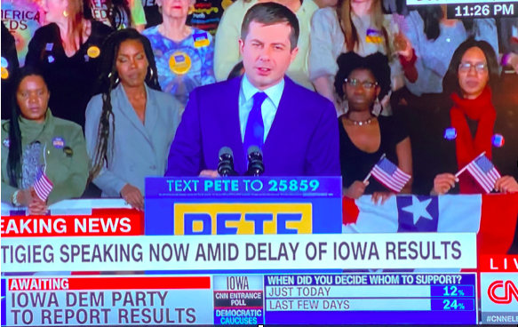
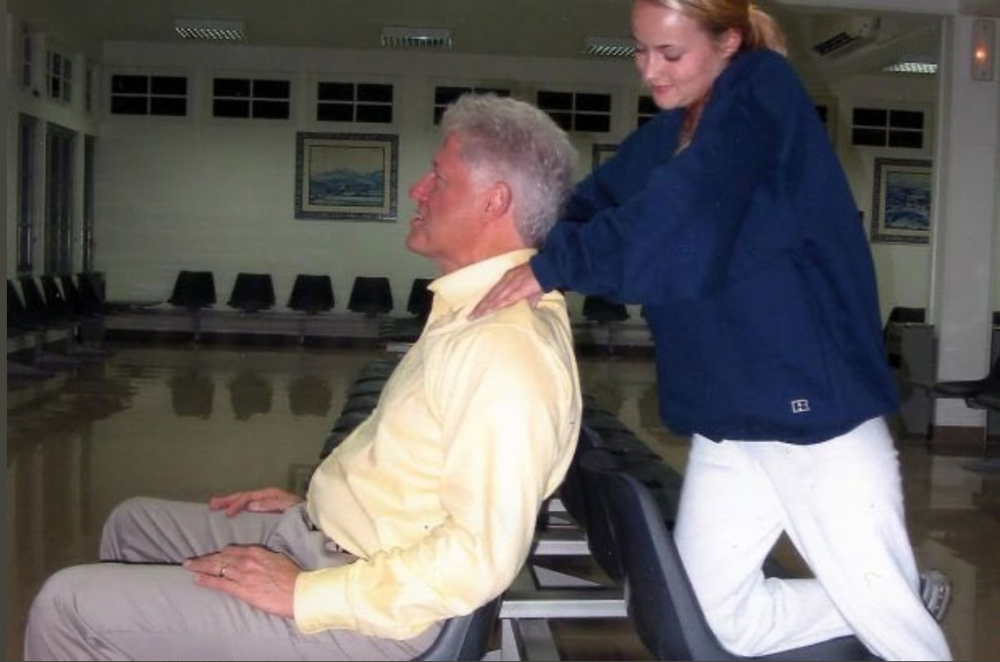
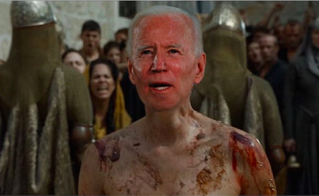

It seems like hardly a day goes by that we aren't being urged to cancel somebody. Whether it's a [media celebrity who lacked the foresight to behave according to current standards](https://www.theverge.com/2018/12/8/18131221/kevin-hart-oscar-hosting-homophobia-twitter-tweets), 10 years ago, a [historical figure who had the poor judgement not to be woke in the 1700's](https://thefederalist.com/2020/06/16/if-you-cancel-george-washington-you-have-to-cancel-these-progressive-heroes-too/), or just [some poor schmuck who didn't get the memo on the universal hand gesture for "okay,"](https://thehill.com/blogs/blog-briefing-room/news/502975-california-man-fired-over-alleged-white-power-sign-says-he-was) no longer being okay, the list of non-persons just keeps on growing. But there's one group that seems uniquely impervious to cancellation: establishment Democrat politicians. It's very odd that folks who want to [throw Ulysses S. Grant into the dustbin of history](https://www.newsweek.com/san-francisco-protests-ulysses-s-grant-statue-slavery-1512316), would overlook some of the most powerful and influential people in our society in the course of deciding who does and doesn't belong in the public sphere. But if you're a prominent Democrat in good standing with the party's leadership, there doesn't seem to be very much you can't get away with, from overt racism all the way up to rape, with nary a peep from the Twitterverse. Let's take a look at a few prominent examples.

### Pete Buttigieg

One of Mayor Pete's first official acts was to [fire Daryl Boykins](https://tyt.com/stories/4vZLCHuQrYE4uKagy0oyMA/8MUjW5pPfCO1KcfmeGlsA), the first black police chief of South Bend, possibly at the urging of his donors. The explanation given was that Boykins had illegally recorded his own officers' phone conversations. According to Boykins, their conversations included racial slurs directed at him, and also discussion of a conspiracy to get him fired that included deep-pocketed Buttigeig donors and the Mayor himself. So, essentially, Pete chose to punish the alleged victim, rather than the perpetrators. In response to demands that he release the tapes, Pete refused, claiming that releasing them would be illegal, given that they had since become evidence in an ongoing FBI investigation. That all seems pretty cancelicious, no? But wait, it gets better.

Partly because of this history, and partly because, let's face it, Pete's personality style makes mayonnaise look ethnic, he struggled during the primaries to get any [(literally, any)](https://theweek.com/speedreads/879289/pete-buttigieg-0-percent-support-from-black-voters-new-south-carolina-poll) black support. His solution? Fake it ‘till you make it. Bad enough was his tokenizing of the few black people he could find at his events, who he would often pressure into surrounding him on stage, [whether or not they were actual supporters](https://newsone.com/3901351/mayor-pete-buttigieg-black-voters-iowa-caucuses/), or just Americans guilty of checking out a rally while black.

The coup de grace came when Pete sent out an e-mail to black politicians and community leaders, that gave them [24 hours to "opt-out" of endorsing his "Douglass Plan" for black America](https://theintercept.com/2019/11/15/pete-buttigieg-campaign-black-voters/). Yes, you read that right. If you happened to ignore the email, or if you didn't open it in time and thoroughly read its contents, you woke up the next day to the news that you had not only endorsed Pete Buttigieg's plan (a plan that it appears was written exclusively by white people), but you found your name included on a list of 400 supposedly black South Carolinian supporters, that later investigations found was at least 42% white. Now, maybe I've misunderstood the premises of "anti-racism," but its my understanding that white people speaking for POC, much less exploiting them in this way, is a big no-no. Seems like the kind of thing that should get you canceled, no? Especially when combined with Mayor Pete's history in South Bend. And it didn't end there.

Even after being [called out by many black politicians](https://slate.com/news-and-politics/2019/11/mayor-pete-black-support-announcement.html), some of whom had publicly endorsed other candidates, Pete didn't give up on this tactic of faking black support by claiming endorsements from virtually every POC he had ever shaken hands with. In South Carolina, the Buttigieg campaign claimed that [black-owned businesses they had simply patronized](https://www.gq.com/story/mayor-pete-black-restaurant-owners), had "partnered" with the Buttigieg campaign. Once again, this led to denials from the blindsided African Americans in question.

Now, maybe this is just crazy talk, but it seems to me that if you're going to cancel people for just *saying* fucked up shit, actually *doing* this much fucked up shit should have made Pete persona non grata in polite society a long time ago. But far from being canceled, he was a prominent speaker at the recent DNC convention, and it's pretty much assumed that he'll be getting a cabinet position in a theoretical Biden administration. And the craziest part? Most of his fan base consists of the same [college educated white liberals](https://www.vice.com/en_us/article/epggme/why-do-white-people-love-pete-buttigieg) who would be clogging up your feed for days with their peculiarly off-putting brand of high dudgeon if 1/10th of this fact set belonged to anyone without a big blue D next to their name. 

### Bill Clinton

I'm not going to spend a lot of time on this dirtbag's long history of sexual assault going back decades. The facts are so well known and undeniable, that even the most head in the sand party-line Dems are aware of them. But there are two facts that they haven't really reckoned with, one old, and one relatively new, because to acknowledge them would be to make allowing Bill to continue on in his uncanceled state an impossibility. And the forces of woke really just don't want to deal with it.

Clinton has been [credibly accused of rape by Juanita Broaddrick](https://www.vox.com/2016/1/6/10722580/bill-clinton-juanita-broaddrick), and that's been out there since 1999. Has he been accused in a "would stand up in a court of law" kind of way? No. Sexual assault allegations rarely meet that standard, which is a big part of why, in frustration, many have chosen to litigate guilt via social media. By Twitter trial standards though, the evidence against Clinton more than clears the bar. So why was he speaking at the DNC, and why hasn't the #MeToo movement harassed him out of the public sphere?

As if that wasn't bad enough, we now have two separate witnesses, [one of them an Epstein victim](https://www.thedailybeast.com/jeffrey-epstein-and-ghislaine-maxwell-accuser-virginia-giuffre-says-bill-clinton-partied-on-pedophile-island), placing the old pervert on Epstein's "pedophile island," a place he claims to have never been. He also lied about the [number of trips](https://www.foxnews.com/us/flight-logs-show-bill-clinton-flew-on-sex-offenders-jet-much-more-than-previously-known) he took on Epstein's plane, owning up to only four trips, when flight logs show he did in fact take 26 flights on the so-called "Lolita Express." [Records also place Clinton on the plane](https://www.newsweek.com/jeffrey-epstein-lolita-express-bill-clinton-flight-logs-1448367) at the same time as some of Epstein's possibly underaged trafficking victims, identified only by their first names. And mere days before Clinton's appearance at the DNC, photos leaked of him receiving a massage from one of Epstein's victims. To be clear, thus far none of the women have claimed to have had sexual contact with Bill Clinton. But one thing no one has ever accused Slick Willy of is abject stupidity. Does anyone really believe that Clinton was spending this much time around Epstein without understanding what was going on? What if every time you went to your middle-aged male friend's house, they were surrounded by a bevy of extremely young girls? What would you think was going on there? Karate lessons? So why was this man speaking at a political convention whose main message was that Donald Trump is morally unfit for office? Why is he still walking around unimpeded by the Twitteratti while other men (and some women), of far less consequence, are hiding under a blanket?

### Joe Biden

The shit that flies out of Joe Biden's mouth every time he gets in front of a microphone would be career-ending for pretty much anyone who wasn't an establishment Democrat in good standing. Here are just a few examples.

On working with segregationists: 

> "I was in a caucus with James O. Eastland. He never called me 'boy'; he always called me 'son.' Well, guess what? At least there was some civility. We got things done."

On desegregation: 

> "Unless we do something about this, my children are going to grow up in a jungle, the jungle being a racial jungle with tensions having built so high that it is going to explode at some point."

On the intelligence of POC: 

> "Poor kids are just as smart as white kids."

On black parenting: 

> "They want help, but they just don't know what to do."

On black politics: 

> "What you all know, but most people don't know. Unlike the African American community, with notable exceptions, the Latino community is incredibly diverse community with incredibly different attitudes about different things."

On black identity: 

> "If you've got a problem figuring out whether you're for me or for Trump, then you ain't black."

We could go on and on, but you get the picture. Biden regularly says things that would send the world's biggest movie stars straight to Kevin Spacey-land, if they offered similar observations. And yet, far from being canceled, he's the nominee of the party most sympathetic to the idea of breaking out the digital stocks for anyone caught expressing these kinds of sentiments. Its almost like its just a weapon they use on their political enemies, and not something they actually care about at all. Weird, huh?

It would be bad enough if Joe Biden just kinda said stuff. In fact that's pretty much the defense those who are self-aware enough to acknowledge the contradiction at the heart of his nomination offer, by dismissing all these statements as "gaffes." But far from limiting his racism to his stated beliefs, Biden's political history is a virtual laundry list of cancelable offenses. 

As a Senator, Biden repeatedly collaborated with his beloved segregationist buddies to work on overtly racist legislation. Not only was Biden one of the leading voices speaking out against school busing, [he worked with avowed segregationists](https://www.nbcnews.com/news/nbcblk/joe-biden-didn-t-just-compromise-segregationists-he-fought-their-n1021626) Jesse Helms and Strom Thurmond on numerous bills and amendments aimed at preventing it.  

Throughout the 80's he continued to collaborate with his favorite segregationist, Thurmond, who had run for President in 1948 on a white supremacist platform, on a series of [draconian anti-crime measures](https://nymag.com/intelligencer/2019/06/on-crime-biden-worked-closely-with-his-segregationist-pals.html). These bills created the groundwork for the carceral state we live in today, by introducing mandatory minimum sentences for drug offenses, and the now infamous sentencing disparity between crack and powdered cocaine. The capstone of the Biden-Thurmond love affair was the 1994 crime bill, which Biden gleefully bragged, ["would do everything but hang people for jaywalking."](https://www.businessinsider.com/joe-biden-touted-crime-bill-1992-death-penalty-jaywalking-senate-2019-6)

If [making racist jokes about Asians](https://www.thedailybeast.com/snl-fires-new-cast-member-shane-gillis-over-racist-asian-jokes) is enough to get you canceled, what should we do with someone who destroyed the lives of millions of POC in order to score points with white voters, all while claiming the new sentencing guidelines in his bills were aimed at keeping people off the streets "who don't meet the middle-class criteria of susceptibility to rehabilitation." If there were a dog-whistling Olympics, Biden would surely have taken home the gold for that bit of racist pablum. Seems like if we're going to apply the Biden standard for fitting the punishment to the crime ([except where his son is concerned](https://www.newyorker.com/magazine/2019/07/08/will-hunter-biden-jeopardize-his-fathers-campaign)), Biden should be doing the Cersei Lannister naked walk of shame through the middle of DC right about now. And now you're never getting that image out of your head. You're welcome.

And lest we forget (which is exactly what we're supposed to do), Tara Reade has made accusations of sexual assault against Biden that are at least as credible as a host of others that have ended the careers of many people not named Joe Biden. Reade's accusations were accompanied by all the supporting evidence we look for in these cases: [people she had told about the incident at the time](https://www.npr.org/2020/04/29/847982990/former-neighbor-corroborates-tara-reades-account-of-sexual-assault-by-joe-biden), [dismissal from her employment with the accused in the right time frame](https://www.latimes.com/politics/story/2020-05-02/joe-biden-tara-reade-complaint-harassment-assault), and even a [call-in from her mother to the Larry King show](https://theintercept.com/2020/04/24/new-evidence-tara-reade-joe-biden/) discussing her daughter's problems with a "prominent Senator." Whether you believe the accusations or not, one thing is beyond debate: by the standards that the #MeToo movement had previously established, Biden should have been forced into hiding. That's exactly what would have happened if you attached the same set of facts to anyone who wasn't an establishment Democrat in good standing.

To make the hypocrisy even more glaring, in order to defend Biden, the ["nuts and sluts" defense](https://www.politico.com/news/2020/05/15/tara-reade-left-trail-of-aggrieved-acquaintances-260771) that feminists have rightly been working to delegitimize for decades was turned against Reade full-force by the media, party leadership, and the rank and file brainwashed cult members that make up most of the party's remaining base. That in the course of carving out a Joe Biden exception, they've set the #MeToo movement back 20 years by ensuring that those accused of assault in the future will now make full use of the Biden defense ("They said the same thing about Joe Biden. This woman is another Tara Reade."), doesn't seem to trouble them in the slightest. But then again, people who never saw a downside in holding extra-judicial social media trials that would be adjudicated by the kinds of isolated and emotionally damaged people who make up the greater part of regular Twitter users, clearly aren't ones to think in terms of unintended consequences.

And just for bonus points, Biden has been [lying about his civil rights activism](https://shaunking.substack.com/p/2-truths-and-31-lies-joe-biden-has) for thirty years, right down to the present day. That kind of unfathomable insult to the legacy of those who really did put their lives on the line in the struggle for equality is about the most cancelable shit I've ever heard. Except for pretty much every other thing Biden has ever done in office.  

These are just some of the most egregious examples of those who have managed to duck the people's tribunal by flashing the blue-check sign. You could also make strong cases for Kamala Harris ([fought against gender reassignment surgery for inmates](https://www.washingtonblade.com/2019/01/21/harris-takes-full-responsibility-for-briefs-against-surgery-for-trans-inmates/)), Hillary Clinton ([ran one of the most overtly racist campaigns in recent history against Barrack Obama](https://www.huffpost.com/entry/can-black-people-trust-hillary_b_9312004)), and Joy Reid, who was rewarded for [lying about her old homophobic blog posts](https://money.cnn.com/2018/04/28/media/joy-reid-hacking-claims-msnbc/index.html) with a better time slot on MSDNC. 

Just to be clear, I'm not making an argument for cancellation. As you can probably tell, I'm not a big fan of the concept of turning decisions about who does and doesn't get voted off the island over to the congregation of miserable freaks who do the most jumping up and down online. But if we're going to be cancelling people anyway, shouldn't we be starting with the folks who have the most power and influence, and saving Hollywood types and poor working stiffs for later? I mean, isn't it kind of like guillotining the minor nobility and the peasants without ever getting around to the royals? Or gunning down the Kulaks, while leaving the Romanovs unmolested? Say what you will about the Ruskies, but when it came time to upend the social order, they didn't fuck around. The People's Army massacred the royal family right off the bat, and only got around to executing the merchant class later. And they didn't even look at thought crimes among the serfs until everyone else was already safely dead or in the gulag. It's like we're doing this whole cultural revolution thing backwards.

So, listen up liberals, you've got a choice to make here. You can either keep going after the easy targets, or you can truly make an impact on society by taking down the big game. So far you haven't really accomplished anything other than destroying stand-up comedy and arguably getting Donald Trump elected. That's a start in a nihilistic Joker-esque embrace of chaos kind of a way, but if ya really wanna pull an NKVD kinda deal, you're going to need to set your sights a little higher. 

**Photo: AP**
