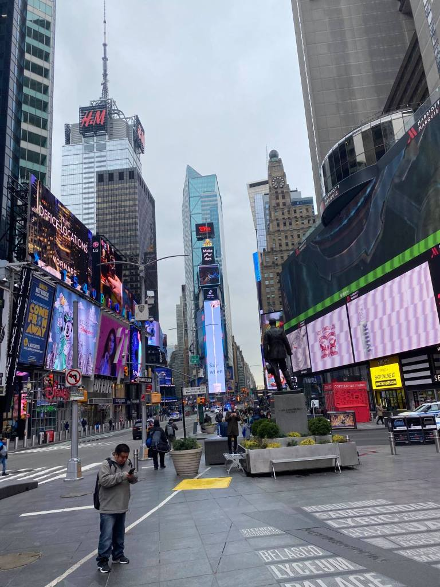
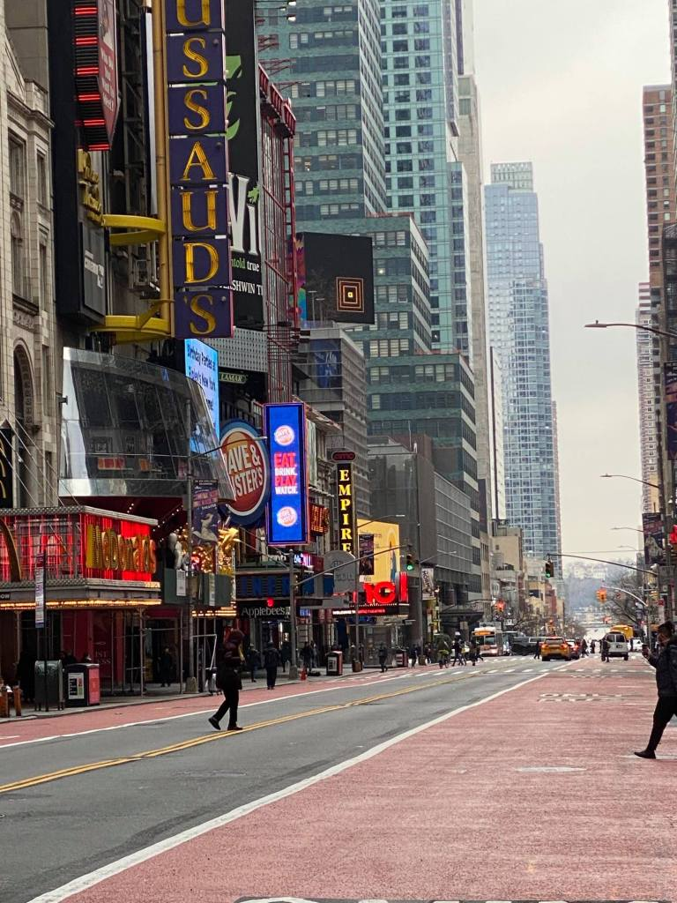
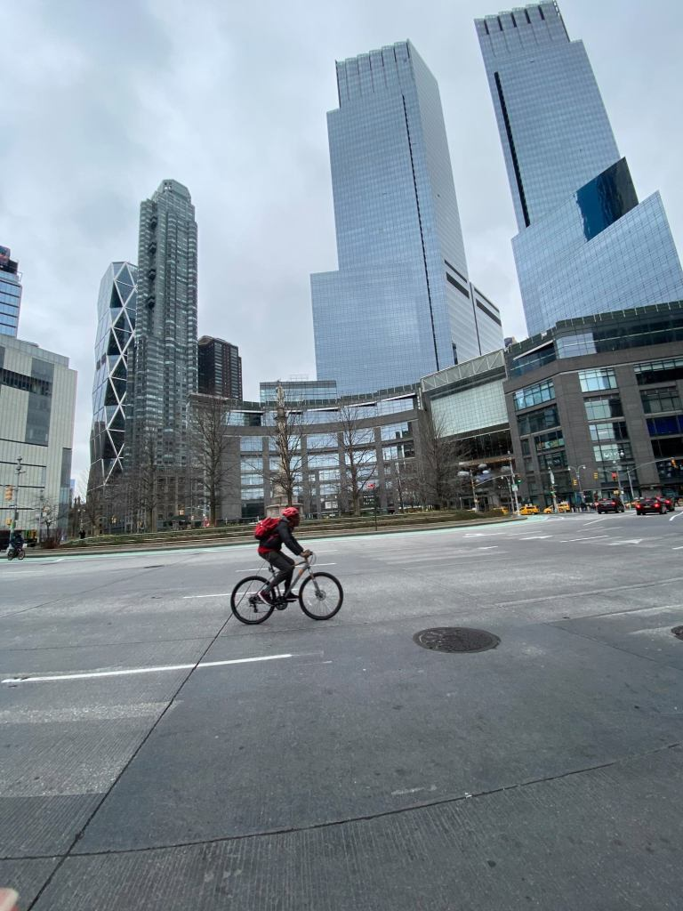
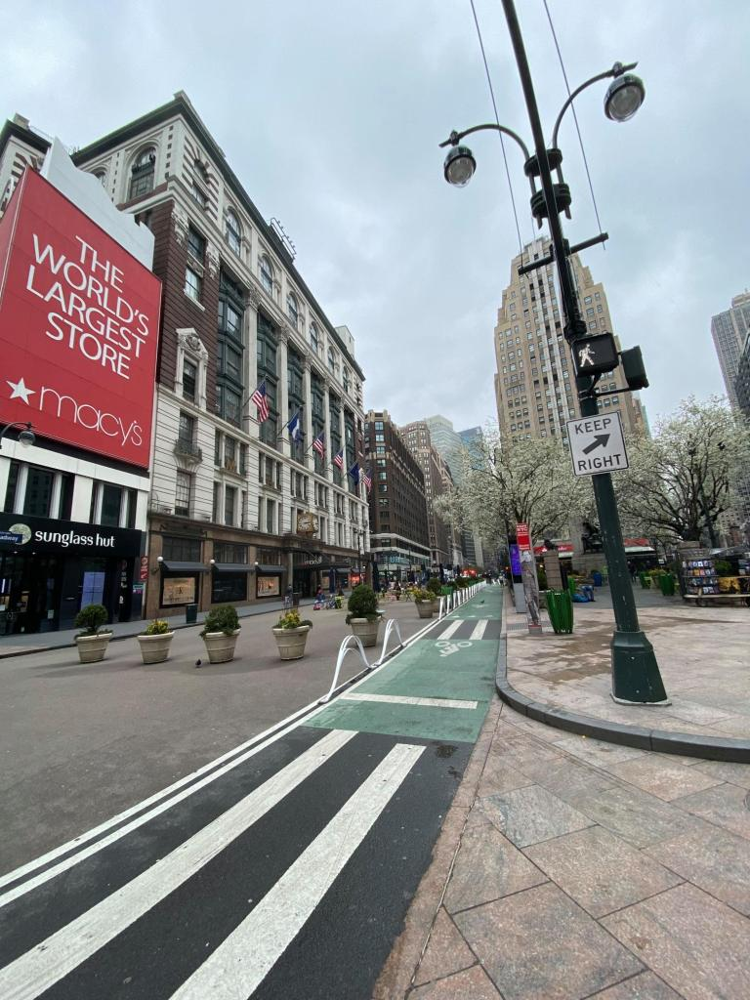
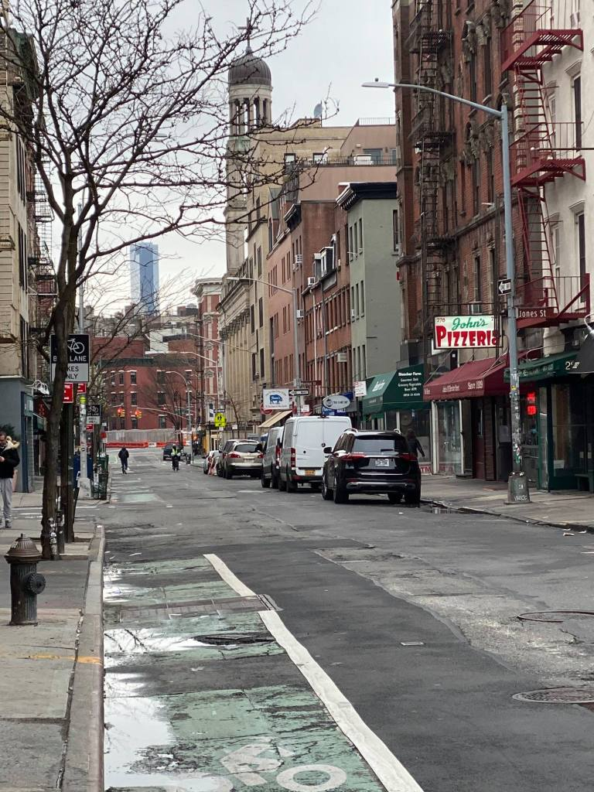

If you live in New York City and you've watched a New York crime show in the last twenty years, it probably felt a lot like alternate history science fiction. *What if you put Starsky and Hutch in a world with cell phones and the internet?*Those realities never co-existed, but that doesn't matter for the vast majority of viewers who not only don't live in New York, but in most cases have never even been there. The city only functions as a symbolic stand-in for everything they find threatening and mysterious about urban life. You don't need New York crime to make a New York crime show, anymore than you need real cowboys roaming around Wyoming to make a Western. Its become a beloved genre, completely independent of the actual place that is its theoretical setting.

In the same spirit, and perhaps because New York played such a central role in the storyline the last time we were facing down the prospect of total collapse as a nation, certain portions of the media have been playing up the idea that the 70's have come back full-blown, with crime and chaos on every corner, as well-heeled Upper West Siders flee the marauding homeless hordes. But the truth is, its pretty damned quiet. A lot quieter than it is most everyplace else. You can't just undo 30 years of gentrification in six months. The kinds of people who made the Bronx burn were locked up or driven out by skyrocketing rents decades ago. And we still have a police force that, if it were an army, would be the world's 11th largest. No, New York isn't descending into chaos. At least not yet. But everyplace else is. The result is a perverse inversion of 1977. The Bronx isn't burning, but the nation is. Never has Spaulding Gray's vision of us as "an island off the coast of America" seemed more apt. It's like living in a city-state on the periphery of Rome circa 476 AD, and watching the collapse of the empire with morbid fascination while wondering what it's all going to mean for our small, independent, trading hub.

The last time I drove cross-country, I stopped and took a picture of the world's largest cross. It looms up out of the flat Texas plains and you can see it for miles and miles before you get to it. There were people there praying and kneeling, and, it being Texas, I couldn't help but to imagine what might happen if Leatherface were to suddenly burst out of the weeds with his chainsaw. How would they process that? If I lived in Texas, I'd pay a lot of money to find out. In the event, I just took the picture, and when my fiancé at the time asked why, I told her, "So I can explain American politics to New Yorkers."

We like to deny it, but the truth is, we're not really Americans here. Most of us would feel more at home in any European capital than we would in any other part of our native land and all the worst suspicions that our countrymen have about us are mostly true. We're happy to take their tourist dollars, but we're even happier to see them check out of the Best Western and be on their way. For these past four years we've been mostly keeping quiet when they stroll through Times Square with the red hat on, but only because it is not in our nature to tip off the mark. 

For a commercial people, the ultimate measure of intellectual superiority is the ability to take your money. Getting the MAGA's to give us theirs has been some small comfort in these trying times and we haven't survived this long by being choosy about who's pockets we dip our hands into. Besides that, it's hard to really hate what you can't even begin to understand. These puffy, fanny-packed, credulous, Trump-loving specimens might as well be Amazonian tribesmen dropped in the middle of 8th Avenue on a sacred mission to find the nearest Cold Stone Creamery. I've spent enough time in their villages to have caught the drift of their thinking, but for most my fellow New Yorkers, they're as incomprehensible as Quantum Mechanics. I try to explain it to them once in awhile, but then they just think I'm taking their side.

And so we watch in horrified fascination as the nation that we have only ever nominally been a part of, tears itself apart over questions of culture, race, and settled science. We watch people refusing to wear masks in a pandemic, not out of a perverse laziness, but as a matter of principle, and we just can't figure it out. We see a man like Mitch McConnell who wants to give people less money in the middle of an economic catastrophe cruising to re-election, and we just don't understand how you could assemble a majority of people in any state who would want to vote for that, undeniable shittiness of his opponent notwithstanding. There's something very sackcloth and ashes about it. Or BDSM. *Please sir, harder this time.* We would happily secede if we could, but the centurions would be on us in a heartbeat if we tried it. The only question is how much we can decouple our fate from that of the "everyplace else," places. Probably not much, which seems grossly unfair. But we aren't the first to make a deal with the Devil, only to realize when the payment came due that he was hiding there in the details all along.

The irony of all this is that the shit isn't going down around the figure of some homespun Deep South fascist, as ninety years of science fiction, going all the way back to *It Can't Happen Here*, had always intimated it would. Its going down around the first native New Yorker to win the Presidency since Theodore Roosevelt. It's as if Gozer had asked the nation to pick the form of its destruction and instead of the Stay Puft Marshmallow Man, it had inexplicably chosen a tabloid punchline from a part of the country that it had always despised. Who could have seen that coming? But then again, that may be why he slipped under the radar. Raving about Mexican rapists in a Southern drawl would have been a dead giveaway. Trump's guy-from-a-bar-in-Queens thing is more associated with mob movies than visions of the apocalypse. And the idea of putting Tony Soprano in charge for awhile probably seemed like a hoot to a population that hasn't been getting much entertainment value from their government over the past 30 years.

As of this writing, we're 44 days out from the election, and Ruth Bader Ginsberg passed away 48 hours ago. Just typing that sentence, makes me feel like I'm not composing an essay so much as I'm ripping off Vonnegut. All the absurdity of human nature and all the cruel ironies of fate that were the author's favorite themes are on full display in the way we're choosing to dispose of our empire. Not in a final, glorious stand against the barbarian hordes. Not in the self-sacrificing decision to fight against Nazi tyranny. No, we're going down because half the nation believes that a failed casino magnate and former game show host is their only salvation, while the other half believes that he's the second coming of Hitler. Neither side has much faith in democracy anymore, and when the citizens of a democracy no longer believe that democratic processes are an absolute good, regardless of outcomes, no peaceful transfer of power is possible. The results are going to be catastrophic.

New Yorkers, you can take some comfort in the fact that your bone-deep belief in your own superiority has been borne out in some way by the reality that one of the least of us was able to bring down the country in just under four years. Everyone else, well, take some comfort in the fact that your prejudices have been confirmed - all it took was one godless New Yorker in the White House to ruin the whole damned national endeavor. Whatever our differences, we will ultimately share the same fate, and perhaps in the end we both have it coming; us for producing him, and you for electing him. 

Smoke ‘em if you got ‘em folks. In six some-odd weeks, this is all going to end the way it was always meant to; in a Vegas floor show-style spectacle, with a half-assed con man leading the way.

**Title Photo: Noam Galai, Getty Images / All other photos by Russell Dobular**
