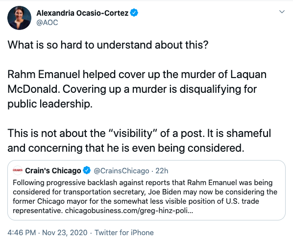

The formal presidential transition process is now underway, according to a [letter from the General Services Administration](http://cdn.cnn.com/cnn/2020/images/11/23/gsa.biden.pdf) sent to Joe Biden sent on November 23, signaling the beginning of the end of a bizarre and mostly incoherent effort by the Trump campaign to challenge the results of the 2020 election. [After having lost over 30 cases in court](https://www.cnbc.com/2020/11/21/trump-loses-l.html), and with state after state [certifying their results](https://www.washingtonpost.com/elections/2020/11/24/joe-biden-trump-transition-live-updates/), it seems the Trump team is starting to accept their fate. If this was indeed an attempted "coup," as many in the media were calling it, it was among the lamest ever. 

Later in the afternoon, [Biden rolled out many of his highly anticipated cabinet picks](https://www.cnn.com/2020/11/24/politics/biden-cabinet-nominees-event/index.html), which included Antony Blinken for Secretary of State, Avril Haines for Director of National Intelligence, and Janet Yellen for Treasury Secretary. Biden's selections thus far offer few surprises, and even fewer olive branches to progressives. As had been widely predicted, Biden's early choices signal a return to Obama-era technocracy and foreign policy.

Thankfully, the Left seems more alert to the problematic nature of many of these appointees, and is even raising concern over some still in consideration for lower-level positions. For example, Alexandria Ocasio-Cortez tweeted the following in response to news that the odious Rahm Emanuel is being floated for a less "visible" position within the Biden administration:

Esteemed environmental activist and consumer advocate Erin Brockovich penned an Op-Ed entitled, ["Joe Biden: Are You Kidding Me?"](https://www.theguardian.com/commentisfree/2020/nov/19/dear-joe-biden-are-you-kidding-me-erin-brockovich) in response to Biden's tapping of former Dupont consultant Michael McCabe to his EPA transition team, and warned on CNN that ["the fox is in the henhouse."](https://www.cnn.com/videos/politics/2020/11/20/erin-brockovich-intv-biden-michael-mccabe-epa-transition-sot-nr-vpx.cnn)

The Sunrise Movement, a youth climate group which organized for Bernie Sanders' campaign and later helped get out the vote for Democrats in the general election, called Biden's appointment of Congressman Cedric Richmond, a notorious bundler of fossil fuel donations, for director of the Office for Public Engagement, a "betrayal" and ["an affront to young people who made President-elect Biden's victory possible."](https://www.commondreams.org/news/2020/11/17/today-feels-betrayal-sunrise-movement-blasts-biden-pick-big-oil-backed-cedric)

We discuss the underwhelming end of the Trump "coup" as well as the reaction to Biden's first round of cabinet nominees, on episode 97 of the Due Dissidence podcast. Listen to our full conversation by clicking the player below:

Subscribe to the Due Dissidence podcast on [Apple,](https://podcasts.apple.com/us/podcast/due-dissidence/id1457244081)[Stitcher](https://www.stitcher.com/podcast/due-dissidence)[,](https://podcasts.apple.com/us/podcast/due-dissidence/id1457244081)[Spotify](https://open.spotify.com/show/3jDky0r8Cg0vlYuORwWhaE)[,](https://podcasts.apple.com/us/podcast/due-dissidence/id1457244081)[Castbox](https://castbox.fm/channel/Due-Dissidence%7D-id2086184?country=us)[,](https://podcasts.apple.com/us/podcast/due-dissidence/id1457244081) [Google Podcasts](https://podcasts.google.com/feed/aHR0cHM6Ly9mZWVkcy5zb3VuZGNsb3VkLmNvbS91c2Vycy9zb3VuZGNsb3VkOnVzZXJzOjYwNjI5Njg0NC9zb3VuZHMucnNz), or any major podcast player!

Photo: Twitter
