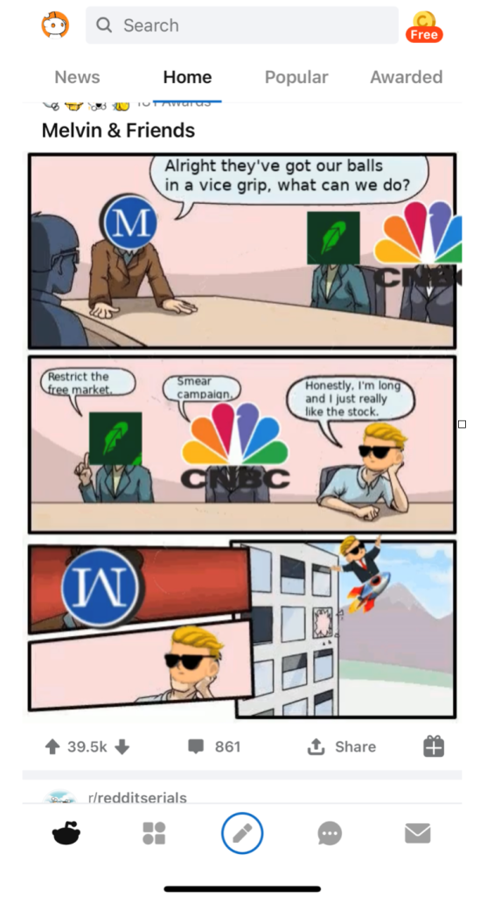
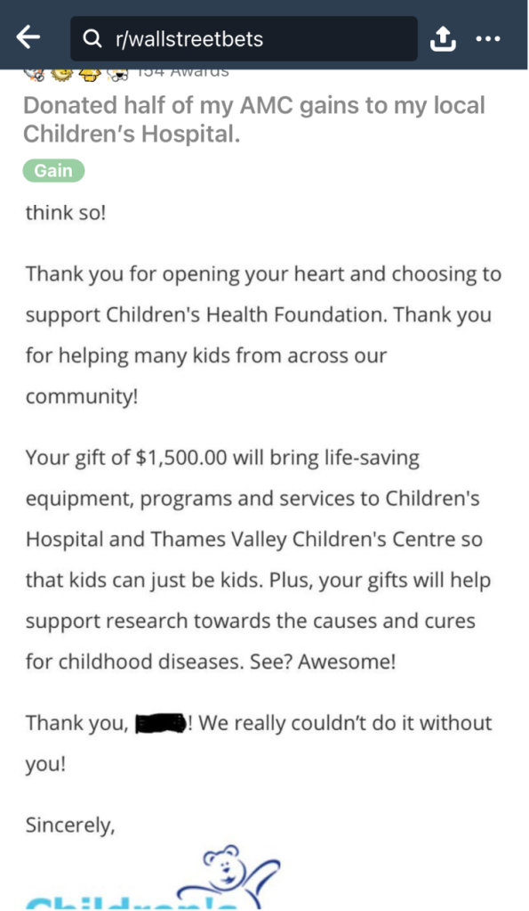
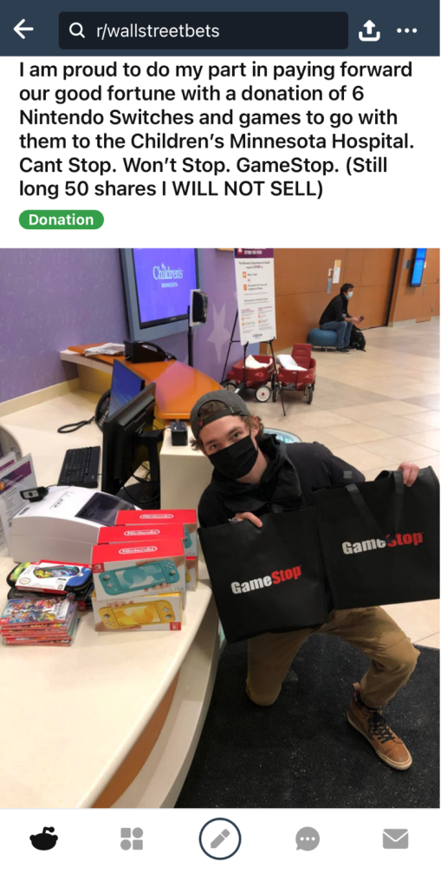
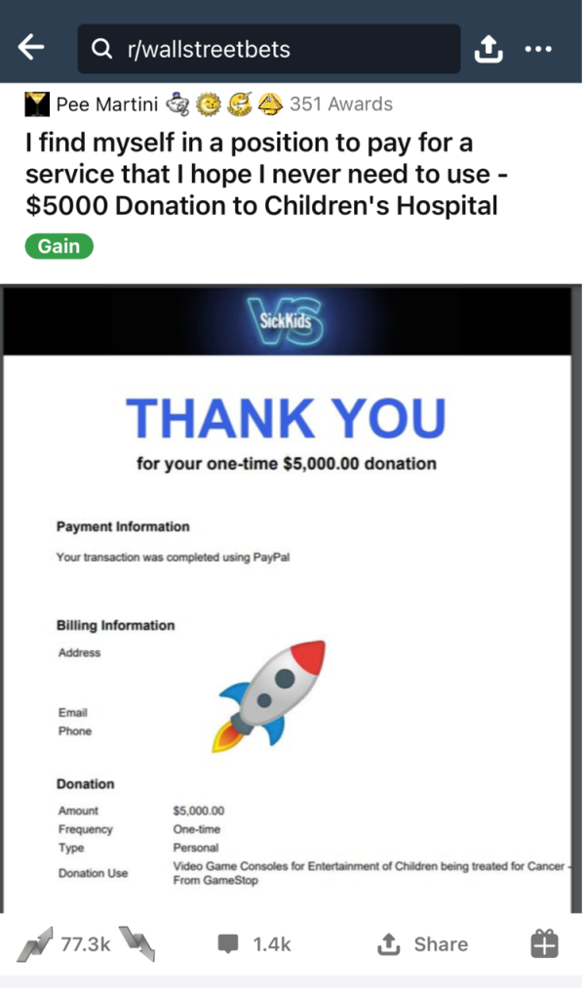
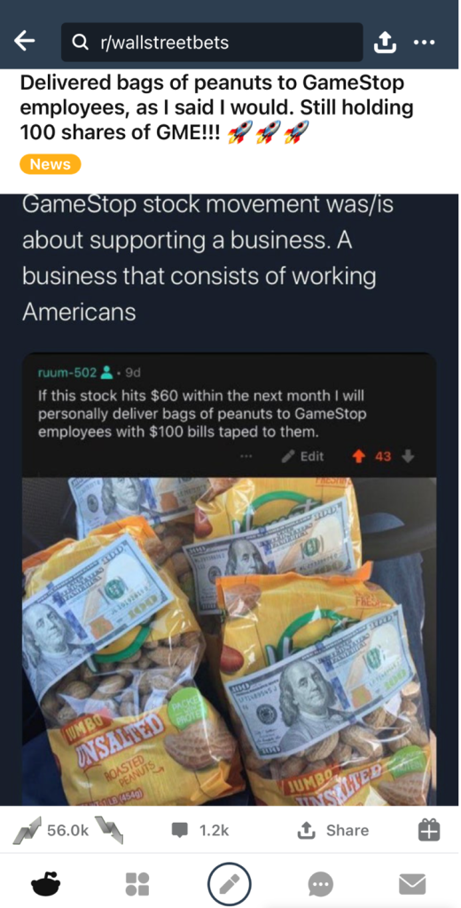
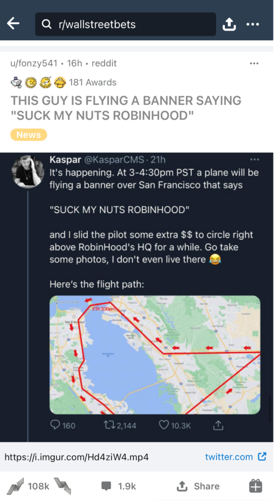
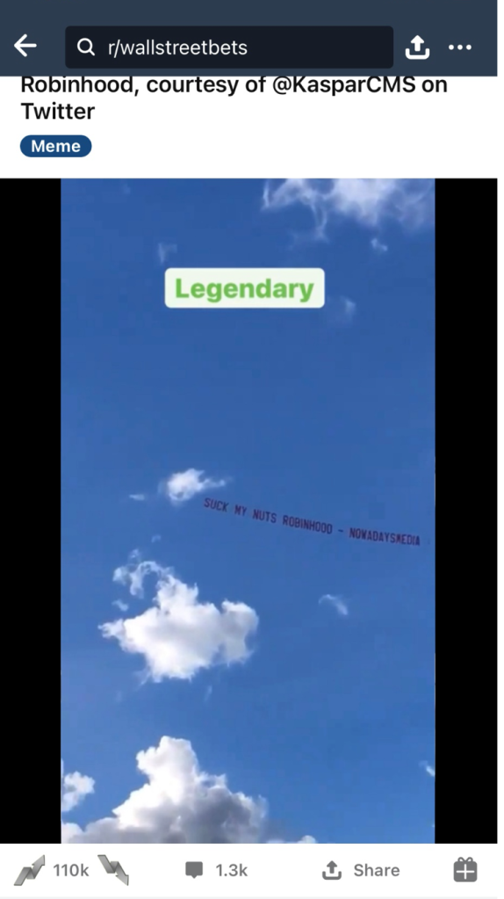
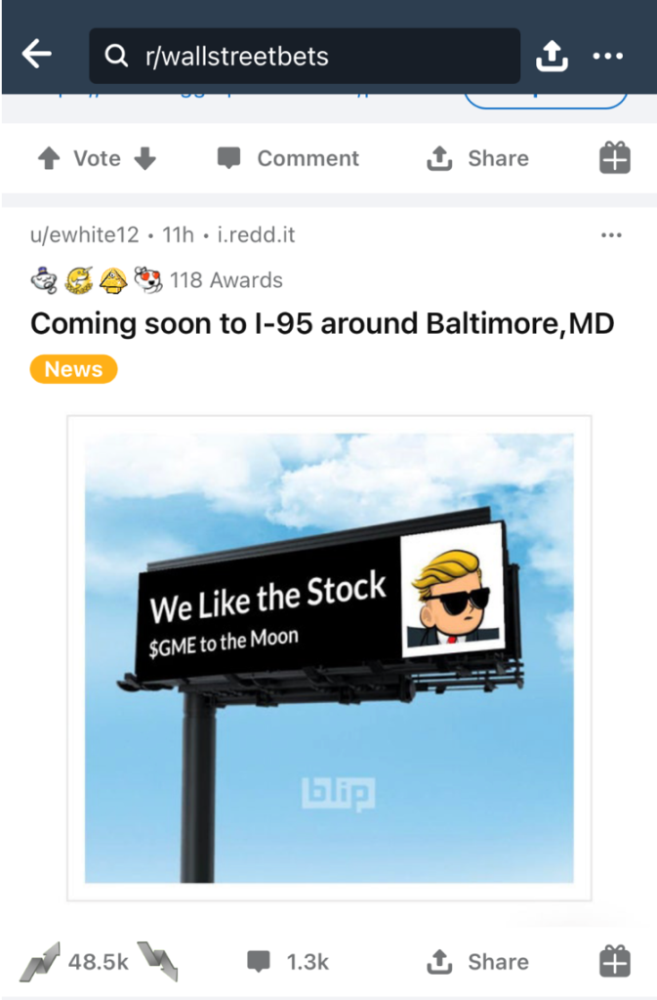
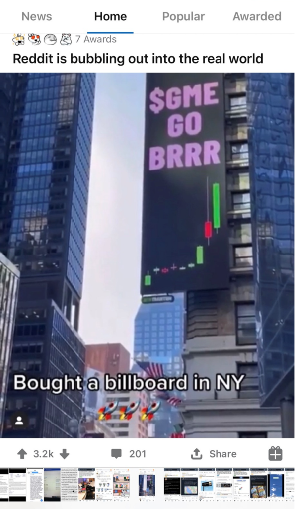

>"We like the stock." - *Jim Cramer, January 28, 2021*

Except for a few rare moments of populist uprising big enough to force concessions from elites (the labor movements of the late 19th-early 20th century), the story we tell ourselves about our own history, is mostly the story of the upper classes. Thus, when we think of the 60's, we think of hippies at Woodstock, even though there were never more than 500,000 hippies, and they were mostly drawn from middle to upper-middle class homes. The majority of young boomers at the time were too busy working, raising families, and fighting in Viet Nam, to be cheering on Hendrix at Woodstock. 

Similarly, when we think of millennials and Gen Z, we think of fragile, wokester snowflakes, more concerned with pronouns and speech codes than systemic corruption in our political and financial system. But this only represents a small fraction of their generational cohort and it's mostly the fraction that's fortunate enough to have gotten through two decades of endless war, financial ruin, and now a once-in-a-century pandemic, without ever having to work at a Wendy's. 

The media never tells us what the two-thirdsrds of people under 30, without a 4-year college degree think, except to represent them as quasi-human, Trump-loving, 4-chan using, white supremacist, troglodytes. But a perusal of Wall Street Bets on Reddit, where the greatest frontal assault on Wall Street in its 232-year history was conceived and hatched by a bunch of broke kids, many of them with low wage fast food and retail service jobs, tells a very different story.

Funny, irreverent, self-effacing, generous, savvy, pissed-off, and decidedly un-PC, the Wall Street Bets community reads a lot like what you might have gotten if Abbie Hoffman had written the screenplay for Oceans 11. They're pulling off the heist of the century and they know it. And the best part is the people they're stealing from not only deserve it but have all directly or indirectly had a hand in creating the land of no opportunity that is the only America they've ever known. WSB is full of stories from young adults who experienced the 2008 financial crisis through the eyes of a child who helplessly watched their parents lose the house, or the family business go bust. And it's also rife with stories of people donating a portion of their windfall to charity; children's hospitals are a favorite recipient.

One lucky winner who swore he'd bring bags of peanuts with $100 bills taped to them and give them out to the workers at his local Game Stop if the stock price hit $60, did just that.

There's a fierce determination not to be like the greedy hedge fund assholes they're robbing that's completely unexpected if you've only been exposed to [media accounts of the sub-reddit](https://www.pcgamer.com/discord-ban-wall-street-bets/?fbclid=IwAR0GRPbf_vybHUQO9DAxQ1dMhmviOD0_LTIzvtHpbUidkiAXB_r0At60DI0), which predictably attempt to paint its users as unusually finance obsessed Nazis.

And then there are the kinds of pranks that a bunch of teenagers and twentysomethings flush with more money than they've ever seen in their lives and animated by a loathing for institutions would pull. After Robin Hood shut down trading on Game Stop, AMC, and a host of other WSB targeted stocks, one newly wealthy Game Stop investor hired a private plane to fly over Robin Hood's San Francisco headquarters for an hour, trailing a banner emblazoned with the legend, "Suck My Nuts Robin Hood."

Renting out billboards and filling them with taunting messages aimed at the hedge funds they've gone to war with, has also been a favorite use of Game Stop winnings.

In the face of overwhelming odds, and in many cases, deep personal hardship, the WSB community has used their ingenuity to find a way to strike back at the system that's screwed them all their lives and make a lot of money doing it. With can-do spirit, cynical humor, and stick-to-itiveness ("diamond hands" is a favorite phrase, which means, a person who will never sell, even if the price dips wildly), they've taken on the whole financial establishment, and exposed its corruption in a way that no social movement of the past several decades has been able to achieve. 

In other words, this army of retail investors, some of whom are buying just one or two shares of Game Stop, in order to support the cause, better exemplify the qualities of individual initiative and outside the box thinking that have always been at the heart of the American myth, than anyone or anything we've seen represented in our politics and media for a long, long time. 

Turns out the American spirit isn't dead, its just not on the TV. To find it, open yourself a reddit account and wander on over to Wall Street Bets. The self-described "smooth brained monkeys, autists, and pranksters" over there will probably bring a smile to your face, maybe for the first time in awhile. Unless you own a hedge fund, in which case, you should probably cover your short now; I haven't personally examined them, but as far as I can tell from the price action, these folks have diamond hands.

***Disclaimer: Nothing in this article should be construed as financial advice. The author holds positions in AMC and Sundial and plans on opening a position in Game Stop at market opening, simply because he likes the stock.***

For more on this topic, listen to episode 104 of the Due Dissidence podcast by clicking the player below, and subscribe to the Due Dissidence podcast on [Apple,](https://podcasts.apple.com/us/podcast/due-dissidence/id1457244081)[Stitcher](https://www.stitcher.com/podcast/due-dissidence)[,](https://podcasts.apple.com/us/podcast/due-dissidence/id1457244081)[Spotify](https://open.spotify.com/show/3jDky0r8Cg0vlYuORwWhaE)[,](https://podcasts.apple.com/us/podcast/due-dissidence/id1457244081)[Castbox](https://castbox.fm/channel/Due-Dissidence%7D-id2086184?country=us)[,](https://podcasts.apple.com/us/podcast/due-dissidence/id1457244081) [Google Podcasts](https://podcasts.google.com/feed/aHR0cHM6Ly9mZWVkcy5zb3VuZGNsb3VkLmNvbS91c2Vycy9zb3VuZGNsb3VkOnVzZXJzOjYwNjI5Njg0NC9zb3VuZHMucnNz), or any major podcast player:

**Images: Twitter, Reddit**
