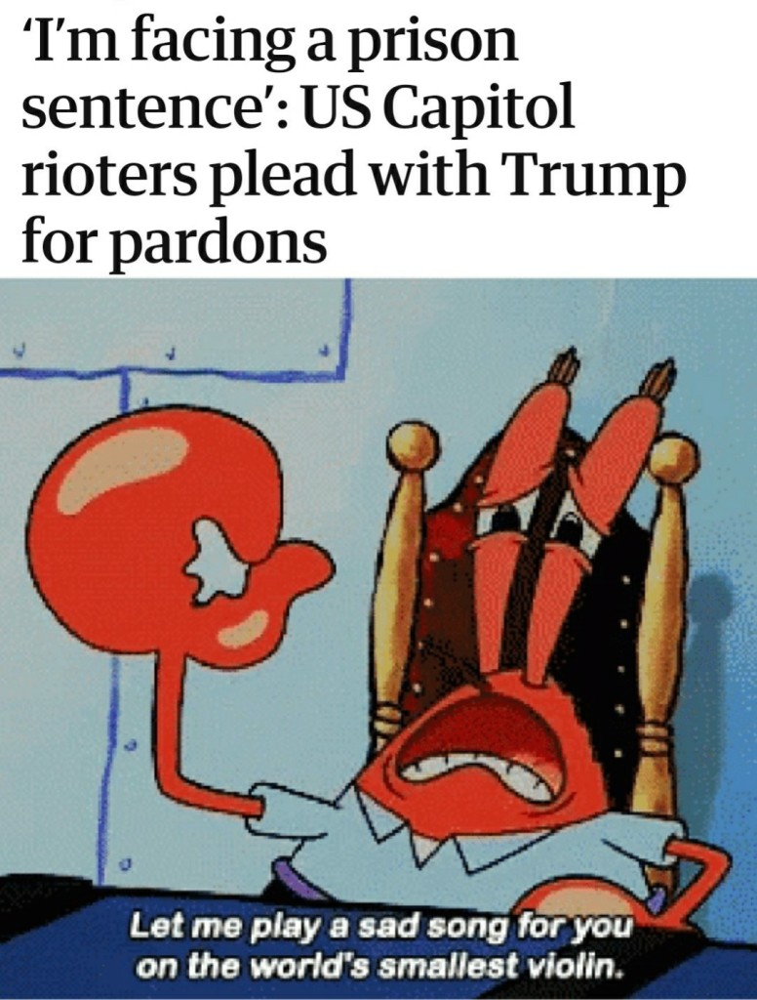
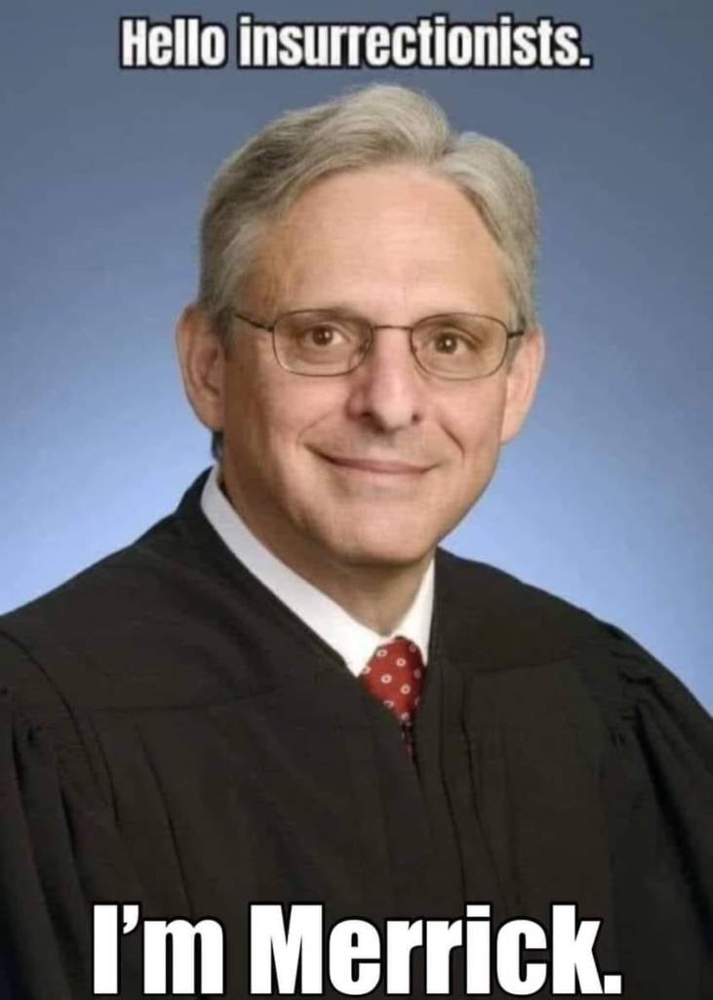

We on the Left had always assumed that the defense of free speech and freedom of expression were core principles of Leftism, and that the impulse to censor and ban was a right-wing phenomenon. Boy, were we naïve. Turns out that whoever has institutional power will use that power to try to shut down dissenting voices, no matter where those voices may fall on the ideological spectrum. For most of the post-war period, the center-right had all the power, which created the false impression that censorship is always coming from a Victorian prudishness, or Russophobia. But in this new bizarro world where a fringe identarian movement has seized control of academia, the media, and for the moment, the government, we've made the mind-blowing discovery that it's possible to be prudish from the Left, and when you give the Left the power to make that prudishness actionable, all that ACLU stuff goes right out the window. Strangely, the Russophobia part has carried over unchanged.

What's really disheartening is that if anything, the New Left seems to be even more enthusiastic about shutting down speech and debate than the Old Right was.

*The New York Times* recently [ran an article](https://www.nytimes.com/2021/02/25/technology/clubhouse-audio-app-experience.html) decrying the fact that (Heaven's Forbid!), the new platform Clubhouse is enabling private conversations (remember those?), that can't be monitored by its crack team of wokescolds, and there's [growing pressure on Substack](https://techcrunch.com/2021/03/18/substack-backlash/) to kick writers off its completely subscriber-supported platform. Think about the implications of that for a moment: critics of Substack are saying that people who want to pay to read the writing of certain authors and journalists, should not be allowed to do so. This is a level of madness you have to go back to the McCarthy era to find a right-wing equivalent for. We've replaced the core principle, "I may not agree with what you say, but I'll defend to the death your right to say it," with "I may not agree with what you say, and I may start an online Twitter campaign to shut down your right to say it."

Censorship and cancellation, though, are just the tip of the iceberg. It seems there's a growing tendency among liberals to not just want to limit their opponents' freedom of expression, but to strip them of certain rights and freedoms altogether, even going as far as to cheer on what they hope will be extended prison sentences for the accused Capitol rioters and their enablers. Memes like those listed below have been all over #BlueMAGA Twitter in recent months:

Aside from the Capitol rioters themselves, those who "cast doubt on the integrity of the presidential election" are also apparently deserving of years in "maximum security federal prisons," according to this liberal meme maker:

Not only do liberals gleefully celebrate the prospect of all of these people rotting in prison for decades, they apparently don't feel any of these criminal defendants ought to have the right to raise funds for their legal defense. [In a recent *USA Today* article](https://www.usatoday.com/story/news/nation/2021/03/28/online-trump-supporters-insurrection-raise-money-lawyers-legal-fees/4751712001/), a team of journalists bragged that they convinced crowdfunding platforms to delete the campaigns of accused Capitol rioters who were using their sites to raise money for their attorneys' fees. Glenn Greenwald, in his [excellent Substack post critiquing the piece](https://greenwald.substack.com/p/journalists-attack-the-powerless), writes:

> "The primary target of the Trump-era media has [become private citizens](https://reason.com/2017/07/07/what-cnns-threat-to-dox-a-redditor-tells/) and people who wield no power, yet who these media outlets believe must have their lives ruined because they have adopted the wrong political ideology. So many corporate journalists now use their huge megaphones to humiliate and wreck the lives of ordinary private citizens who they judge to have bad political opinions (meaning: opinions that deviate from establishment liberalism orthodoxies which these media outlets exist to enforce)."

For a cohort of political thinkers who gasped in horror at then candidate Donald Trump's suggestion that perhaps he would appoint a special prosecutor to investigate Hillary Clinton should he defeat her in the 2016 election (a threat that, after he won, he never followed through on), liberals seem awfully eager to see the book thrown at the deplorables for their perceived offenses against decency and democracy. They're equally excited to use the informal relationship between Big Tech oligarchs and the federal government in order to silence these enemies online, and strip them of their ability to finance their legal defenses. That Barack Obama's unseated nominee for the Supreme Court, current Attorney General Merrick Garland, is the one who gets to lead these unfortunate Trumpsters to the gallows, is just the icing on the cake.

Maybe it's just us, but these don't seem like the attitudes of committed "anti-fascist" actors. 

We discuss all of this in further detail in episode 110 of the Due Dissidence podcast. Listen to our full conversation by clicking the player below:

Subscribe to the Due Dissidence podcast on [Apple,](https://podcasts.apple.com/us/podcast/due-dissidence/id1457244081)[Stitcher](https://www.stitcher.com/podcast/due-dissidence)[,](https://podcasts.apple.com/us/podcast/due-dissidence/id1457244081)[Spotify](https://open.spotify.com/show/3jDky0r8Cg0vlYuORwWhaE)[,](https://podcasts.apple.com/us/podcast/due-dissidence/id1457244081)[Castbox](https://castbox.fm/channel/Due-Dissidence%7D-id2086184?country=us)[,](https://podcasts.apple.com/us/podcast/due-dissidence/id1457244081) [Google Podcasts](https://podcasts.google.com/feed/aHR0cHM6Ly9mZWVkcy5zb3VuZGNsb3VkLmNvbS91c2Vycy9zb3VuZGNsb3VkOnVzZXJzOjYwNjI5Njg0NC9zb3VuZHMucnNz), or any major podcast player!

**Photo: Tyler Merbler**
