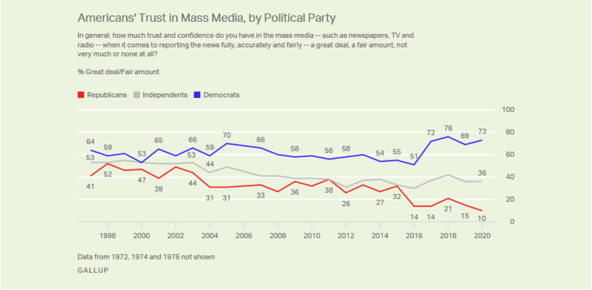

Nina Turner entered her primary for Ohio's 11th Congressional District with massive advantages in name recognition, fundraising, and polling. In fact, as recently as June 1, her lead seemed insurmountable; she was [polling at 50% to Shontel Brown's 15](https://www.wkyc.com/article/news/politics/nina-turner-leads-poll-11th-congressional-district-race/95-5842fe8f-4824-4185-8020-c0f16a47da96). When [Hillary Clinton endorsed Brown](https://thehill.com/homenews/campaign/558750-clinton-backs-shontel-brown-in-ohio-congressional-race) a couple of weeks later, progressives mostly laughed it off, seeing as Turner seemed like a lock to win anyway.

But Clinton's intervention was the beginning of an all-out blitz by the Democratic establishment to destroy Turner's campaign and install their preferred moderate candidate. James Clyburn, as well as other senior members of the Congressional Black Caucus, would endorse and campaign for Brown. Centrist-aligned Super PACs flooded the airwaves with attack ads against Turner which [ranged from inane to downright dishonest.](https://www.wkyc.com/article/news/politics/elections/ohio-11th-congressional/3news-investigates-fact-checking-shontel-brown-nina-turner/95-9e04816a-0418-4d0a-afee-2167613e7aea) In the end, they were successful; Brown defeated Turner on Tuesday night by a comfortable margin.

Since Turner's loss, several articles have been published explaining why she fell and what it means moving forward. Normon Solomon's piece entitled ["Nina Turner's Loss is Oligarchy's Gain"](https://scheerpost.com/2021/08/04/nina-turners-loss-is-oligarchys-gain/?fbclid=IwAR3i3Qm0s6W1d4uwX2TU_DFF19bNlwMEEodjA6IT_alPtViyz7u3eQ0xP84) points out that Ohio has open primaries and that high profile Republicans like Bill Kristol openly encouraged members of his party to vote for Brown. [Alexander Sammon wrote](https://prospect.org/politics/nina-turner-lost-to-redbox-ohio-shontel-brown/) in *The American Prospect* that Brown's victory is "a blueprint for super PAC takeovers of elections and campaigns going forward," citing the Brown campaign's shady relationship with such PACS as well as the impact of their attack ads down the home stretch of the primary contest.

But it was David Sirota who got it the most right, tweeting out the following:

https://twitter.com/davidsirota/status/1422753685797367811

Indeed, "more Dem voters want a corporate government than something else." This is self evident to a large degree, seeing how these primaries continue to materialize. And even to the extent that Democratic voters don't *really* want a corporate government, but are rather duped into voting for one, this can be explained by Democratic voters' overwhelming support for establishment media outlets that steer their support towards centrist candidates over progressives (even in cases like this one where the progressive starts with a massive lead). According to a [2020 Gallup poll](https://news.gallup.com/poll/321116/americans-remain-distrustful-mass-media.aspx), Democrats' trust in the media registered at 73%. When independents were asked the same question, 36% expressed confidence in media. Republicans, 10%.

And so while this particular contest was of course corrupted by big money and Super PAC intervention, we have to remind ourselves of two very important things:

First, big money interests will *always* interfere in elections, and they will *always* do so against the progressive in the race. 

Second, and more importantly, there is a very good reason that such interventions are more effective in Democratic Party primaries than they are in Republican ones: *73% of Democrats trust the media*, *as opposed to 10% of Republicans.* This means that Democratic voters are more likely to fall for dishonest Super PAC ads, because they're psychologically predisposed to believe everything they see on television. These are the kinds of people who may actually think that Snapple really is made from the "Best Stuff on Earth." 
 
Democratic primary voters take orders from their party leaders and media idols. This explains why the party's last ditch effort to coalesce behind Joe Biden 48 hours before Super Tuesday was so shockingly successful, and it explains why Nina Turner's 35-point polling lead evaporated once the party bosses made their preference known.

Therefore, while observations about the influence of "oligarchs" and the like are undoubtedly accurate when it comes to summarizing this campaign, the banality of the voters themselves can no longer be excused or ignored. Democratic primary voters are simply awful. They cannot be trusted, under any circumstances, to make the right decision, which is why I myself predicted Turner would lose to Shontel Brown way back on [our March 2nd podcast (skip to 33:22 to hear for yourself if you'd like)](https://soundcloud.com/duedissidence/rainbow-bombs-and-broken-promises-things-are-getting-back-to-normal). 

The Democratic Party is a dead end for Leftists and progressives not because of Hillary Clinton and James Clyburn, but because of the millions of primary voters who take their cues from them. After all, Super PACs exist on the Right as well, and millions of dollars in Super PAC money was spent to destroy Donald Trump's candidacy in the 2016 primaries. It didn't work against Trump because Republican voters, unlike Democrats, don't trust the media, and instead actually think for themselves about who they want to nominate. We might not like *how* they think or *what* they think, but at least they think. 

Democrats don't think. Democrats obey. They do what the party wants them to do. And so, to put it quite simply, there is no future in the Democratic Party, because the Democratic Party is full, from top to bottom, of *Democrats*. 
 
We discuss Turner's defeat more thoroughly in episode 116 of the Due Dissidence podcast, featuring Rod Brana from The [People's Party](https://peoplesparty.org/). Click the player below to hear our full conversation, and subscribe to the Due Dissidence podcast on [Apple,](https://podcasts.apple.com/us/podcast/due-dissidence/id1457244081)[Stitcher](https://www.stitcher.com/podcast/due-dissidence)[,](https://podcasts.apple.com/us/podcast/due-dissidence/id1457244081)[Spotify](https://open.spotify.com/show/3jDky0r8Cg0vlYuORwWhaE)[,](https://podcasts.apple.com/us/podcast/due-dissidence/id1457244081)[Castbox](https://castbox.fm/channel/Due-Dissidence%7D-id2086184?country=us)[,](https://podcasts.apple.com/us/podcast/due-dissidence/id1457244081) [Google Podcasts](https://podcasts.google.com/feed/aHR0cHM6Ly9mZWVkcy5zb3VuZGNsb3VkLmNvbS91c2Vycy9zb3VuZGNsb3VkOnVzZXJzOjYwNjI5Njg0NC9zb3VuZHMucnNz), or any major podcast player.

**Photo: Paul Becker**
