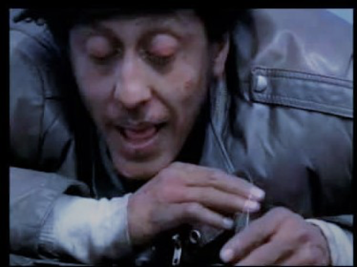
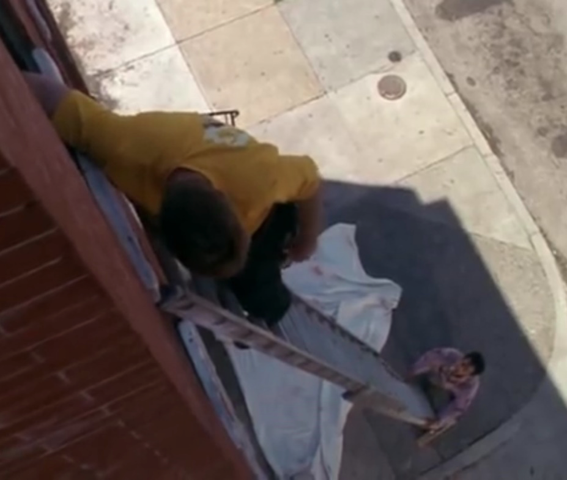
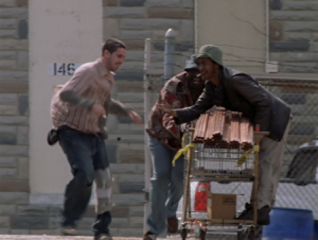
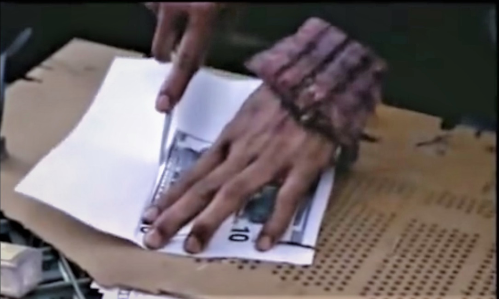
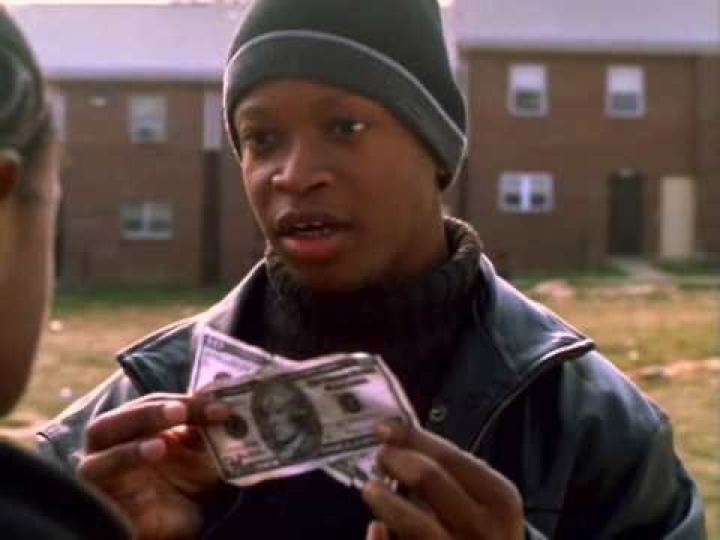
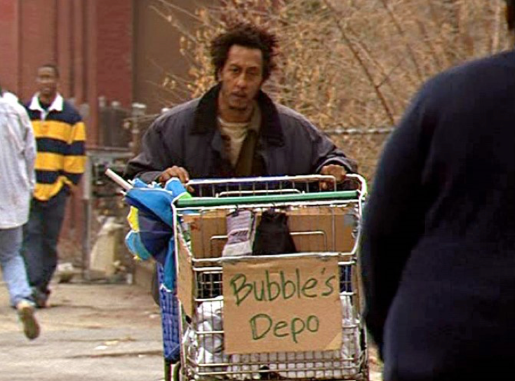

> "McNulty: I've gotta ask you: if every time Snot Boogie would grab the money and run away… why'd you even let him in the game?
> 
> Kid: What?
> 
> McNulty: Well, if every time, Snot Boogie stole the money, why'd you let him play?
> 
> Kid: Got to. It's America, Man
> 
> Opening scene of *The Wire*, HBO, 2002

Every couple of years or so, I make it a point to rewatch one of my all-time favorite series, HBO's masterpiece inner-city drama *The Wire*. A few months ago, I was studying the exploits of one of the most memorable characters of the show, Reginald Cousins, a.k.a. "Bubbles."

Suffice to say that Bubbles is an endearing drug addict with a heart of gold who has an exceptionally poignant arc over the course of the series as he traverses from addiction to recovery. 

However, early in the series, before he achieves sobriety, Bubbles is sort of a wandering Taoist in West Baltimore seeking out ways to score cash or drugs (which for him are of interchangeable value) to feed his habit. He either happens upon, devises, or improvises several different schemes, scams, and ploys designed to yield him cash or drugs. 

He sneaks up on a rooftop where drug dealers are operating below him and with a fishhook surreptitiously lifts bags of heroin from a stash in an old tire; he scavenges scrap metal and discarded cell phones (with active minutes remaining) which he is able to resell; he takes advantage of an unattended ambulance while the crew is on a call to raid their store of syringes, needles, and liquid morphine.

This past binge was my fifth time watching the series when the thought struck me: Bubbles is a street-level, rapacious late-stage capitalist looking to turn circumstances to his advantage at a moment's notice, heedless of any damage he may be wreaking on the social fabric around him. In fact, Bubbles has at least as much (and quite probably more) conscientiousness and ethical responsibility than real life capitalist speculators and financial operatives.

Let's examine his scheme of passing counterfeit money to buy drugs from the Barksdale drug crew in Season One. Bubbles and his young apprentice Johnny make black and white photocopies of several $10 bills. Bubbles then goes about soiling the bills with dirt and coffee. After he puts together three fake $10 bills, he asks Johnny for "the real" (meaning the one $10 bill they had left between them). They were using a real bill on the outside to cover up the fakes. 

Including assets of real value along with others to cover and mask the worthlessness of other elements. . .Does this sound familiar? Sounds quite a bit like the mortgage-backed securities of the 2006-2008 era, doesn't it? 

You remember those don't you, the ones that nearly collapsed the entire world financial system? They famously featured some few AAA, AA, and A rated mortgages that were bundled with BBB and BB rated mortgages (which by the end of the subprime fiasco were as worthless as Bubbles' counterfeit) and sold to unwitting pension funds as safe investments. Of course, Wall Street's perpetrators were ultimately not held culpable for any of that mischief, whereas the consequences for Bubbles, and particularly his young protégé, are considerably more dire. 

Young Johnny is caught and beaten so severely that he is left relying on a colostomy bag. If only divine providence had visited *that* sort of retribution upon the perpetrators of the 2008 financial crisis.

In the penultimate season of the series, Bubbles partners with another young protégé from the streets, Jerrod, and the two operate a shopping cart mobile convenience store /peddling business he dubs "Bubbles Depot." 

Personally, I see similarities between Bubbles growing his cart enterprise to Jeff Bezos and Amazon. The variable that comes into play in both cases is a reliant, time-pressed consumer base. 

Bubble's business grows exponentially when he happens upon a rogue police-sanctioned open air drug market dubbed "Hamsterdam" featuring drug crews that cannot leave their location for fear of losing their spot to a rival crew, and thus are essentially stuck operating in place 24/7. They need T-shirts, socks, toilet paper, food, water and other supplies that they can't go out and shop for. 

So, Bubbles has a captive clientele that needs him to bring the necessities of life directly to their front stoop. Similarly, even before the pandemic, the working poor in this country were well beyond the 40-hour work week and had ventured in some cases into the 70 or 80-plus hour a week range. As a result, they have little choice but to rely on the convenience offered by Mr. Bezos and Amazon. 

Although they might be cognizant of its deleterious effects on their wages, working conditions, and the health of manufacturing and retail industries, they are pressed by absolute need for convenience and lower prices. Just like the drug crews stuck within Hamsterdam need Bubbles, so too do America's working poor need Bezos.

Bubbles is definitely more socially responsible and ethical in his worldview than Mr. Bezos in one vital way: he pays his taxes. After being arrested for shoplifting, he is told by the series lead McNulty that he is going to have to "pay taxes on this," meaning that he is going to work off his debt to society by acting as a paid police informant. When his young friend Johnny tries to talk Bubbles out of it, he insists that everyone needs to pay their taxes. This is a life lesson and outlook that is most sorely needed by the 1%. 

In fact, I really must apologize to the fictional character of Reginald "Bubbles" Cousins for my unfair comparison of him to the rapacious capitalists currently wreaking havoc on our non-fictional reality. Bubbles' victims are largely drug dealers, slumlords whose scrap metal he loots, city budgets that bear the brunt of pilfered medical supplies, and chain retail establishments whose goods he shoplifts. He never engages in any activity that particularly hurts working and struggling individuals. Certainly, he never holds employees to such a rigid time frame that they stroke out or can't find time to urinate as they struggle to keep up with a pace designed to optimize profits. 

Bubbles' excuse for his crimes is that he is addicted to cocaine and heroin. Our current capitalist operatives are likewise addicted; they are addicted to marshaling and leveraging their resources to accrue money that they haven't worked to earn. 

By the end of *The Wire*, Bubbles has overcome his addictions and found redemption. But for Bezos, Musk, Gates, et al, it doesn't seem as if anything short of pitchforks and torches followed up by several years of Cultural Revolution-style struggle sessions are going to lead them to similarly change their ways.
