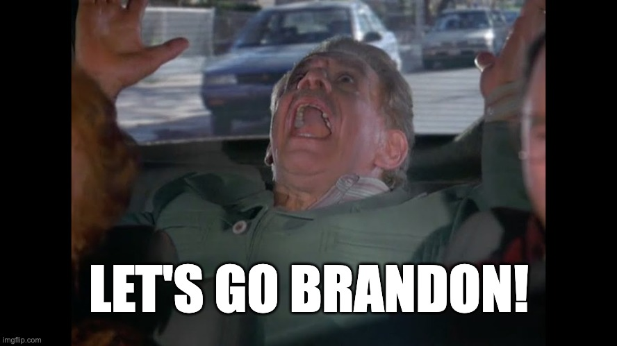

Yes, 90% of the "Let's Go Brandon" chanters have politics that are pretty different from mine. After all, the phrase was born at a NASCAR event. During a TV interview with winning driver Brandon Brown, an NBC reporter nervously interpreted the crowd's chants of "Fuck Joe Biden" as "Let's Go Brandon." Ridiculous as her attempted coverup was, she deserves credit for thinking on her feet.



In the weeks since the video surfaced online, "Let's Go Brandon" has gone viral as a G-rated stand-in for the saying's actual sentiment. As an added bonus that the Trump base is sure to enjoy, "Let's Go Brandon" also serves to call out the media for its willful and absurd misrepresentation of reality (or, as they would put it, "Fake News.")

While the Left has mostly responded negatively to the phrase - some have [dismissed it as juvenile and classless](https://twitter.com/RonFilipkowski/status/1454108075670003720?ref_src=twsrc%5Etfw%7Ctwcamp%5Etweetembed%7Ctwterm%5E1454108075670003720%7Ctwgr%5E%7Ctwcon%5Es1_&ref_url=https%3A%2F%2Fwww.dailykos.com%2Fstory%2F2021%2F11%2F1%2F2061463%2F--Let-s-go-Brandon-The-GOP-s-latest-jab-at-Joe-Biden-why-it-s-trending-and-what-it-means), while others have hyperbolically (though if we're being honest, somewhat predictably) [compared it to a Nazi salute](https://twitter.com/TristanSnell/status/1454801643824979969?s=20), I, for one, love it.

It's everything the Left used to be: it's mass politics, it's grassroots, it's transgressive in ironic and humorous fashion. But perhaps more importantly, it's cathartic in its simplicity and emotional honesty.

As a Leftist who's spent the past few months holding out hope that House progressives would hold the line on infrastructure negotiations and not capitulate to the "moderates" as they always have in the past, this last week has been incredibly frustrating. I should have known all along that it was only a matter of time before Pramila Jayapal and the rest of the holdouts in the Progressive Caucus would [cave under pressure](https://news.yahoo.com/joe-manchin-won-progressives-folded-040702521.html).

And so after months of digging through the weeds of political gamesmanship, analyzing intra-party negotiations, and fruitlessly attempting to predict the fates of both the bipartisan infrastructure package and the Build Back Better add-on, it seems that we are destined for yet another massive disappointment. In the end, once again, it all adds up to nothing. Progressives fold, centrists win, the media continues to propagate the narrative that the moderates are the "adults in the room" who "get things done," and that Lefties are "pie in the sky," "all talk, no action," blah, blah, blah.

It all makes you want to just throw your hands up and say 'fuck it all.' Fuck the craven "moderates" who withhold even the smallest plate of crumbs from their constituents so as not to upset their corporate donors. Fuck the feckless progressives who were never willing to tank both bills in order to stand up to their corrupt centrist counterparts. And also, for showing little to no leadership on these negotiations, Fuck Joe Biden - or, in the parlance of our times, *Let's Go Brandon.*

For NASCAR fans and the MAGA faithful, "Let's Go Brandon" is a subversive rallying cry against the Biden administration and its media propagandists. For the Left, it ought to be a sort of mantra; a squishy stress ball we can all squeeze when the dysfunctionally corrupt Democrats become too infuriating to think about without losing our minds altogether.

For example, you might find yourself getting riled up over [Ro Khanna's disgusting cowardice on CNN](https://twitter.com/JoshNBCNews/status/1455296630085890051) when he explained that after all of this chest-pounding, he'll be taking a "leap of faith" that Joe Biden can twist Joe Manchin's arm into supporting BBB. When you feel your heart rate spiking, just close your eyes, take a deep breath, and as you exhale, whisper a soft, gentle, "Let's Go Brandon."

You may come across a clip of [Don Lemon](https://twitter.com/TezlynFigaro/status/1456446125381140489) blaming the activist Left for the defeat of Terry McAuliffe, the insider's insider and moderate of all moderates. Rather than excite yourself trying to formulate a retort that will surely be wasted on anyone brainwashed enough to care what Don Lemon has to say about anything, simply breathe in, breathe out, and, nice and quietly: *Let's Go Brandon.*

Or, if you're more from the Frank Costanza school of meditation, you can even scream it:

Say it soft, say it loud, say it fast, say it slow - anyway you want. You do you. But seriously, try it. I think you'll like it. It's comfort food; chicken soup for the soul; self-care for the embattled Leftist.

We discuss the 'Let's Go Brandon' phenomenon, the 2021 election results, and more on episode 125 of the Due Dissidence podcast. Click the player below to hear our full conversation, subscribe to our podcast and listen on [Apple,](https://podcasts.apple.com/us/podcast/due-dissidence/id1457244081)[Stitcher](https://www.stitcher.com/podcast/due-dissidence)[,](https://podcasts.apple.com/us/podcast/due-dissidence/id1457244081)[Spotify](https://open.spotify.com/show/3jDky0r8Cg0vlYuORwWhaE)[,](https://podcasts.apple.com/us/podcast/due-dissidence/id1457244081)[Castbox](https://castbox.fm/channel/Due-Dissidence%7D-id2086184?country=us)[,](https://podcasts.apple.com/us/podcast/due-dissidence/id1457244081) [Google Podcasts](https://podcasts.google.com/feed/aHR0cHM6Ly9mZWVkcy5zb3VuZGNsb3VkLmNvbS91c2Vycy9zb3VuZGNsb3VkOnVzZXJzOjYwNjI5Njg0NC9zb3VuZHMucnNz), or any major podcast player.

(election recap begins at 4:25, Let's Go Brandon discussion at 38:11)

**Photo: Ivan Radic (CC 2.0)**
