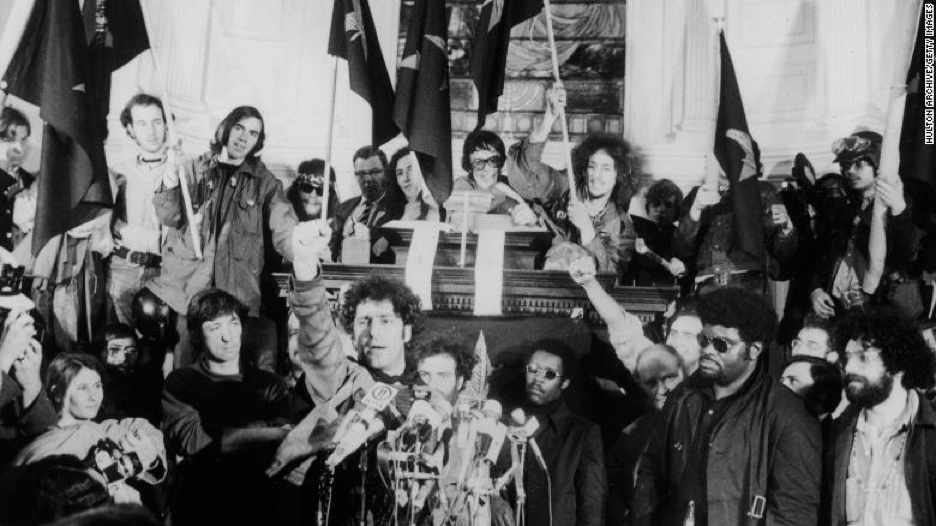
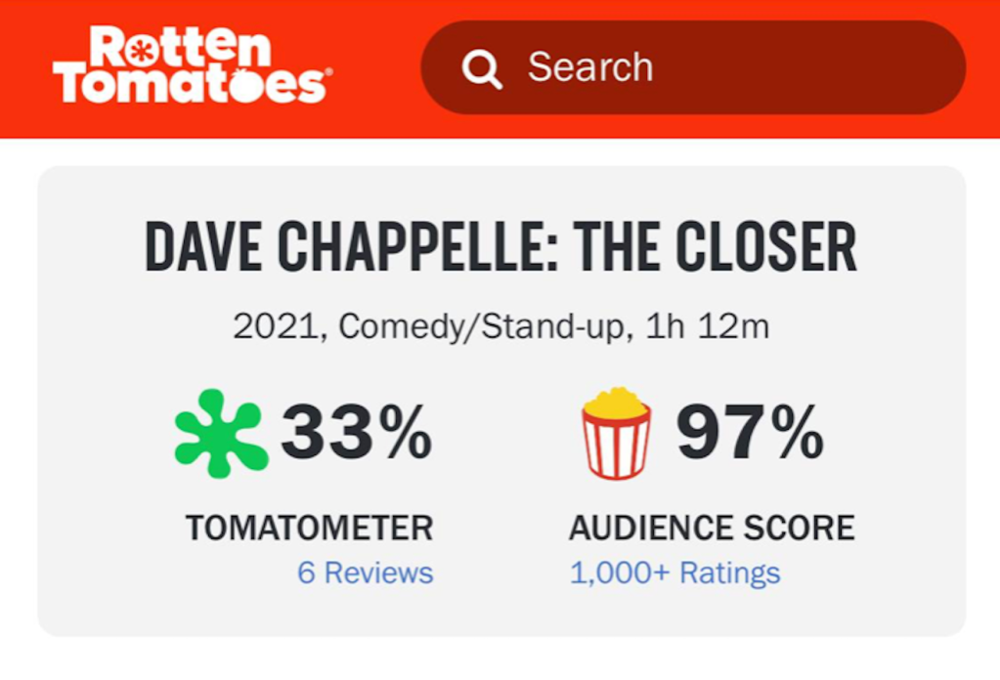

From a drunken, jibbering James Carville [appearing on CNN to lament the state of the race in Virginia](https://www.youtube.com/watch?v=kv27Bp-FHLA) a few days out, to the NBC poll that dropped over the weekend showing [Joe Biden with a 42% approval rating](https://www.axios.com/biden-poll-numbers-nbc-approval-960fec42-d0aa-4f0d-8a17-9191dfe37524.html), there was bad Juju for the Democrats written all over the first major election night of the Biden Presidency. As the results unfolded, with Youngkin holding a lead from jump that shrank but never disappeared, and Ciatterelli holding a much tighter, but also consistent lead in New Jersey, a state that should have been an easy lay-up, the punditocracy cast around for easy explanations while diligently avoiding the hard ones that get your network barred from sit-down interviews with the President.

Everyone's favorite convert to the Church of Shitlibbery, Nicole Wallace, unbelievably [tried to blame the mu](https://www.youtube.com/watch?v=CDkiF4xHIsk)lti-car Democrat electoral pile up on the fact that we pulled out of Afghanistan, as if Americans are sitting around their kitchen tables, sadly lamenting the unfulfilled promise of a woke Kabul. 

And all the flavors of racism were invoked, as has become de rigueur in the face of Republican victories: Brianna Keilar at CNN, [blamed "dog whistle racism"](https://www.youtube.com/watch?v=1rMFAS96j5c) for Youngkin's victory in a state that elected its [first black female Lieutenant Governor](https://www.youtube.com/watch?v=3mTxY70OQxA) right alongside him, and the ever reliable Queen of Dumb Takes, Joy Ann Reid, confidently declared that parents' expressed concerns about "education," (air quotes, Reid's), is ["code for white parents don't like the idea of teaching about race,"](https://www.youtube.com/watch?v=JgJa_5SUOYE) apparently without digging into the [demographics of Virginia voters expressing those concerns](https://www.theatlantic.com/politics/archive/2021/11/youngkin-republican-virginia-governor/620562/), a large number of whom were Asian, Latino and African-American. 

But the real reason behind these losses and the even more devastating and consequential losses to come is far simpler: no one likes a weenie. If you look up the definition of "weenie" in the dictionary, then plaster the face of pretty much any Democrat you can think of next to it, 9 times out of 10 they'll go together like [outed sex procurers to the powerful and mysterious suicides](https://www.huffpost.com/entry/the-convenient-suicide-of_b_99717). 

Okay, that may not be the only reason, but running candidates with faces as eminently punchable as Terry McAuliffe's, may just not be the winning strategy that it appears to be if you only talk to the kinds of people who don't want to punch Terry McAuliffe: a tiny subset of Washington insiders and donors, along with maybe a few of his closest relatives, and probably not even those if you get them liquored up enough to be honest about it. 

For everybody else, he's just a Clinton-era bag man with the same weird Trump fixation that his old Domme Hillary rode right into embittered obscurity. So, here's the real deal top 5 takeaways that didn't make it into Politico:

### 1. Let's Go Brandon

Honestly, we could just stop here. Nothing better demonstrates the way the left and the right have switched places than the eruption of this phrase and the desperate attempts of the establishment and its media mouthpieces to do what they always do with dissent in the post-Trump era: [define it as dangerous right-wing extremism](https://taibbi.substack.com/p/the-lets-go-brandon-freakout-goes), if not outright domestic terrorism. It used to be the left that tweaked the nose of the powerful with a mix of subversive humor, vulgarity, and impromptu guerilla theater.

Now it's the right that challenges the absurd hypocrisy and dishonesty of our institutions by parodying one hapless NBC reporter's attempt to pretend that ["Fuck Joe Biden"](https://www.youtube.com/watch?v=axcmVFtwSM4) wasn't really being chanted at the NASCAR race she was covering. 

Meanwhile, the left has taken on the role of its one-time nemesis, the humorless censor, ruling every challenge to its authority as uncouth, uncivilized, dangerous, and out of bounds. America has always hated a stiff and a scold, and while those types have occasionally held sway, they've never held it for long, and have always been regarded with derision and loathing in the end. Welcome to the beginning of the end.



### 2. $1,400 Doesn't Buy As Many Votes As It Used To

What exactly has Joe Biden done for you, other than send out a check for $600 less than what he originally promised? Now, here's an even more salient question: what has Joe Biden done for you that Trump wouldn't have done? Exactly. You see the problem here.

### 3. You Can Fuck With People's Heads, But You Better Not Fuck With Their Kids

For several years now, the identitarian left has been proudly touting its support of ideas about race that are derived from Critical Race Theory. As soon as it became clear how deeply unpopular those ideas are, not only with white people, [but with many POC](https://www.yahoo.com/now/trump-won-highest-share-non-164843048.html?guccounter=1&guce_referrer=aHR0cHM6Ly93d3cuZ29vZ2xlLmNvbS8&guce_referrer_sig=AQAAAJ-3ss8k1YKjmMVBXODbPn4OL1YoCg4Z-SDqwp70oRaOjuwP9Uc_XXAFdyFwJhLlcbEOwy6-uKUJ9O_vzJuDN2WY-geKqnjOLRB046hsr65FYEuM1UPBvTfIa82Kz-lav89u0HG9LdMUG8r8eb_3Q-GtJqmKb37n8MKvVw7DIfLX), they began to swing between [denying that CRT exists](https://www.youtube.com/watch?v=cVO71Mpjq0E) (which would be news to originators like Derrick Bell and Kimberle Crenshaw), claiming with intentional obtuseness that even if it does exist, it's a theory about outcomes in the legal system that certainly [isn't being taught to children](https://www.nbcnews.com/news/us-news/teaching-critical-race-theory-isn-t-happening-classrooms-teachers-say-n1272945), and finally, asserting that it [doesn't represent anything more](https://www.usatoday.com/story/news/education/2021/09/10/crt-schools-education-racism-slavery-poll/5772418001/) than an attempt to teach America's history of slavery and segregation in schools. 
 
No, CRT itself isn't being taught to children, and yes, it [did begin as a theory of law](https://www.americanbar.org/groups/crsj/publications/human_rights_magazine_home/civil-rights-reimagining-policing/a-lesson-on-critical-race-theory/). But since its inception, it has morphed into a General Unified Theory of race that colors the way the "soft sciences" and humanities are taught at the university level, and the students who have directly or indirectly absorbed these precepts in the course of their academic training then bring that [perspective to the way they teach children](https://thechalkboardreview.com/latest/of-course-crt-is-in-schools). 

This is what parents are reacting to, because most people aren't all that keen on the idea of having their children taught that they're [divided between race-based oppressed and oppressor classes](https://nypost.com/2021/06/11/black-mom-blasts-critical-race-theory-as-not-teaching-the-truth/), before they're old enough to reliably tie their shoes. Yes, there is a conversation to be had about the way slavery and Jim Crow are taught in schools ([badly](https://www.edweek.org/leadership/how-is-slavery-taught-in-u-s-schools-not-well-says-study/2018/02), like pretty much every other historical topic), but do we really believe that liberal Northern Virginia parents voted for Youngkin because they don't want their kids learning about Rosa Parks? 

These are separate issues that proponents of CRT desperately want to conflate because most people are not actually against teaching children about slavery, but they are very much against having their children taught to see themselves as victims and victimizers. The more Democrats are tied to these ideas, the better for the GOP.

### 4. Covid Fatigue

Based on [where they rank Covid among their concerns](https://www.reuters.com/world/us/covid-19-fading-dominant-political-issue-americans-focus-inflation-economy-2021-11-04/), at this point a majority of Americans probably feel that the juice of further lockdowns, mask mandates and general restrictions, isn't worth the squeeze. This puts the party that's been blowing Dr. Anthony "[what could possibly go wrong with funding gain of function research in China](https://abcnews4.com/news/nation-world/nih-letter-conflicts-with-fauci-collins-claims-about-wuhan-lab)" Fauci for two years running, at a distinct disadvantage. Throw into the mix the fact that Florida and some other Southern states [are doing as well, and in some cases better,](https://www.newsweek.com/florida-covid-cases-among-lowest-country-two-months-after-record-high-surge-1639985) than covid restriction model citizen states like California and New York, and you're looking at the makings of virtual GOP hegemony after 2022, as people run right into the arms of the party most likely to just leave them the fuck alone already.

### 5. Personally, I Could Give Two Shits Who Shits Where, But...

... maybe that's not the hill we want to die on? Sometimes I just want to ask Democrats, "Do you know any normal people?" Y'know, the kind of people who don't believe there are seven sexes, or at least don't believe that extreme outliers are all that relevant to their day-to-day existence, and are also deeply uncomfortable with the idea of sharing a bathroom with someone of the opposite biological sex, no matter how they identify? Set aside what your opinions on the subject are; we're talking political realities here. If I had to come up with a policy proposal that would piss off parents enough to overwhelmingly flip to the GOP, I couldn't come up with anything better than imposing gender-neutral bathrooms in public schools, without offering single-sex options. All it took was [one sexual assault in such a bathroom](https://www.usatoday.com/story/opinion/voices/2021/10/29/trans-bathroom-policy-sexual-assault/8568005002/) to undermine the Democrats' suburban strategy.

This sort of incident was inevitable, not because of gender neutrality, but because unfortunately, sexual assault is a thing, and it's a thing that sometimes happens in bathrooms. Thing is, when it happens in a gender-neutral bathroom in a public school, now you've realized parents' worst fears, and they're going to vote accordingly.

---

On a final note, as I wrote this article, I could already hear the identitarian shitlib pushback. It's the same pushback you get when you defend Dave Chapelle, or Joe Rogan, or - God forbid! - Jordan Peterson. Meanwhile, Chapelle's special has a 97% audience rating on Rotten Tomatoes, [Joe Rogan continues to be America's most popular podcaster](https://www.digitalmusicnews.com/2021/08/13/joe-rogan-experience-continued-popularity/), and [Peterson sells a lot more books](https://www.newsweek.com/jordan-peterson-book-amazon-preorder-1550580) than Robin DiAngelo.

Liberals' response to this evidence of how deeply out of touch they are with most of their fellow citizens usually boils down to: everyone else is stupid, racist, reactionary, and evil. And they aren't shy about expressing that opinion, as any casual peruser of pretty much any social media platform will have experienced first-hand. Then, after charming the voting public with this behavior day after day for several years running, they are always somehow shocked that when people get a chance to vote on the matter, they'd sooner elect the reanimated corpse of John Wayne Gacy than a Democrat. The response is never to re-evaluate their beliefs or messaging. It's always to double down on attacking the voters, as was the case after last week's latest wipe out. 

This is not the behavior of people who can or will win elections, policy battles, or anything else. Flame wars and petty cancel crusades do not a meaningful political movement make and that's more or less all Democrats have got at this point. The future belongs to the other side. Because nobody likes a weenie.

We discuss the 2021 election results and more on episode 125 of the Due Dissidence podcast. Click the player below to hear our full conversation, and subscribe to our podcast and listen on [Apple,](https://podcasts.apple.com/us/podcast/due-dissidence/id1457244081)[Stitcher](https://www.stitcher.com/podcast/due-dissidence)[,](https://podcasts.apple.com/us/podcast/due-dissidence/id1457244081)[Spotify](https://open.spotify.com/show/3jDky0r8Cg0vlYuORwWhaE)[,](https://podcasts.apple.com/us/podcast/due-dissidence/id1457244081)[Castbox](https://castbox.fm/channel/Due-Dissidence%7D-id2086184?country=us)[,](https://podcasts.apple.com/us/podcast/due-dissidence/id1457244081) [Google Podcasts](https://podcasts.google.com/feed/aHR0cHM6Ly9mZWVkcy5zb3VuZGNsb3VkLmNvbS91c2Vycy9zb3VuZGNsb3VkOnVzZXJzOjYwNjI5Njg0NC9zb3VuZHMucnNz), or any major podcast player.

**[Image: Don DeBold](https://www.flickr.com/photos/donkeyhotey/12480954033)**
