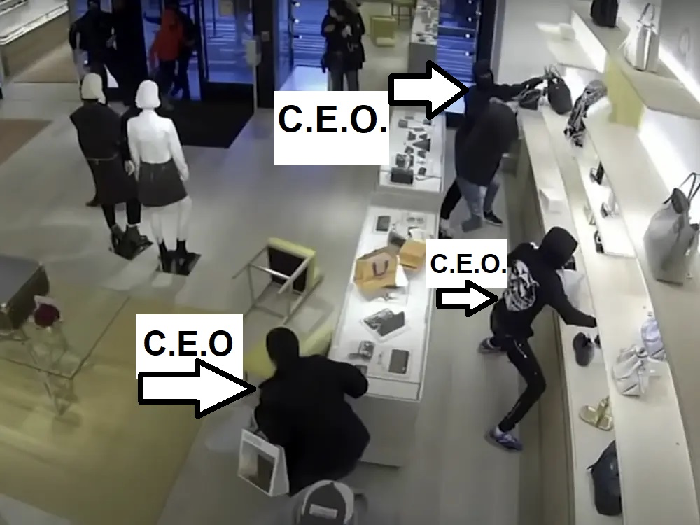

>"My dad was a... petty thief. Never could hold down a job, so, he just robbed. Convenience stores, shops, small-time stuff. One time, he sat me down, he told me something I never forgot. He said, ‘Everyone steals. That's how it works. You think people out there are getting exactly what they deserve? No. They're getting paid over or under, but someone in the chain always gets bamboozled.' I steal, Son, but I don't get caught. That's my contract with society. Now if you can \*catch\* me stealing, then I'll go to jail, but if you can't, then I've earned the money."
>
>-Mr. Robot, 2015

---

>"Behind every great fortune there is a crime."
>
>-Balzac (as cited by Mario Puzo in The Godfather)

---

This holiday season, habitual cable news viewers couldn't escape the [corporate media's steady supply](https://www.msnbc.com/morning-joe/watch/new-wave-of-smash-and-grab-robberies-has-retailers-shoppers-on-edge-127532101923) of consternation, pearl-clutching, handwringing, and in some cases outright hysteria, about the wave of organized smash-and-grab robberies befalling high-end retailers this holiday season. Pundits on CNN, MSNBC, and Fox News were of course quick to offer explanations from their partisan grab bags: unregulated big tech allowing the robbers to coordinate online, liberal D.A.s refusing to prosecute crime or impose bail, the erosion of the cohesive civil society, or the grisly endgame of the war on Christmas. Much of the hue and cry raised boil down to one overarching concern: if designer scarves and Louis Vuitton handbags aren't safe from masked hordes of marauding looters then what *is*?

Nancy Pelosi, under pressure to [denounce the robberies](https://na01.safelinks.protection.outlook.com/?url=https://www.yahoo.com/news/pelosi-slams-apos-attitude-lawlessness-172255693.html&data=04%257C01%257C%257Cf8104aeb34c74bac28f708d9cfc1d716%257C84df9e7fe9f640afb435aaaaaaaaaaaa%257C1%257C0%257C637769253703697373%257CUnknown%257CTWFpbGZsb3d8eyJWIjoiMC4wLjAwMDAiLCJQIjoiV2luMzIiLCJBTiI6Ik1haWwiLCJXVCI6Mn0=%257C3000&sdata=gDE31DMQzajSHopqZCDVut/ofm+IREnCD+1yfBgqoDo=&reserved=0), called them "absolutely outrageous" and a product of an "attitude of lawlessness" that "springs from I don't know where." She went on to assert that "we cannot have that lawlessness become the norm." 

Hmm. Where could such an "attitude of lawlessness" have come from? Well Madame Speaker, perhaps it has come from the very top.

As has been recently reported, some [52 members of Congress](https://na01.safelinks.protection.outlook.com/?url=https://www.yahoo.com/news/29-members-congress-caught-violating-193508477.html&data=04%257C01%257C%257Cf8104aeb34c74bac28f708d9cfc1d716%257C84df9e7fe9f640afb435aaaaaaaaaaaa%257C1%257C0%257C637769253703697373%257CUnknown%257CTWFpbGZsb3d8eyJWIjoiMC4wLjAwMDAiLCJQIjoiV2luMzIiLCJBTiI6Ik1haWwiLCJXVCI6Mn0=%257C3000&sdata=A4+dAv6YPyD4N6uUQHddl0Ig9ewxi3YNrObpVLc8i6Q=&reserved=0) have failed to properly report their financial trades as mandated by the Stop Trading on Congressional Knowledge Act of 2012, also known as the STOCK Act. When Pelosi was asked whether it was ethical for members of Congress to buy and trade individual stocks, she defended the practice by stating "We're a free-market economy … they should be able to participate in that." 

Very well. But there is more than one way of "participating" in the free market. One way is using privileged inside information you gain from public service to garner an unfair advantage against competing investors, and another is to smash open plate glass windows and grab merchandise.

When observers pointed out to defenders of the neoliberal status quo over the past three decades that wealth imbalance has created an unfair playing field in which small players can't compete, they were simply dismissed for failing to see the "big picture." For these Masters of the Universe, the global capitalist stage was some sort of primordial savanna where strong and fit firms could vanquish and feast upon the weak, and in turn create better services and lower prices for all consumers. But when masked marauders employ tactical logic straight out of a real-life savanna (property belongs to those who take it), they are aghast.

In language that neoliberal defenders of capitalist enterprise will be familiar with, the perpetrators of the flash mob, smash-and-grab robberies are all independent economic entities acting in their own self-interest. So, what's the problem? Every one of these smash-and grab looters can be considered their own personal corporation. As such, they are effectively CEOs. Well then, these CEOs have a fiduciary responsibility to their various stakeholders (themselves, family, landlords, creditors, and student loan servicers) to seek out, create, and exploit opportunities presented to them. 

Now, the owners and shareholders of the retailers in question might object to the "aggressiveness" of these CEOs. They are certainly guilty of running afoul of various "regulations" etc. - and please, just for a moment here let us interrogate why it is that when rich people break a law they are said to merely have "run afoul of regulations," and when a poor person does, they have *broken the law*? Of course, the answer is that regulatory violations are usually met with a fine or extremely brief custodial sentence, while crimes could require lengthy imprisonment.

Insider trading isn't simply "breaking a regulation," it's committing a crime. But if members of Congress are caught, the worst consequence they can expect is [a $200 fine](https://www.businessinsider.com/congress-stock-act-violations-penalties-consequences-2021-12). Struggling hand-to-mouth Uber drivers are fined more if they run a red-light in Manhattan. 

In general, white-collar criminals have never, and will never, see the inside of a jail cell. The masked marauders of this past holiday season, on the other hand, were all risking their freedom. But their economic circumstances are so dire that stealing a $7,000 handbag that can be resold online seemed to them a risk worth taking. Such is the aftermath of so eroding the economic prospects of people in their prime earning years.

In reality, we should be applauding their entrepreneurial initiative. Their elan. Their acquisitional pluck! These smash-and-grabbers aren't looking for a handout. They aren't waiting for the government to mail them each a Hermès scarf - they are going out and creating opportunities for themselves. 

Incidentally, wasn't it "opportunities" that politicians and pundits promised working people corporate interests would provide them given free rein? Perhaps the flash mob robbers were simply tired of waiting for the balancing arm of the free market to raise their boats.

Those who carried out the recent spate of smash-and-grab robberies had a few advantages: their numbers, their desperation, and a pandemic which allowed them to be masked and disguised without attracting scrutiny. They leveraged these advantages to their own benefit. In return, they create lower prices for consumers of high-end designer merchandise by selling their aggressively acquired goods on eBay. They create demand for private security companies and security guards while also providing work for plate glass window manufacturers and installers. 

Job creation and lower prices? It looks like the next generation of American entrepreneurs have arrived.

**Photos: Ashraf Ghani, Concord Police Dept.**
