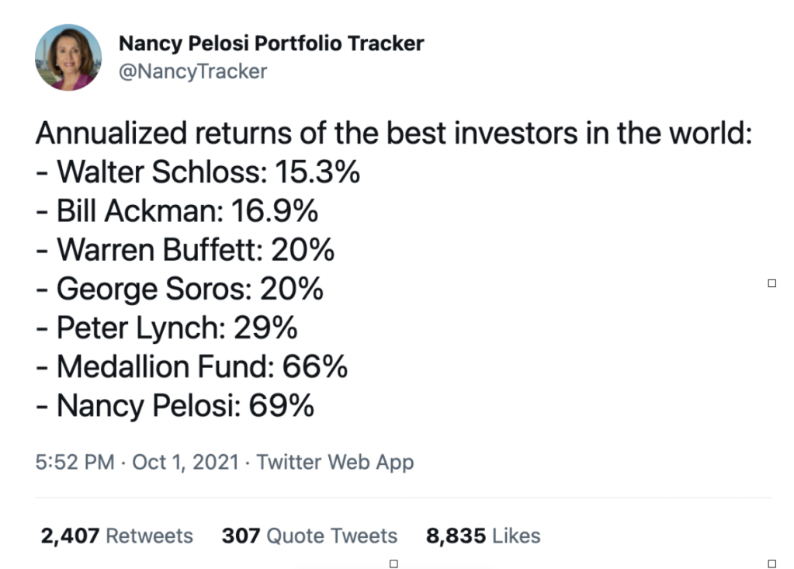

*"[SEC Rule 10b-5](https://www.sec.gov/Archives/edgar/data/1164964/000101968715004168/globalfuture_8k-ex9904.htm#:~:text=1.,trading%20in%20the%20Company's%20stock.) prohibits corporate officers and directors or other insider employees from using confidential corporate information to reap a profit (or avoid a loss) by trading in the Company's stock. This rule also prohibits "tipping" of confidential corporate information to third parties.*

*An "insider" is an officer, director, 10% stockholder and anyone who possesses inside information because of his or her relationship with the Company or with an officer, director or principal stockholder of the Company. Rule 10b-5's application goes considerably beyond just officers, directors and principal stockholders. This rule also covers any employee who has obtained material non-public corporate information, as well as any person who has received a "tip" from an Insider of the Company concerning information about the Company that is material and nonpublic, and trades (i.e. purchase or sells) the Company's stock or other securities.*

*This policy also applies to your family members who reside with you, anyone else who lives in your household, and family members who do not live in your household but whose securities transactions are directed by you or are subject to your influence or control, as well as trusts or other entities for which you make investment decisions."*

Based on all of the above, Nancy and Paul Pelosi should be getting fitted for orange jumpsuits right about now. That's what would be happening to you or me, or Martha Stewart, were our stock picks to repeatedly, mysteriously, outperform the S&P 500, and leave the annual returns of professional money managers in the dust. Once may be a lucky pick. Twice even. A good year here and there is plausible. But the Pelosis' "good luck" isn't confined to a particular company, transaction, or calendar year. Trade after trade and year after year they bury the smartest minds on Wall Street. There is no reasonable explanation for this feat other than the proposition that they are trading on inside information. And really, how could they not be? For a member of Congress, much less the Speaker of the House, to trade stock is like a referee making a bet on the game that they're about to call. Let's go back to the summer of 2021 for an example:

In May and June, investment manager and spouse to the Speaker, Paul Pelosi (this is how they work the scam-Nancy doesn't execute the trades), [purchased $11M worth of risky call options](https://markets.businessinsider.com/news/stocks/nancy-pelosi-husband-buys-millions-4-mega-cap-tech-stocks-2021-7?utm_medium=ingest&utm_source=markets) in Amazon, Apple, Alphabet (Google), and Nvidia. These types of trades only pay off if the stock reaches a "strike price," by a certain date. If the target price isn't met in the proper time frame, the options expire worthless. 

Adding to the risk was the fact that the House was at the very same moment creating anti-trust legislation that would better regulate large tech companies. In the end, a few weak proposals were [drafted and passed by the House Judiciary Committee](https://www.cnbc.com/2021/06/24/house-committee-passes-broad-tech-antitrust-reforms.html), none of which were seen as a major threat to Silicon Valley, and that weren't brought up for a full vote in the House in any case. All of the stocks Pelosi had purchased went through the roof, partly in response to the toothless proposals.

While this doesn't constitute hard proof of insider trading (the Pelosi's are far too wily to do anything that wouldn't meet the "reasonable doubt" standard in a court of law), the sheer mathematical impossibility of their annual gains simply can not be explained any other way. 

How good are the Pelosi's' trades? In 2021, they made a 69% gain on their investments. Warren Buffet, widely considered one of the greatest investors of all time, did 20%. So did George Soros, a man so canny that he is often credited with [causing a collapse in the British pound](https://www.forbes.com/sites/steveschaefer/2015/07/07/forbes-flashback-george-soros-british-pound-euro-ecb/?sh=6b158ad36131) in the Fall of 1992 by heavily shorting the currency. Peter Lynch, the Wall Street legend who took Fidelity's Magellan fund from $18M to $13B between 1977-1990, did 26%. And yet the Pelosi's left them all in the dust, more than doubling Lynch's returns, and more than tripling Buffet's and Soros'. 

Funny side note, the Twitter account "Nancy Pelosi Portfolio Tracker," which produced the below graphic, was shut down immediately upon Jack Dorsey's exit as CEO.

This was after they had received a "cease and desist order from a lawyer representing someone high up in the [Political] office." Apparently having her corruption laid out for all the world to see on Twitter was putting a bug up the ass of the reigning Queen of Stonks. But as the erstwhile Speaker herself has trenchantly observed, ["We are a free market economy."](https://www.marketwatch.com/story/pelosi-defends-lawmakers-and-their-spouses-trading-stocks-we-are-a-free-market-economy-01639606786)  

In that spirit, a plethora of Tik Tok groups and websites have sprung up to [track the financial maneuvers of the Speaker and her husband](https://news.yahoo.com/retail-traders-follow-nancy-pelosis-stock-moves-to-find-winners-163943788.html?guccounter=1&guce_referrer=aHR0cHM6Ly93d3cuZ29vZ2xlLmNvbS8&guce_referrer_sig=AQAAAM_PYr4R4LXE9UnYqOFOrgBLex7PidBJt-obsV3oFMvMVU_90dq0Bsct13mDDDRUmDIeP3SjmgU5V5sTkLHlT8v7OOQ52qNJU6VfscviGLcGsxF4jcjT52VVf-i4xfR9bA2otVMcFufc4Qj1InqOn2ZBpv76r4LyRGpyhYUFyQDv), so that retail investors can pile into trades that are widely perceived as being among that rarest of beasts in the world of stock picking: a sure thing. Time and again we have seen that any stock the Pelosi's buy is almost guaranteed to outperform the broader market. 

As Christopher Josephs, co-founder of the social media investing app Iris, which helps users track the investments of celebrities, friends, and political figures, [told Yahoo Finance Live](https://news.yahoo.com/retail-traders-follow-nancy-pelosis-stock-moves-to-find-winners-163943788.html), "The reason why Speaker Pelosi became so popular was because every trade she was making inevitably turned out to be such a long-term winner. Albeit the entire market has gone up significantly, but these are very, very risky bets because she's been buying [LEAP options](https://finance.yahoo.com/news/using-leaps-alternative-buying-etfs-110049213.html) as opposed to just stock...It started early in 2020 with Crowdstrike ([CRWD](https://finance.yahoo.com/quote/CRWD/)), and then she bought Tesla ([TSLA](https://finance.yahoo.com/quote/TSLA)), and there were some laws passed pro for the EV market...Then she bought Google ([GOOG](https://finance.yahoo.com/quote/GOOG?p=GOOG&.tsrc=fin-srch), [GOOGL](https://finance.yahoo.com/quote/GOOGL)) and then the laws came out that they weren't going to go after Big Tech." Each of the stocks Josephs mentions were up 20-30%, as of October, 2021. 

But if you, dear peasant, want to grab some crumbs off the Congressional Corruption table by trading like Nancy does, you may not have a lot of time left to get in on the action. After Business Insider revealed that [54 Congressional lawmakers and 182 senior staffers were in violation of the STOCK ACT](https://www.businessinsider.com/conflicted-congress-key-findings-stock-act-finances-investing-2021-12), which requires the reporting of all stock trades made by members of Congress and their staffs, momentum began to build for broad reform. 

Moderate Senator Jon Ossoff, of all people, seemingly in response to the Speaker's contention that members of Congress should be allowed to trade unfettered because capitalism or some shit, has [introduced a bill that would ban members of Congress from trading individual stocks](https://truthout.org/articles/jon-ossoff-introduces-legislation-to-ban-members-of-congress-from-trading-stock/), with the penalty being total forfeiture of their Congressional salaries. Senator [Josh Hawley is about to introduce a competing bill](https://www.businessinsider.com/josh-hawley-jon-ossoff-introduce-dueling-stock-trading-bans-2022-1), which would fine lawmakers their total profits if they are caught trading. Given the kind of money the Pelosi's and others are making off their insider moves, Hawley's penalty is probably the one with the most teeth. Nancy spends more on gourmet ice cream than her Congressional salary can cover.

What neither proposal includes is jail time. ‘Cause jail is only for the little people. And occasionally Martha Stewart.
