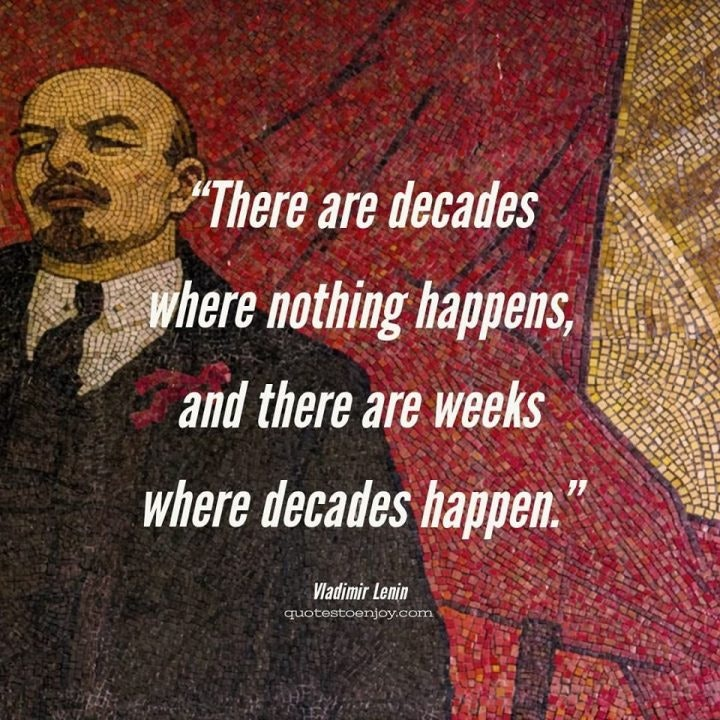
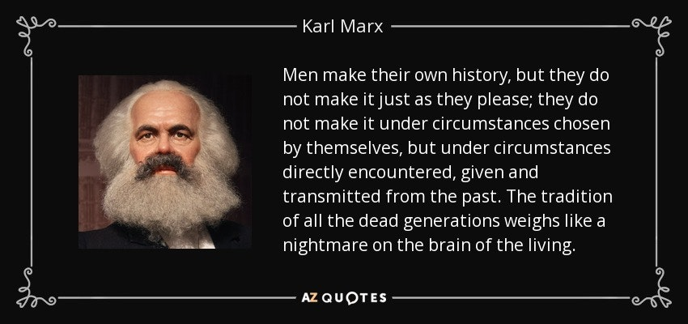

The great Lenin once said "There are decades when nothing happens, and there are weeks when decades happen." Now we are living in such a moment. Putin's risky ploy to overturn American unipolar global hegemony has crashed onto the rocks of poor planning and Ukrainian resistance and is turning into a catastrophe of historic proportions. Decades of history have been unleashed, but as Marx said, "Men make their own history, but not in circumstances of their own choosing." On this knife's edge of history, things could go in one of two radically different directions.

Putin's war has been a windfall for imperialists the world over. They now have a new justification to bloat their military budgets to unprecedented levels. They are sure to usher in a dystopian future of unimaginable militarism and state repression.

But only if we let them. There has never been a more opportune time for the working people of the world to rise up and take power.

People of Russia, you have nothing to gain from being part of a capitalist empire. Ending American global hegemony will not improve your lives in any way. This is a fight of capitalists—the working class has no stake in it. 

As an American from the wealthiest empire in world history, the working people of my country have not seen any gains in our standard of living. On the contrary, the more the capitalist class consolidates its stranglehold, the more desperate our plight becomes. The oligarchs of America and I have no common interests. They are my enemy. You have no common interests with your capitalist oligarchs either, especially the one at the top.

Putin's propaganda wants you to believe that if the Russian Empire is revived, it will benefit all Russian people. Putin has said that the collapse of the USSR was the biggest geopolitical disaster of the 20th century. It is, but not for the reasons he wants you to think. 

The capitalist reforms and privatization of the 1990s ushered in the worst suffering of the Russian people in decades. The rise of Putin brought greater stability, but only thanks to the coincidence of rising oil prices on the global market. With those profits, Putin was able to buy off the Russian working class. 

The agreement was that you would get political stability in exchange for your non-participation in Russian matters of state. Now he has abused that power to launch an imperialist invasion that you did not ask for, to resurrect the Russian Empire for the benefit of the Russian capitalist class. He has betrayed you, as capitalists who claim to serve your interests always do.

Russian working people, this is not your fight. World history stands on a knife's edge. At a time when the world needs to immediately end its dependency on fossil fuels in order for life on earth to survive, we must reject all capitalist imperialism. Let us seize this opportune moment to remake the world to serve the interests of working people. Working people of the world have nothing to lose but our chains. We have a world to win. Now is the time to rise up and say: 
 
No to NATO imperialism! 
No to American imperialism! 
No to Russian imperialism! 
No to all capitalist imperialism! 
No war but the class war!

**Photo: @IlyaYashin, Twitter**
