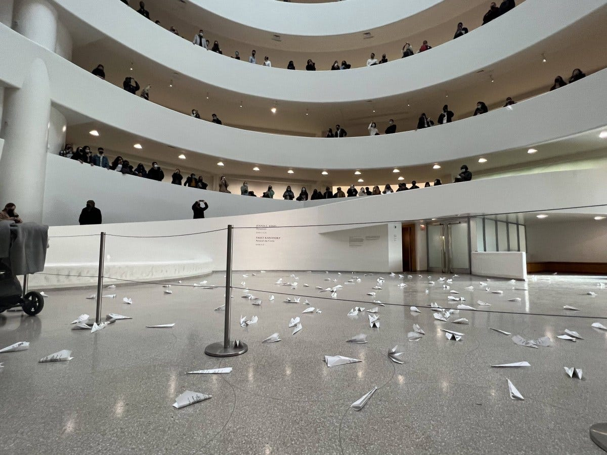
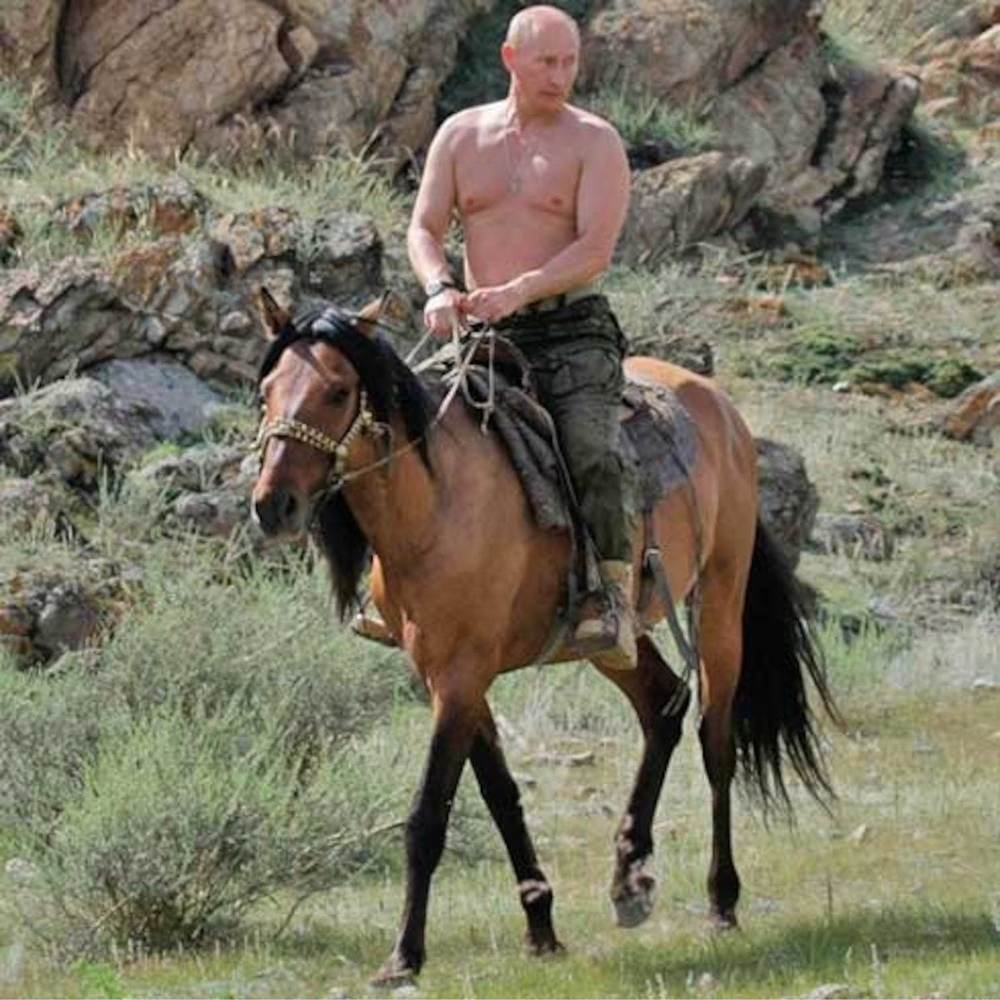

> "If you should go skating on the thin ice of modern life, 
> Dragging behind you the silent reproach of a million tear-stained eyes, 
> don't be surprised when a crack in the ice appears under your feet."
> 
> -Roger Waters

When Putin attacked Ukraine, some part of me said, *Of course. No way we were getting off with just a once-in-a-century global pandemic. That's only the first seal broke. Legend has it there's six more.*

Things fall apart.

When they do, an infernal momentum takes hold that's impossible to stop, or even slow most of the time.

That's what Chamberlain didn't understand, stepping off the plane, proudly waving around his little piece of paper with Der Fuhrer's signature on it. The thing was bigger than both of them by then. A historical inevitability.

When Shiva works up a powerful thirst, the blood will flow until she's good and satisfied. Entropy will have its way, and many will call it justice.

From the slave markets of Libya to the killing fields of Cambodia, we've left a lot of pissed off people in the wake of our Pax Americana. Those who have given parents, children, and limbs to our armies will be cheering for Russia right about now and hoping that we do something incredibly stupid. Like impose a no-fly zone on the request of [a corrupt comedian](https://www.theguardian.com/news/2021/oct/03/revealed-anti-oligarch-ukrainian-president-offshore-connections-volodymyr-zelenskiy).

So far, cooler heads are prevailing but [at the Guggenheim last week](https://hyperallergic.com/715642/calling-for-no-fly-zone-over-ukraine-artists-launch-hundreds-of-paper-planes-at-guggenheim-museum/), with the kind of gesture that would make a second year art student at The New School say, "Too pretentious," a group of 15 artists and activists threw 350 paper planes across the museum's famous winding walkways, in order to call for a no-fly zone over Ukraine.

Artists often believe that if their cohort ran things, utopia would naturally follow. But the only examples we have from history of artists with real political power are Nero, Hitler, and George W. Bush (whose work is featured below). This does not fill one with confidence in their geo-strategic judgment as a class.

Putin has no artistic pretensions. At least none that he shares with the public. His pleasures run more towards polonium and the occasional bare-chested horseback ride. The problem is he craps bigger than any President we've had in recent memory. You'd have to go back to Nixon to find an American leader with the kind of vicious sewer-rat instincts necessary to go ten rounds with Vlad. This is only Round One and Biden is already looking tired.

Putin has been plotting this moment for a long, long time, and it never had much to do with Ukraine. It has everything to do with the way the [Americans unleashed their hedge funds, banks, and political consultants](https://www.pbs.org/wgbh/pages/frontline/shows/crash/etc/russia.html) to pick over the bones of the failed Soviet state at the end of the Cold War. By the time they were done having their filthy way with the Russian economy, the only growth industries left were organ sales and prostitution. 

To keep the gravy train running, Bill Clinton sent his own people in ‘96 to interfere in the Russian elections by advising degenerate drunk Boris Yeltsin, who was polling at 6%. With Bubba's help, which included [securing a $10 billion dollar loan for Russia](https://www.theatlantic.com/ideas/archive/2018/07/the-us-has-a-long-history-of-election-meddling/565538/) from the IMF, he went on to defeat his Communist opponent by 13%, in an election so crooked that bombed-out Chechnya was recorded to have handed 70% of their vote to the man who had ordered the bombings.

Enter Putin.

It's true that Russia has traditionally been ruled by one strongman or another, first under the Tsars, and then under the Party. But it didn't have to be this way. Not this time. With the collapse of the USSR there was a hunger on the part of the Russian people to join the West and to adopt its then vaunted democratic institutions. Rock n' Roll, blue jeans, Jefferson, all that jazz.

What they got instead was an [ass-raping from Goldman Sachs](https://www.nytimes.com/1998/10/18/business/easy-money-special-report-for-russia-its-us-bankers-match-wasn-t-made-heaven.html), under the auspices of a US-controlled puppet government. Naturally, they turned for protection from their rapacious new American "friends," to the devil they've always known. And right up until he crossed the border into Ukraine, Putin pretty much held up his end of the bargain. For two decades he made sure that if anyone was going to grow fat exploiting Russia, at least they'd be Russians.

It wasn't much, but it was something and compared to the chaos and humiliation of the Yeltsin years, it wasn't half bad. At least you got to keep your kidneys, and if your daughter chose prostitution, it would only be because of an affinity for the lifestyle and not because the family had run out of tires to trade for eggs.

The big question now is whether Western sanctions will have the desired effect of knocking the Russian economy right back to where it was during the giddy years when Goldman was ["advising" the country into bankruptcy](https://www.rbth.com/blogs/2013/02/01/goldman_sachs_and_the_dark_days_of_russia_22025).

The other related question is whether a population that burned its own capital in order to deny shelter to Napoleon's troops, and that fought the battle of Stalingrad, five men to a rifle with the understanding that when one died the next would pick it up and keep fighting, are going to be broken by an absence of Target stores and Big Macs. That probably depends on how much they perceive the sanctions to be part of a Russophobic Western crusade. 

On that score, [kicking Russian children out of the Paralympics](https://www.nbcchicago.com/news/sports/russian-belarusian-athletes-out-of-paralympics-stunning-about-face/2773880/#:~:text=In%20a%20stunning%20reversal%2C%20Russian,Committee%20said%20Thursday%20in%20Beijing) and [firing Russian conductors from orchestras](https://abcnews.go.com/Entertainment/wireStory/munich-fires-russian-conductor-gergiev-supporting-putin-83174620) might not be the way to go. But going all the way back to Salem, Americans have never been ones to let common sense get in the way of a good witch hunt. Once the wood is stacked and the pitch ignited, its best for rational, fair-minded people to keep their heads down and their mouths shut until the fire burns itself out and the mob moves on to another target. Last month it was Joe Rogan, the month before that it was the unvaccinated, this month it's everything Russian, and next month; who knows? Tweet the wrong thing and it could be you. 

No matter how the war turns out; whether Bloody Hillary gets her longed for Afghanistan Part Deux, with the Russians bogged down fighting an armed insurrection for years to come (unlikely); Russia and Ukraine come to an agreement over the next few weeks (much more likely); or some downed drone over Krakow sets off World War Three (I give it 50-50 odds), Putin will come out of this having achieved his overall strategic objective: to accelerate the decline of American power and influence.



The non-Western world has been watching our moves closely and taking notes, drawing the obvious conclusion that as long as the dollar remains the world's reserve currency, Washington can always impose devastating sanctions on any nation that defies it's wishes. In response, the beginnings of an alternative economic system have been taking hold.

First, Russia's banks announced that they would respond to Visa and Mastercard pulling out of the country by [switching over to China's UnionPay](https://www.reuters.com/business/finance/russian-banks-rush-switch-chinese-card-system-2022-03-06/). Not long after, our Saudi "allies" [floated the idea of pricing oil sales to China in Yuan rather than the dollar](https://thehill.com/policy/energy-environment/598257-saudi-arabia-considers-accepting-yuan-instead-of-dollar-for-oil). And while Western nations have been more or less uniform in imposing sanctions, there are [a lot of non-Western nations out there](https://www.washingtonpost.com/world/2022/03/10/putin-india-brazil-south-africa-eritrea-belarus/) like India, Turkey, Brazil, and South Africa that have diligently refrained from criticizing Russia's actions, and continue their trade relationships.

The war in Ukraine will likely resolve in a negotiated peace over the next few weeks, but the war for the 21st Century is just beginning. Both our enemies and frenemies will continue to poke and probe our weaknesses, with the long-term strategic objective of creating a multi-polar world where the West is one power base among many and, ideally, the weaker one relative to Asia. Bringing this future into being is Putin's true strategic objective and whatever the realities on the ground in Ukraine, so far, all signs suggest that he's succeeding.

**Photos: CC 4.0, Public Domain (Wikimedia Commons)**
