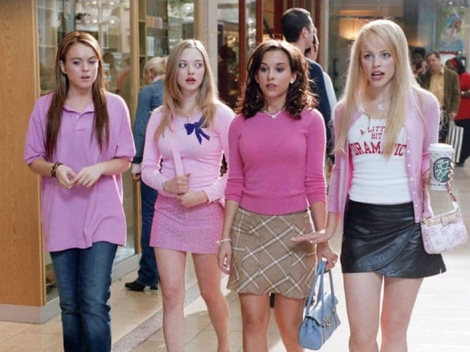
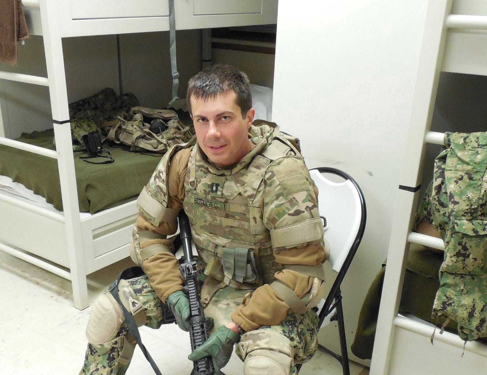
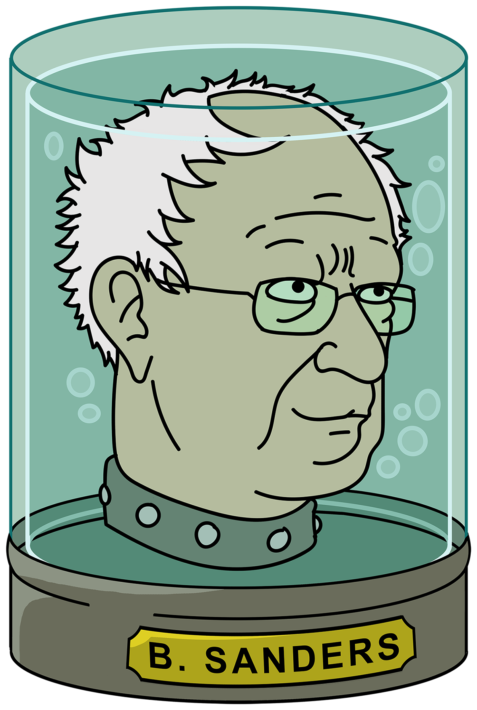

Anyone who has ever tried to reason with, cajole, prevail upon, talk sense to, or in any other way, shape, or form, get anything out of the Democratic Party, has come to discover pretty quickly that there's no one manning the phones. At least not if you aren't promising to show up at their next fundraiser with a T-shirt gun stuffed full of hundred-dollar bills. 

For the average Democratic voter, with nothing to offer beyond their single, solitary, measly little vote, the answer to any and all requests for relief, be they financial, medical, judicial, or racial, is a beet-red, screwed up, fat-cheeked face, howling, "WHAT, DO YOU WANT THE REPUBLICANS TO WIN???!!!!"

More understand this now, than ever before. Everyone will catch on eventually. 

Coming from an arts background, I know some of the shittiest shitlibs that God ever shat. And even they started seeing the glitches in the Matrix when the party dropped old, white, male Joe Biden on their asses and told them they had to suck it up. 

Buttigieg was more their kind of bloodless, technocratic, checking the identity boxes, flavor. And for the Warren folks, even though they focused most of their bitching on the biblical plague of digital serpents that Sanders' supporters unleashed on Liz after her desperate claim on the debate stage that he told her a woman couldn't win, it didn't escape their notice that the press and the party leadership wasn't giving Warren the ol' Hillary footrub, in spite of her similarly being in full possession of a vagina.

As she began to gain in the polls, [WAPO organized the same op-ed firing squad](https://www.washingtonpost.com/opinions/2019/11/01/seven-big-questions-warrens-medicare-for-all-raises/) that had previously been reserved for Sanders, and even [Mama Bear took a swipe at her Medicare for All proposal](https://thehill.com/policy/healthcare/468553-pelosi-im-not-a-big-fan-of-medicare-for-all/). It was reported that in blue states, incidents of cerebral hemorrhage increased ten-fold after Pelosi attacked Warren more or less openly in the press, with some victims heard to say through clenched teeth and spittle, *"Pelosi woman, Warren woman, both woman, ahhhhhhhhhhhh!"*

For Sanders voters who had switched to Liz, this was all familiar territory, but the Hillbots in her coalition had no experience with being on the wrong side of the party's Mean Girls leadership and their obsequious toadies in the press. They really thought -wait for it - that the establishment gave a flying fuck about sexism, and not simply about preserving and extending its own power through whatever vehicle they consider best suited to that objective in any given election.

 These days they prefer that their corporate tools be on the diverse side so that they can attack all criticism as sexism, homophobia, transphobia, racism; whatever gets the Twitterverse clucking its collective tongue. It also allows them to tell their base that they're doing something with their time in office other than trading stock on inside information and starting up new wars on behalf of Lockheed Martin. *Look! A gay, black, female, press secretary! See, we're doing stuff!*

On this score, they didn't want Joe Biden. But they would be damned if they were going to let Warren, or, God forbid, Sanders, anywhere near the White House. Getting a taste of that medicine opened up enough daylight between some former Hillary voters and the establishment for the leaked Roe decision to act as a final straw.

TYT's Ana Kasparian, in the clip below, is speaking for many when she says she's done with the party:



Never mind that Kasparian has spent years labelling anyone who said what she's now screeching at the top of her lungs a grifter, a right-winger, a Russian agent, etc. In that, as in many things, she is emblematic of her shitlib fellows.

So why does this realization come only now?

Because where healthcare, wages, affordable education, criminal justice reform, and structural racism are concerned, the liberal class are mostly immune from the consequences of belonging to a party that hasn't taken any meaningful action in any of these areas for decades. Indeed, this is a party that is currently, however theoretically, led by a man who during his long tenure in the Senate did more to create the [student loan crisis](https://www.businessinsider.com/biden-made-it-harder-to-discharge-student-debt-through-bankruptcy-2022-5) and the [carceral state](https://www.nytimes.com/2019/06/25/us/joe-biden-crime-laws.html) than any other living politician. That didn't stop them from vote-blue-no-matter-whoing anyone who had the poor taste to point out the obvious hypocrisy of the Kente cloth party nominating the warden from Cool Hand Luke.

But abortion. Ah, now we're talking about an issue they actually care about. 

Let's face it. The Democrats are the modern stewards of a Protestant work ethic that has long informed the country's attitudes towards the poor. In the end, in their heart of hearts, they don't really believe that everyone *deserves* access to healthcare and education. They believe that everyone deserves the opportunity to *gain* access to healthcare and education. 

Discrimination is the only true sin in their philosophy. Purge that from the system, and it's all kosher. If you didn't get the grades to win a scholarship, and you didn't land a job that provides healthcare, that's on you, isn't it? Should have cracked those books before you got that cancer diagnosis.

It's not an exaggeration to say that the thing that held this whole repulsive clusterfuck of narcissistic self-regard disguised as a political project together, was Roe. As long as the right to an abortion was nominally protected, the shitlibs could always justify themselves. Roe was the first thing they mentioned when trying to bully others into voting for the D-designated, psychopath du jour, and it was their last line of defense when confronted with the real-world uselessness of their party. But now . . .

Now, the Democrats have failed at the one thing the powerful suburban wine mom lobby entrusted them with. And they are pissed. Perhaps not as pissed as someone who can't discharge their student loans in bankruptcy because of Biden, or someone who got [thrown out of their house because of Obama](https://billmoyers.com/2015/02/14/needless-default/), or someone who's serving twenty years on a BS drug charge because of Bill Clinton, but still, pretty pissed.

Pissed enough to withhold their vote? Yes, I think so. Not in an intentional, willful way. After all these years of vote-shaming and Bernie Bro blaming, they'll never openly proclaim their intention to stop voting. They just won't make the time between soccer practice and Chardonnay to get down to the polling station. That's how it usually works; not with a movement in the streets, but with thousands individually deciding they have better things to do with their Tuesday. 

That's why voter enthusiasm is such a reliable predictor of outcomes.

Voting is a pain in the ass in this country. In order to win you need your side motivated enough to dodge the dragons, swim the moat, defeat the Gorgon, stand on line, present ID, and then, should they make it through all that, pull the lever, punch the chads, touch the screen, sacrifice the goat, or perform whatever other bizarre ritual the particular locality requires in order for voters to simply register their preference for Douchebag A over Douchebag B, along with whether or not Main Street needs a new stop light.

So, how is the post-SCOTUS leak polling looking for Democrats? Not good. 

While Dem enthusiasm to vote has increased by 6%, GOP enthusiasm has gone up by 2%, giving Dems only a +4% net gain-not nearly enough to dig them out of the hole they've been in all year. [Morning Consult/Politico shows a current 7% gap on enthusiasm with 54% of Dems excited to vote, vs. 61% of the GOP](https://www.mediaite.com/news/new-poll-democratic-enthusiasm-surges-after-roe-leak-but-still-trails-republicans-by-a-lot/).

Remember, this polling was done well after the SCOTUS draft leak. Which means that even in the face of an almost certain repeal of Roe, Dems cannot whip what's left of their base into a full-on voting frenzy. 

Pelosi [refusing to rescind her endorsement of Henry Cuellar](https://www.texastribune.org/2022/03/23/nancy-pelosi-henry-cuellar/), a pro-life Democrat, who's house was raided by the FBI in January for still unknown reasons, probably isn't helping. James Biggest-Scumbag-In-Congress-And-That's-Saying-Something Clyburn [going down to Texas](https://www.texastribune.org/2022/05/04/jim-clyburn-henry-cuellar-democrats-abortion-election/) to campaign for him, literally two days after the leak, might not have been the best of optics either.

This kind of *fuck you peasants*, governing style from the Democrats has been on display for a long time. But as long as Roe held, it was mostly invisible to the voter-donors that they cared about. Now that even those are getting the middle finger from a leadership that nonetheless wasted no time sending out the fundraising e-mails as soon as the draft decision first appeared in Politico, the Dems are down to MSNBC viewers and the immediate families of office holders. Have you seen the ratings for MSNBC? You can't win an election on that.

While a lot of Dem politicians secretly greeted the news of Roe's death with a sigh of relief, thinking it would save them from a midterm rout, failing to do the one thing they were charged with doing by all the disparate elements of their dwindling coalition, probably signifies the end of the party. Without enough voters left to hold meaningful power after 2022, and particularly after 2024, they are likely to go the way of the Whigs, over the next few election cycles.

The only question now is, what comes after? My money's on a few decades of social chaos, fascism, and de facto civil war. At the end of which, Bernie Sanders' disembodied head in a jar may finally be given some latitude to reform the healthcare system.

**Photo: MarylandGeoffrey, Wikimedia Commons**
